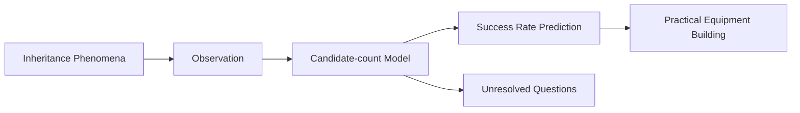

# Rune Factory Inheritance Research
This repository documents hidden gameplay mechanics in Rune Factory 4 Special and Rune Factory 5 discovered through observation, repeated experimentation, and statistical analysis.

Topics covered include:
- Rune Factory 4 Special inheritance mechanics
- Rune Factory 5 inheritance mechanics
- Rune Factory inheritance mechanics
- Rune Factory accessory inheritance
- Rune Factory equipment inheritance
- Candidate-count model
- Inheritance probability prediction
- Auto-arrange mechanics
- Recursive inheritance
- Self-contamination mechanics
- Friendship optimization
- Daily friendship farming
- NPC gift mechanics
- Shop inventory management
- Long-term gameplay optimization
- Hidden game mechanics research

An observation-based research archive for Rune Factory 4 Special and Rune Factory 5 inheritance mechanics, hidden gameplay systems, and long-term optimization strategies.

This repository documents extensive testing and analysis of equipment inheritance, accessory inheritance, candidate-count models, inheritance probability, auto-arrange behavior, recursive inheritance processing, self-contamination, and other hidden mechanics discovered through large-scale gameplay observation.

The archive also includes long-term gameplay research covering friendship optimization, daily gift routing, NPC relationship management, shop inventory mechanics, crop and flower shipping strategies, candidate pool management, and other systems affecting efficient progression in Rune Factory 4 Special and Rune Factory 5.

※This archive is based entirely on in-game observation, repeated experimentation, and statistical analysis. No reverse engineering, decompilation, or extracted game source code is used.

## Overview

Rune Factory 4 Special / Rune Factory 5
inheritance mechanics research archive.

This archive focuses on observed behavior, inheritance mechanics, and candidate-count models derived from gameplay testing.

This archive is based on gameplay observation rather than game code analysis.

## Research Structure

The candidate-count model is the central hypothesis of this research archive.

## Featured Articles

- 
- 
- 
- 
- 
- 

## Main Archive
- ルンファク（全部入り文字列検索可）

## Supporting Documents

### English Roadmap
- 00_roadmap_en.txt

### Additional Notes
- 99_補遺_追加未解決事項備忘録.txt
- 99_検証効率化のための工夫.txt
- 99_余談_作物花類陳列候補数問題と効率的な好感度上げ.txt
- 99_bonus_Efficient_Friendship_Guide.txt
- 99_備忘録_ゲーム検証方法論と検証環境.txt
- 99_Memo_Collaborative_Research_Environment_and_AI_Selection.txt
  
### Appendices
- 99_付録_AIコーディネート案実例.pdf
- 99_付録_用途別装備一覧.pdf

## Status

Observation-based research.

Some hypotheses remain unresolved.

This archive does not claim to prove internal game code or implementation details.

Its purpose is to document observed behavior and provide reproducible observation-based models that may explain those observations.

## Download

See 
- 00_DOWNLOAD_OK.txt

## Articles
- [The Hidden Cost of Shipping Everything](articles/The-Hidden-Cost-of-Shipping.md)
- [RF5 Daily Friendship Farming Guide](articles/RF5-Daily-Friendship-Farming-Guide.md)
- [RF4SP Daily Friendship Farming Guide](articles/RF4SP-Daily-Friendship-Farming-Guide.md)
- [Candidate Count Model](articles/Candidate-Count-Model.md)

