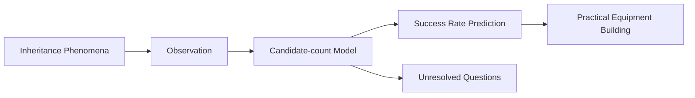

# Rune Factory Inheritance Research
This repository provides an observation-based research archive on Rune Factory 4 Special and Rune Factory 5 mechanics.

The archive focuses on inheritance mechanics, candidate-count models, auto-arrange behavior, recursive processing, self-contamination, inheritance success-rate prediction, and long-term gameplay optimization based on observation.

Additional notes include shop inventory management, crop and flower shipping strategies, friendship optimization, gift mechanics, NPC relationship building, and other long-term gameplay strategies discovered through extensive testing and observation.

※This archive is based on in-game observation, repeated experimentation, and statistical analysis. It does not rely on reverse engineering, decompilation, or extracted game source code.

## Overview

Rune Factory 4 Special / Rune Factory 5
inheritance mechanics research archive.

This archive focuses on observed behavior, inheritance mechanics, and candidate-count models derived from gameplay testing.

This archive is based on gameplay observation rather than game code analysis.

## Research Structure

The candidate-count model is the central hypothesis of this research archive.
## Topics

- Inheritance
- Candidate-count model
- Auto-arrange
- Recursive processing
- Self-contamination
- Messilight inheritance success rate

## Documents

### Main Archive
- ルンファク（全部入り文字列検索可）

### English Roadmap
- 00_roadmap_en.txt

### Additional Notes
- 99_補遺_追加未解決事項備忘録.txt
- 99_検証効率化のための工夫.txt
- 99_余談_作物花類陳列候補数問題と効率的な好感度上げ
- 99_bonus_Efficient_Friendship_Guide
  
### Appendices
- 99_付録_AIコーディネート案実例.pdf
- 99_付録_用途別装備一覧.pdf

## Status

Observation-based research.

Some hypotheses remain unresolved.

This archive does not claim to prove internal game code or implementation details.

Its purpose is to document observed behavior and provide models that may explain those observations.

## Download

See 
- 00_DOWNLOAD_OK.txt

