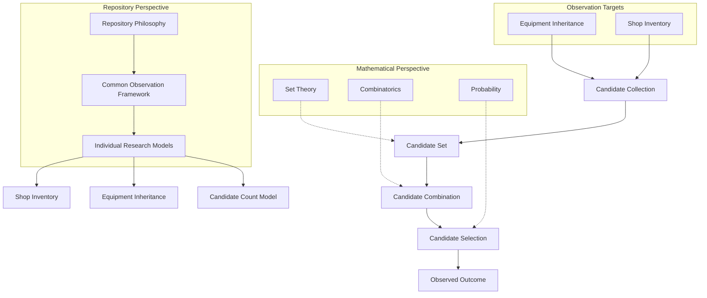

# Rune Factory Inheritance Research

Observation-based research archive for **Rune Factory 4 Special** and **Rune Factory 5**.

Have you ever wondered why some inheritance attempts succeed much more often than others?

This research began while trying to create roleplay-oriented equipment without sacrificing performance, while keeping the required effort practical.

Rather than relying on repeated trial and error, I wanted to understand why some inheritance setups were consistently easier than others.

This repository documents the observations, models, and experiments that eventually led to the Candidate Count Model.

This archive is based entirely on in-game observation, repeated experimentation, and statistical analysis.

No reverse engineering, decompilation, or extracted game source code is used.

---

## 日本語研究資料（日本人向け）

詳細な日本語PDF、一次資料、観測記録、補足図は、以下の公開Google Driveにまとめています。

[📂 日本語研究資料（Google Drive）](https://drive.google.com/drive/u/0/folders/1y9JR9AFVTS0ytAcWwDjW5m9K1c4tW2cB?ths=true)

---

## Mathematical Perspective


```mermaid
flowchart TB

%% =========================================================
%% Observation Targets
%% =========================================================

subgraph Targets["Observation Targets"]
    EI["Equipment Inheritance"]
    SI["Shop Inventory"]
end

%% =========================================================
%% Common Observation Framework
%% =========================================================

EI --> CC
SI --> CC

CC["Candidate Collection"]
CC --> CS["Candidate Set"]
CS --> CB["Candidate Combination"]
CB --> SEL["Candidate Selection"]
SEL --> OUT["Observed Outcome"]

%% =========================================================
%% Mathematical Perspective
%% =========================================================

subgraph Math["Mathematical Perspective"]
    ST["Set Theory"]
    COM["Combinatorics"]
    PROB["Probability"]
end

ST -.-> CS
COM -.-> CB
PROB -.-> SEL

%% =========================================================
%% Repository Architecture
%% =========================================================

subgraph Repo["Repository Perspective"]
    RP["Repository Philosophy"]
    COF["Common Observation Framework"]
    IRM["Individual Research Models"]
end

RP --> COF
COF --> IRM

IRM --> CCM["Candidate Count Model"]
IRM --> INH["Equipment Inheritance"]
IRM --> SHOP["Shop Inventory"]
```

Many Rune Factory systems may share a common structural pattern observed through gameplay.

Candidate Set
↓
Combination
↓
Selection
↓
Observed Outcome

This repository approaches equipment inheritance and shop inventory through this common structure.

The framework draws upon concepts from:

- Set Theory
- Combinatorics
- Probability (when random selection is involved)

---

## Repository Status

Current phase: **Release Preparation**

The repository architecture, article relationships, and directory structure are treated as stable for release.

This README serves as the public entry point.

For the full navigation graph, see:

- [ROADMAP](ROADMAP.md)

---

## Main Research Root

The central research root of this repository is:

- [Candidate Count Model](articles/Candidate-Count-Model.md)

The Candidate Count Model is an observation-based framework for interpreting inheritance behavior through candidate structure, combination space, and success probability.

---

## Reference Assets

Short visual entry points into the research methods, decision processes, observation design, and concrete research constraints used in this repository.

- [Reference Asset Series](reference-assets/README.md)

---

## Major Research Articles

These articles are existing repository nodes connected to the Candidate Count Model.

### Candidate Count Branch

- [Auto Arrange](articles/Auto-Arrange.md)  
  Observation-based model describing how required recipe materials may become inheritance candidates.

- [Self Contamination](articles/Self-Contamination.md)  
  Observation-based model describing how source equipment or inherited information may re-enter the candidate pool.

- [Recursive Processing](articles/Recursive-Processing.md)  
  Conceptual model for inheritance behavior that appears to involve nested or internal arrangement information.

- [Success Probability](articles/Success-Probability.md)  
  Mathematical interface connecting candidate count, combination space, and expected inheritance success.

- [Messhilite Inheritance](articles/Messhilite-Inheritance.md)  
  Validation-oriented article using Messhilite inheritance observations to test candidate-count and combination-space explanations.

---

## Gameplay Articles

These articles document practical gameplay strategies, complete playthroughs, and observation-based case studies derived from repeated experimentation and long-term play.

### Strategy Guides

* [Efficient Friendship Farming Strategy](articles/Efficient-Friendship-Farming-Strategy.md)
* [RF5 Daily Friendship Farming Guide](articles/RF5-Daily-Friendship-Farming-Guide.md)
* [RF4SP Daily Friendship Farming Guide](articles/RF4SP-Daily-Friendship-Farming-Guide.md)
* [Triple Gift Mechanics](articles/Triple-Gift-Mechanics.md)
* [The Hidden Cost of Shipping Everything](articles/The-Hidden-Cost-of-Shipping.md)

### Case Studies

Practical examples demonstrating how observation-based strategies perform during real gameplay.

* [Rune Factory 5 Spring Story Clear (NG+)](case-studies/RF5-Spring-Story-Clear.md)
* [Rune Factory 5 Rigbarth Maze Early Challenge](case-studies/RF5-Rigbarth-Maze-Early-Challenge.md)
* [Rune Factory 5 Spring 4–5 Copper Route](case-studies/RF5-Spring-4-5-Copper-Route.md)
* [Rune Factory 5 Treasure Chest Pattern](case-studies/RF5-Treasure-Chest-Pattern.md)


---

## Repository Folders

```text
README.md
ROADMAP.md

articles/
reference-assets/
research-methodology/
case-studies/
research/
pdf/
csv/
images/
mermaid/
ルンファク（全部入り文字列検索可）/
```

### articles/

English Markdown research articles and gameplay guides.

This folder contains the primary AI-search-friendly entry points for the repository, including observation-based research, gameplay strategies, and practical guides.

* [Articles README](articles/README.md)

---

### reference-assets/

Short visual entry points into the research methods, decision processes, observation design, and concrete research constraints used in this repository.

* [Reference Asset Series](reference-assets/README.md)

---

### research-methodology/

This repository documents not only research results, but also the thinking and judgment processes used to obtain them.

- [Research Process](research-methodology/research-process.md)  
  A visual overview of how questions, parallel evaluation, decisions, validation, and learning form a continuous research cycle.

- [Judgment Architecture](research-methodology/judgment-architecture.md)  
  A conceptual model explaining how Judgment, Knowledge, Experience, and Reality interact.

For the full methodology overview, see the [Research Methodology index](research-methodology/README.md).

---

### case-studies/

Observation-based gameplay documentation.

This folder contains complete playthroughs, optimization attempts, discovery records, and practical case studies demonstrating how repository strategies perform during actual gameplay.

---

### research/

Experimental records, validation documents, datasets, and supporting research materials.

---

### pdf/

Stable Japanese research archive.

These PDF documents preserve detailed observations, validation reports, mathematical interpretation, and long-form discussion.

---

### csv/

Structured datasets and reference tables used during validation and analysis.

---

### images/

Image assets used throughout the repository.

Images are organized by article or topic.

---

### mermaid/

Mermaid source files used to generate repository diagrams.

Rendered figures may be stored under `images/`.

---

### ルンファク（全部入り文字列検索可）/

Searchable Japanese source archive containing the complete text version of the research materials.


---

## PDF Research Archive

The detailed Japanese PDF archive includes:

- [00_README_継承仕様整理](pdf/00_README_継承仕様整理.pdf)
- [00_サマリー](pdf/00_サマリー.pdf)
- [01_用語定義](pdf/01_用語定義.pdf)
- [02_基本仕様整理](pdf/02_基本仕様整理.pdf)
- [03_オートアレンジ詳細](pdf/03_オートアレンジ詳細.pdf)
- [04_自己混入解析](pdf/04_自己混入解析.pdf)
- [05_再帰処理解析](pdf/05_再帰処理解析.pdf)
- [06_抽選処理解析](pdf/06_抽選処理解析.pdf)
- [07_数式・一般化モデル](pdf/07_数式・一般化モデル.pdf)
- [08_メッシライト継承解析](pdf/08_メッシライト継承解析.pdf)
- [09_高難度継承と実運用](pdf/09_高難度継承と実運用.pdf)
- [10_ロールプレイ装備研究](pdf/10_ロールプレイ装備研究.pdf)
- [11_未解決問題・今後の検証課題](pdf/11_未解決問題・今後の検証課題.pdf)
- [12_補遺](pdf/12_補遺.pdf)
- [99_付録_AI比較ログ](pdf/99_付録_AI比較ログ.pdf)

---

## Supporting Documents

Additional supporting notes at the repository root include:

- `00_DOWNLOAD OK.txt`
- `00_roadmap_en.txt`
- `99_bonus_Efficient_Friendship_Guide.txt`
- `99_補足_成功率収束について.txt`
- `99_補遺_追加未解決事項備忘録.txt`
- `99_備忘録_ゲーム検証方法論と検証環境.txt`
- `99_Memo_Collaborative_Research_Environment_and_AI_Selection.txt`
- `99_余談_作物花類陳列候補数問題と効率的な好感度上げ.txt`

---

## Research Position

This archive does not claim to prove internal game code or implementation details.

Its purpose is to document observed behavior and provide reproducible observation-based models that may explain those observations.

Some hypotheses remain unresolved.

Future observations may refine, revise, or replace current interpretations.

---

## Navigation

- [ROADMAP](ROADMAP.md)
- [Articles](articles/README.md)
- [PDF Archive](pdf/README.md)

---

## License

This project is licensed under the CC BY-NC 4.0 License.

See [LICENSE.md](LICENSE.md) for details.
