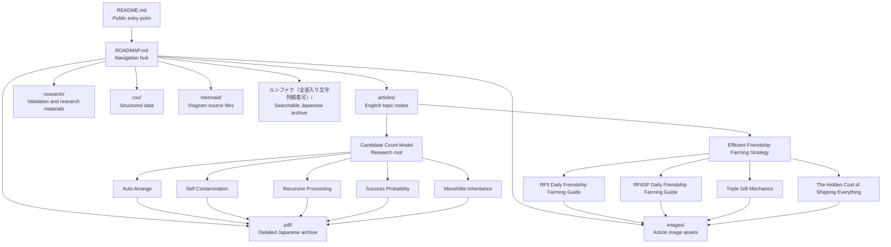

# ROADMAP

## About this Repository

This roadmap provides the repository knowledge graph and recommended navigation routes.

It is a navigation document, not a technical article.

Use this file to understand how the repository contents relate to each other.

For the public entry point, see:

- [README](README.md)

---

## Repository Navigation Model

```text
README.md
    ↓
ROADMAP.md
    ↓
articles/
    ↓
pdf/ or research/ or csv/
```

The repository uses a relatively flat physical structure.

Logical relationships are expressed primarily through Markdown links.

---

## Recommended Reading Order

### Beginner Route

Start here if you want practical gameplay guidance.

1. [RF5 Daily Friendship Farming Guide](articles/RF5-Daily-Friendship-Farming-Guide.md)
2. [RF4SP Daily Friendship Farming Guide](articles/RF4SP-Daily-Friendship-Farming-Guide.md)
3. [Triple Gift Mechanics](articles/Triple-Gift-Mechanics.md)
4. [Efficient Friendship Farming Strategy](articles/Efficient-Friendship-Farming-Strategy.md)
5. [The Hidden Cost of Shipping Everything](articles/The-Hidden-Cost-of-Shipping.md)

### Inheritance Mechanics Route

Start here if you want the main inheritance research path.

1. [Candidate Count Model](articles/Candidate-Count-Model.md)
2. [Auto Arrange](articles/Auto-Arrange.md)
3. [Self Contamination](articles/Self-Contamination.md)
4. [Recursive Processing](articles/Recursive-Processing.md)
5. [Success Probability](articles/Success-Probability.md)
6. [Messhilite Inheritance](articles/Messhilite-Inheritance.md)

### Detailed Research Archive Route

Use the PDF archive when you need complete Japanese research details.

1. [00_README_継承仕様整理](pdf/00_README_継承仕様整理.pdf)
2. [00_サマリー](pdf/00_サマリー.pdf)
3. [01_用語定義](pdf/01_用語定義.pdf)
4. [02_基本仕様整理](pdf/02_基本仕様整理.pdf)
5. [03_オートアレンジ詳細](pdf/03_オートアレンジ詳細.pdf)
6. [04_自己混入解析](pdf/04_自己混入解析.pdf)
7. [05_再帰処理解析](pdf/05_再帰処理解析.pdf)
8. [06_抽選処理解析](pdf/06_抽選処理解析.pdf)
9. [07_数式・一般化モデル](pdf/07_数式・一般化モデル.pdf)
10. [08_メッシライト継承解析](pdf/08_メッシライト継承解析.pdf)
11. [09_高難度継承と実運用](pdf/09_高難度継承と実運用.pdf)
12. [10_ロールプレイ装備研究](pdf/10_ロールプレイ装備研究.pdf)
13. [11_未解決問題・今後の検証課題](pdf/11_未解決問題・今後の検証課題.pdf)
14. [12_補遺](pdf/12_補遺.pdf)

---

## Repository Knowledge Graph



---

## Candidate Count Research Branch

The Candidate Count Model is the primary research root for inheritance mechanics.

```text
Candidate Count Model
    ├── Auto Arrange
    ├── Self Contamination
    ├── Recursive Processing
    ├── Success Probability
    └── Messhilite Inheritance
```

### Research Root

- [Candidate Count Model](articles/Candidate-Count-Model.md)

### Model Interface Articles

These articles describe mechanisms that may generate or expand candidate pools.

- [Auto Arrange](articles/Auto-Arrange.md)
- [Self Contamination](articles/Self-Contamination.md)
- [Recursive Processing](articles/Recursive-Processing.md)

### Mathematical Interface

This article connects candidate count and combination space to inheritance success probability.

- [Success Probability](articles/Success-Probability.md)

### Validation Interface

This article uses Messhilite inheritance observations as a validation-oriented interface for the Candidate Count Model.

- [Messhilite Inheritance](articles/Messhilite-Inheritance.md)

---

## Friendship and Long-Term Optimization Branch

This branch documents daily friendship farming, gift mechanics, shop candidate management, and long-term gameplay optimization.

```text
Efficient Friendship Farming Strategy
    ├── RF5 Daily Friendship Farming Guide
    ├── RF4SP Daily Friendship Farming Guide
    ├── Triple Gift Mechanics
    └── The Hidden Cost of Shipping Everything
```

### Strategy Root

- [Efficient Friendship Farming Strategy](articles/Efficient-Friendship-Farming-Strategy.md)

### Practical Guides

- [RF5 Daily Friendship Farming Guide](articles/RF5-Daily-Friendship-Farming-Guide.md)
- [RF4SP Daily Friendship Farming Guide](articles/RF4SP-Daily-Friendship-Farming-Guide.md)

### Supporting Mechanics

- [Triple Gift Mechanics](articles/Triple-Gift-Mechanics.md)
- [The Hidden Cost of Shipping Everything](articles/The-Hidden-Cost-of-Shipping.md)

---

## Article Index

### Inheritance Research

- [Candidate Count Model](articles/Candidate-Count-Model.md)
- [Auto Arrange](articles/Auto-Arrange.md)
- [Self Contamination](articles/Self-Contamination.md)
- [Recursive Processing](articles/Recursive-Processing.md)
- [Success Probability](articles/Success-Probability.md)
- [Messhilite Inheritance](articles/Messhilite-Inheritance.md)

### Friendship and Strategy

- [Efficient Friendship Farming Strategy](articles/Efficient-Friendship-Farming-Strategy.md)
- [RF5 Daily Friendship Farming Guide](articles/RF5-Daily-Friendship-Farming-Guide.md)
- [RF4SP Daily Friendship Farming Guide](articles/RF4SP-Daily-Friendship-Farming-Guide.md)
- [Triple Gift Mechanics](articles/Triple-Gift-Mechanics.md)
- [The Hidden Cost of Shipping Everything](articles/The-Hidden-Cost-of-Shipping.md)

---

## Directory Guide

### articles/

English Markdown articles.

These are repository knowledge nodes and public-facing entry points.

- [articles/README.md](articles/README.md)

### images/

Image assets used by articles.

Current article image groups include:

- `auto-arrange/`
- `candidate-count-model/`
- `messhilite-inheritance/`
- `recursive-processing/`
- `self-contamination/`
- `success-probability/`
- `rf5-friendship-guide/`
- `rf4sp-friendship-guide/`
- `the-hidden-cost-of-shipping/`
- `triple-gift-mechanics/`

### mermaid/

Mermaid source files for repository diagrams.

### pdf/

Detailed Japanese research archive.

### research/

Validation records, experimental notes, and research support materials.

### csv/

Structured data and reference tables.

### ルンファク（全部入り文字列検索可）/

Searchable Japanese full archive and source materials.

---

## Status

Repository phase: **Release Preparation**

This archive is observation-based.

Some hypotheses remain unresolved.

This repository does not claim to prove internal game code or implementation details.

The current navigation structure preserves the existing repository architecture and knowledge graph.

---

## Navigation

- Back to [README](README.md)
- See [Articles](articles/README.md)
- See [PDF Archive](pdf/README.md)
