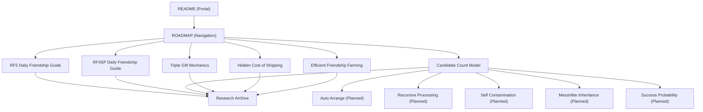

# ROADMAP

## About this Repository

## Recommended Reading Order

Beginner
↓

Mechanics
↓

Strategy
↓

Research Archive

## Knowledge Network

Beginner
│
├── RF5 Daily Friendship Farming Guide
└── RF4SP Daily Friendship Farming Guide

Mechanics
│
├── Candidate Count Model
│     │
│     ├── Auto Arrange (Planned)
│     ├── Recursive Processing (Planned)
│     ├── Self Contamination (Planned)
│     ├── Messhilite Inheritance (Planned)
│     ├── Success Probability (Planned)
│     └── Candidate Pool (Planned)
│
├── Triple Gift Mechanics
└── The Hidden Cost of Shipping

Strategy
│
└── Efficient Friendship Farming Strategy

Research Archive

## Future Branches

## Supporting Documents
