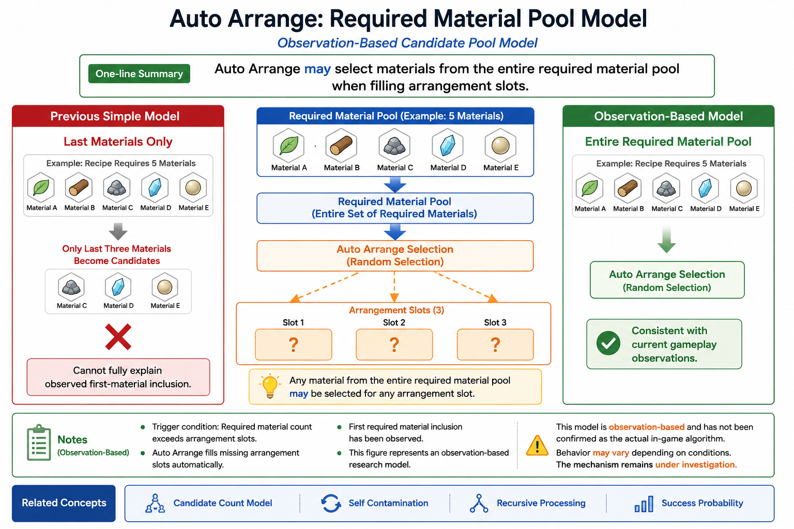
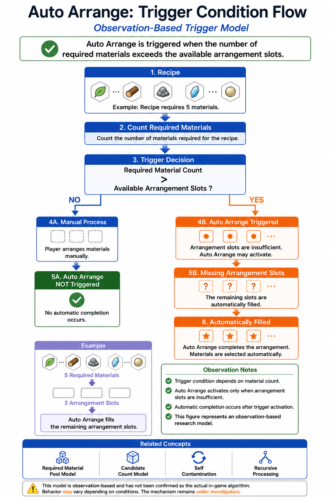
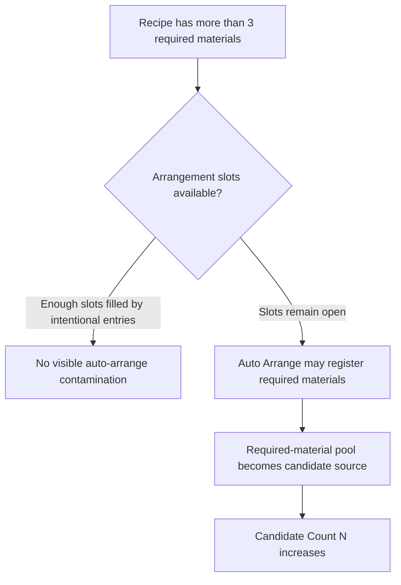
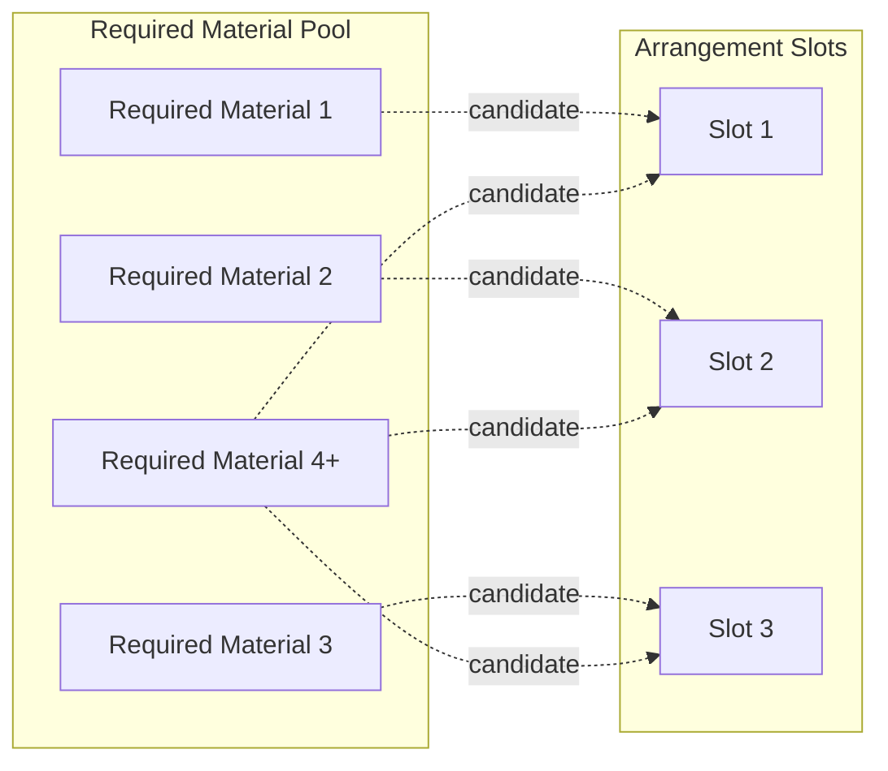
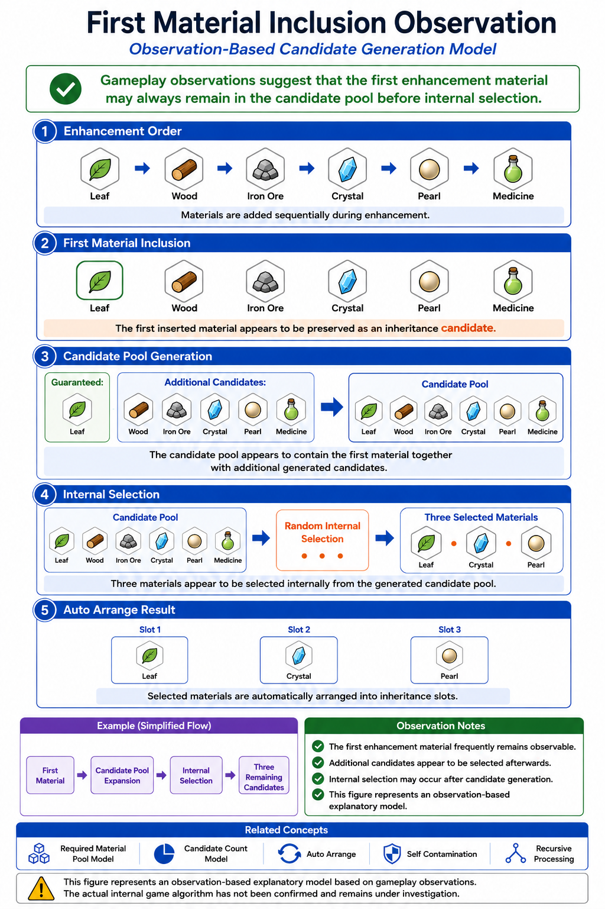
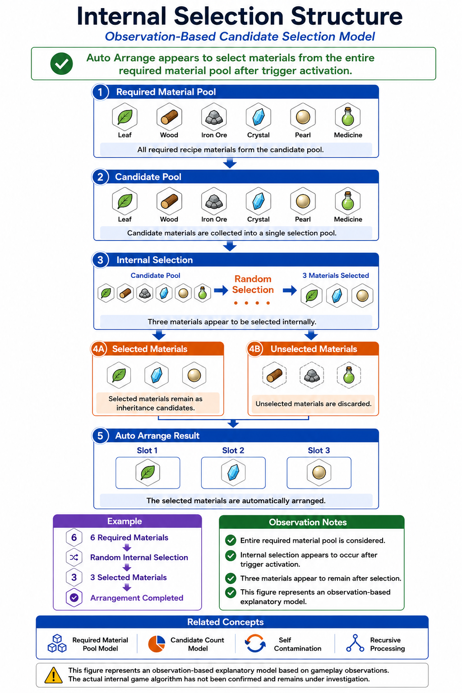
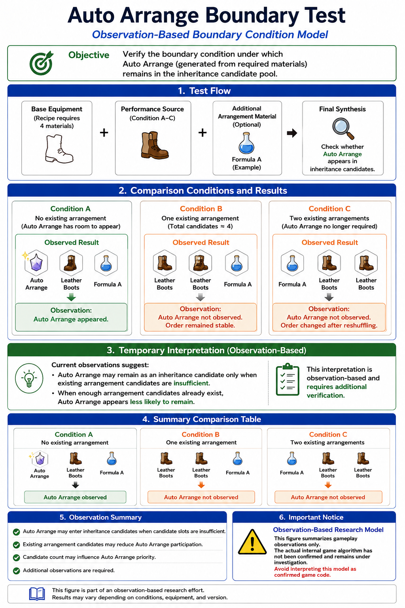

# Auto Arrange

## Overview

Auto Arrange is an observation-based research topic describing how required recipe materials may become inheritance candidates when equipment recipes use more required materials than the three available arrangement slots can cleanly preserve.

This article is a high-level English entry point. It does not claim to reveal the internal implementation. It summarizes one conceptual model that helps explain repeated gameplay observations in Rune Factory 4 Special and Rune Factory 5.

---

## Why It Matters

Auto Arrange matters because it can increase the effective candidate pool even when the player did not intend to add extra inheritance candidates.

In this repository, the core question is not simply:

> Did the desired inheritance succeed?

The more useful question is:

> How many candidates were created before the final three arrangement slots were selected?

Auto Arrange is therefore treated as one interface of the broader Candidate Count Model. When additional required materials become candidates, the candidate count `N` may increase, and the chance of keeping the desired three entries may decrease.

---

## Representative Figures



*Conceptual model: required recipe materials may act as a candidate pool when Auto Arrange is triggered.*



*Conceptual trigger flow: Auto Arrange is most relevant when recipe requirements exceed the normal three-slot arrangement structure.*

---

## Mermaid Source Concept

The repository also keeps Mermaid source diagrams for this concept.





---

## Core Mechanism

The working model is:

```text
Recipe required materials
        ↓
Arrangement slot pressure
        ↓
Auto Arrange candidate registration
        ↓
Candidate Count N increases
        ↓
Final three arrangement entries become less predictable
```

A simplified interpretation is:

- Normal arrangement capacity is limited to three slots.
- Recipes with more than three required materials may create pressure on that structure.
- Required materials may be registered as candidates even when they were not the player's intended inheritance targets.
- Once these materials become candidates, they can compete with desired entries.

This does not mean Auto Arrange always appears visibly in the final result. It means Auto Arrange may affect the candidate-generation stage under certain conditions.

---

## Observations

The current article reflects several observation-oriented points from the Japanese research archive.

### Required-material selection may not be simple tail selection

Some observations suggest that Auto Arrange is not necessarily limited to the last required material in a recipe. First-material contamination has also been observed.



*Observation figure: required material selection may involve a broader required-material pool rather than a simple fixed tail rule.*

### Internal selection model



*Conceptual model: Auto Arrange may be better understood as candidate generation from a required-material pool.*

### RF4SP / RF5 boundary test



*Boundary observations help separate stable three-slot behavior from candidate expansion behavior.*

---

## Practical Implications

For practical equipment building, Auto Arrange suggests a simple rule:

> Do not only count the materials you intended to inherit. Also consider recipe-required materials that may become candidates.

This is especially important when building high-difficulty equipment where success depends on preserving a specific set of three entries.

Practical precautions include:

- prefer recipes with fewer required materials when possible;
- avoid unnecessary candidate expansion;
- separate intermediate crafting steps when candidate pressure becomes too high;
- verify final inheritance results rather than assuming the visible recipe explains all candidates.

---

## Relationship to Candidate Count Model

Auto Arrange is not treated as a separate theory. It is treated as one candidate-generation route.

```text
Auto Arrange
        ↓
Additional candidate generation
        ↓
Candidate Count N increases
        ↓
Combination space expands
        ↓
Success probability may decrease
```

This is why Auto Arrange belongs near Self Contamination and Recursive Processing in the article network: each can explain how the candidate pool becomes larger than expected.

---

## Detailed Research PDF

This article provides an English overview only.

Detailed observations, Japanese terminology, test cases, and discussion are documented in the accompanying research archive.

**Note:** PDF documents are currently available in Japanese only.

- [Auto Arrange Detailed Analysis](../pdf/03_オートアレンジ詳細.pdf)

---

## Related Articles

### Research Root

- [Candidate Count Model](Candidate-Count-Model.md)

### Related Mechanics

- [Self Contamination](Self-Contamination.md)
- [Recursive Processing](Recursive-Processing.md)
- [Success Probability](Success-Probability.md)
- [Messhilite Inheritance](Messhilite-Inheritance.md)

---

## Notes

This article describes an observation-based model. It should not be read as a definitive implementation claim.

---

## Navigation

- [Back to Articles](README.md)
- [Back to ROADMAP](../ROADMAP.md)
- [Back to Repository README](../README.md)
