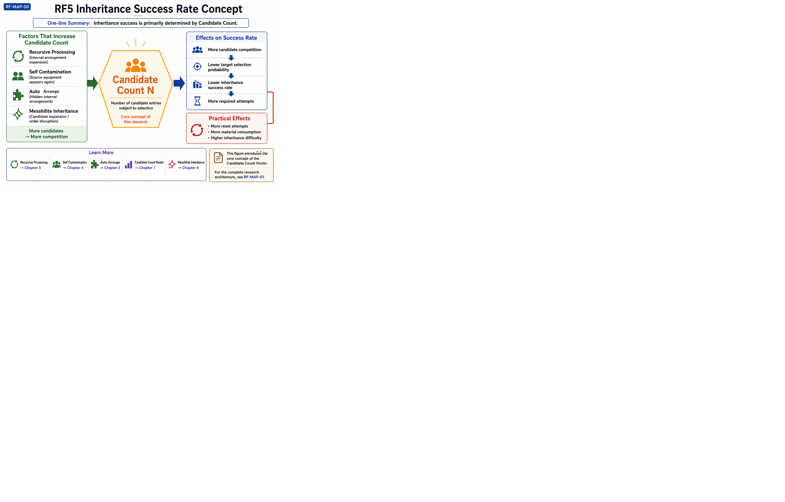

# Candidate Count Model

## Overview

The Candidate Count Model is an observation-based research model that explains inheritance success probability through the number of valid candidate combinations.

Rather than describing a single inheritance mechanic, this model provides a common conceptual framework for understanding multiple inheritance-related phenomena observed in Rune Factory equipment inheritance.

It serves as the research root for many of the articles included in this repository.

---

## Why It Matters

Many inheritance-related behaviors appear to be independent mechanics at first glance.

Auto Arrange, Recursive Processing, Messhilite Inheritance, Self Contamination, and inheritance success probability may all seem unrelated.

However, observation results suggest that these phenomena can often be interpreted through a common perspective based on candidate generation and candidate count.

Understanding Candidate Count therefore provides a unified framework for interpreting a wide range of inheritance behavior without relying on isolated case-by-case explanations.

---

## Candidate Count Overview

---

## Representative Figure

The validation results demonstrate a strong relationship between Candidate Count and inheritance success probability.

---

---

## Key Takeaways

- Candidate Count is one of the central concepts for understanding inheritance behavior.
- Increasing the number of valid candidate combinations generally increases inheritance success probability.
- The same conceptual framework can explain multiple inheritance-related mechanics.
- This model serves as the research root for several inheritance studies documented in this repository.

---

## Key Applications

The Candidate Count Model provides a common foundation for several inheritance-related research topics.

- Auto Arrange
- Recursive Processing
- Self Contamination
- Messhilite Inheritance
- Success Probability

## Notes

### Core Mechanics

- Triple Gift Mechanics

### Related Strategy

- Efficient Friendship Farming Strategy

### Research

- Auto Arrange
- Recursive Processing
- Messhilite Inheritance

---

## Detailed Research PDF

This article is a summary.
The complete observation records and discussion are available in the PDF archive.

## Related Articles

### Core Mechanics

- [Triple Gift Mechanics](../articles/triple-gift-mechanics.md)

### Strategy

- [Efficient Friendship Farming Strategy](../articles/friendship-strategy.md)

- [The Hidden Cost of Shipping Everything](../articles/the-hidden-cost-of-shipping.md)

### Practical Guides

- [RF5 Daily Friendship Farming Guide](../articles/RF5-Daily-Friendship-Farming-Guide.md)

- [RF4SP Daily Friendship Farming Guide](../articles/RF4SP-Daily-Friendship-Farming-Guide.md)

### Research

- [Auto Arrange](../articles/auto-arrange.md)

- [Recursive Processing](../articles/recursive-processing.md)

- [Messhilite Inheritance](../articles/messhilite-inheritance.md)

---

## Navigation

---

## Navigation

- Back to [README](../README.md)
- Back to [ROADMAP](../ROADMAP.md)
