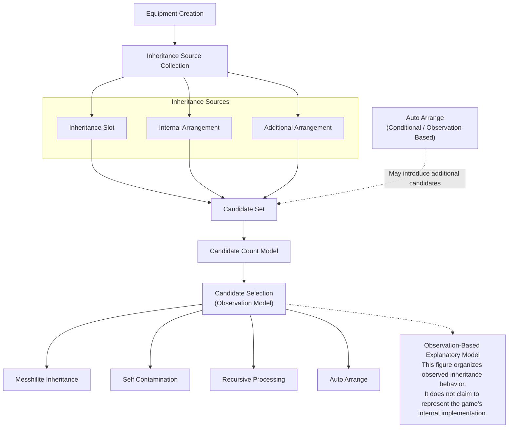
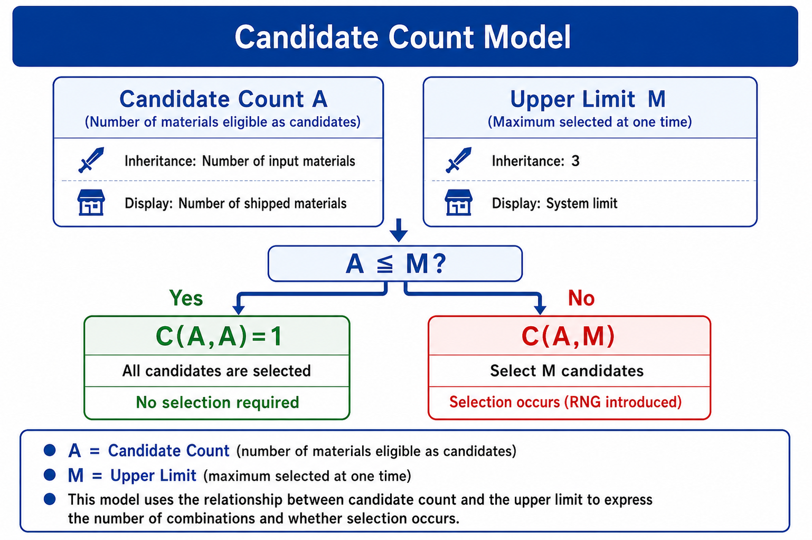
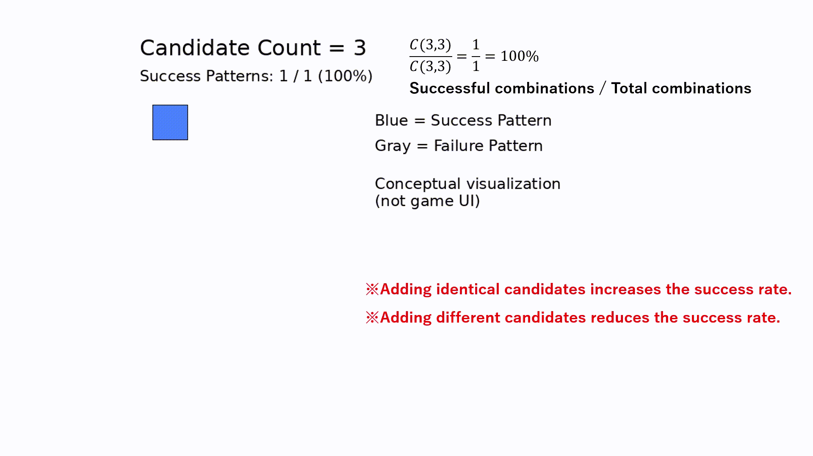
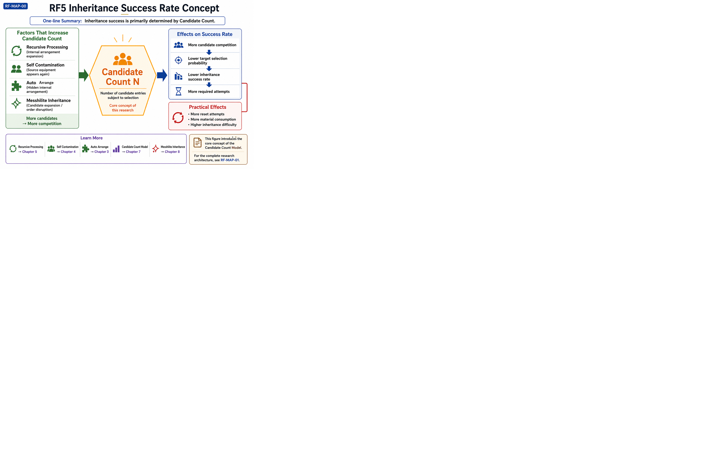
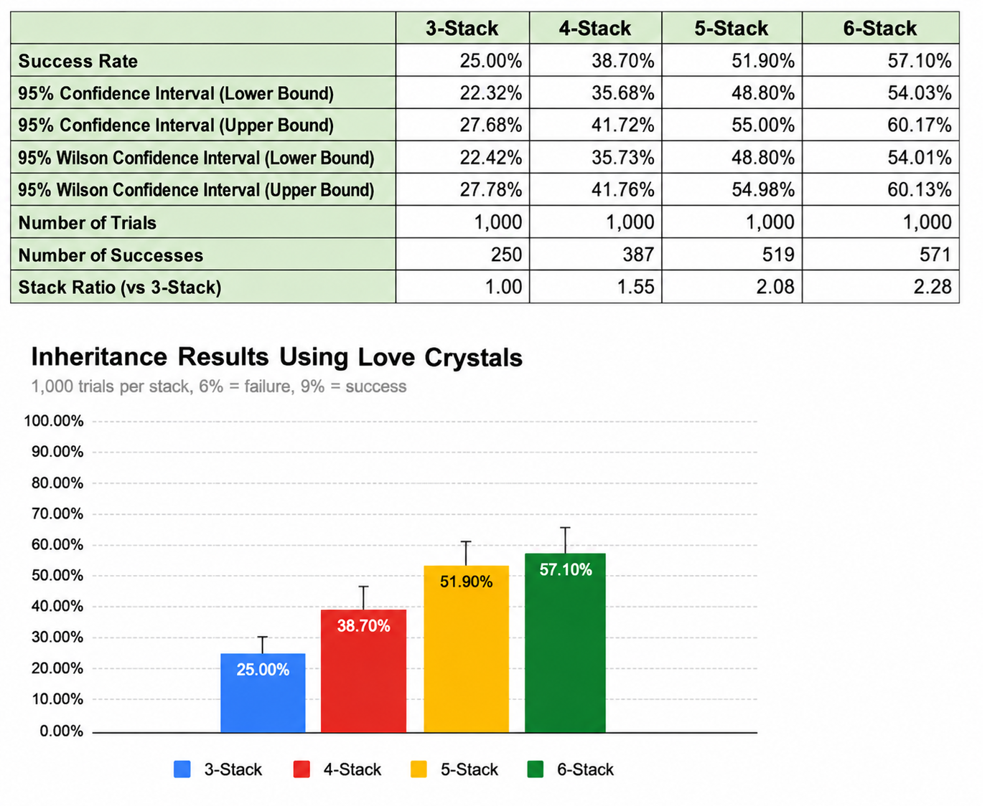
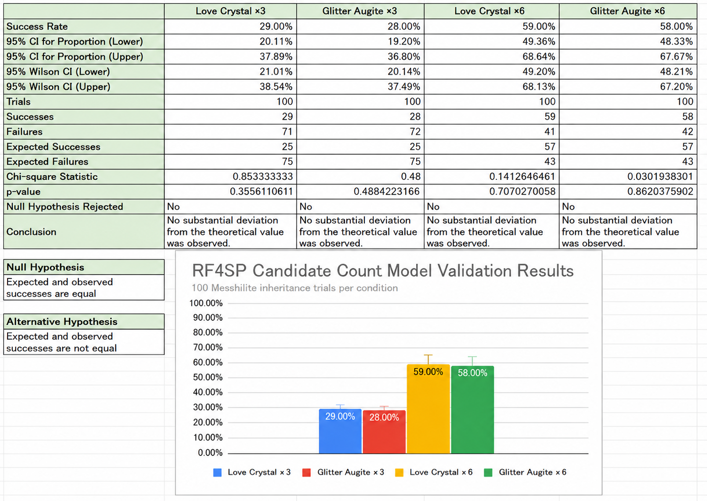

# Candidate Count Model

## Overview

The Candidate Count Model is an observation-based research model that explains inheritance success probability through the number of valid candidate combinations.

Rather than describing a single inheritance mechanic, it provides a common observation framework for understanding multiple inheritance-related phenomena observed in Rune Factory equipment inheritance.

The model focuses on the size of candidate sets. Within the broader framework of this repository, candidate sets are viewed in terms of how they are constructed, combined, and ultimately selected to produce the observed result.

This perspective draws upon concepts from Set Theory, Combinatorics, and Probability, while remaining strictly based on gameplay observations rather than assumptions about the game's internal implementation.

The Candidate Count Model serves as the conceptual foundation for many inheritance-related studies included in this repository.

```mermaid
flowchart TB

%% =========================================================
%% Equipment Inheritance Observation Model
%% =========================================================

EC["Equipment Creation"]
EC --> IC["Inheritance Source Collection"]

subgraph Sources["Inheritance Sources"]
    IS["Inheritance Slot"]
    IA["Internal Arrangement"]
    AA["Additional Arrangement"]
end

IC --> IS
IC --> IA
IC --> AA

IS --> CS
IA --> CS
AA --> CS

AUTO["Auto Arrange<br/>(Conditional / Observation-Based)"]

AUTO -. May introduce additional candidates .-> CS

CS["Candidate Set"]
CS --> CCM["Candidate Count Model"]
CCM --> SEL["Candidate Selection<br/>(Observation Model)"]

SEL --> M["Messhilite Inheritance"]
SEL --> SP["Self Contamination"]
SEL --> RP["Recursive Processing"]
SEL --> AR["Auto Arrange"]

NOTE["Observation-Based Explanatory Model<br/>This figure organizes observed inheritance behavior.<br/>It does not claim to represent the game's internal implementation."]

SEL -.-> NOTE
```

---
## Terminology

- **Candidate Count (A): Total number of elements that can participate in the selection process.**
- **Selection Limit (M): Maximum number of elements selected in a single operation.**

---

## Quick Start: Candidate Count A and Selection Limit M

This simplified overview provides a beginner-facing entry point to the model:

- `A` is the number of candidates that can participate in selection.
- `M` is the maximum number selected in one operation.
- When `A ≤ M`, the model does not require a choice among multiple candidate combinations.
- When `A > M`, multiple combinations can arise, and selection may introduce an RNG requirement.

The figure is a conceptual summary of the Candidate Count Model. It organizes observation-based consequences and does not claim to show the game's internal implementation.

---

## Conceptual Animation

---

## Why I Started This Research

Many players notice that equipment inheritance sometimes succeeds immediately, while other times it requires dozens of reloads.

After repeatedly encountering this myself, I wanted to understand whether the success rate was truly random.

I eventually tested the inheritance system over several thousand crafting attempts and found that many seemingly unrelated inheritance behaviors could be interpreted through a common perspective based on Candidate Count.

---

## Core Concept

Candidate Count refers to the total number of elements that can participate in the selection process.

When Candidate Count exceeds the Selection Limit, multiple possible combinations may arise. Changes in this combination space can affect the probability that the desired inheritance result will be selected.

Many inheritance-related phenomena documented in this repository can therefore be interpreted through changes in Candidate Count.

---

## Why It Matters

Many inheritance-related behaviors appear to be independent mechanics at first glance.

Auto Arrange, Recursive Processing, Messhilite Inheritance, Self Contamination, and inheritance success probability may all seem unrelated.

However, observation results suggest that these phenomena can often be interpreted through a common perspective based on candidate generation and candidate count.

Understanding Candidate Count therefore provides a unified framework for interpreting a wide range of inheritance behavior without relying on isolated case-by-case explanations.

---

## Candidate Count Overview

---

## Representative Figure

The validation results suggest a strong relationship between Candidate Count and inheritance success probability.

---

## Example Application

The Messhilite inheritance mechanism provides one practical example of how Candidate Count can influence inheritance success probability through candidate generation and selection.

---

## RF4SP Validation

### Why RF4SP Was Tested Separately

The Candidate Count Model was originally developed from RF5 observations.

However, later RF4SP observations raised additional questions about candidate selection. In particular, candidate order did not always behave as straightforwardly as expected, and separate observations suggested that selection behavior might also differ depending on material identity.

These questions concern **Candidate Selection Distribution**, and do not necessarily mean that the **Candidate Count / Combination Space** model itself is incorrect.

For that reason, the RF5 results alone were not treated as sufficient evidence that the same model could be applied directly to RF4SP.

I therefore tested Messhilite inheritance in RF4SP under four conditions, using two different materials and two candidate-count conditions.

### Results

Each condition was tested 100 times.

| Condition | Observed Success Rate | Model Expectation |
|---|---:|---:|
| Love Crystal ×3 | 29.00% | 25.00% |
| Glitter Augite ×3 | 28.00% | 25.00% |
| Love Crystal ×6 | 59.00% | 57.14% |
| Glitter Augite ×6 | 58.00% | 57.14% |

Chi-square tests did not detect a statistically significant deviation from the model expectation in any of the four tested conditions (`p > 0.05`).

### Interpretation

Under these tested conditions, the RF4SP observations were consistent with the Candidate Count Model previously developed from RF5 observations.

The use of both Love Crystal and Glitter Augite was intentional. Because RF4SP observations had raised questions about material-dependent selection behavior, testing more than one material provided a stronger check than repeating the experiment with only a single material.

The results therefore suggest that the RF4SP candidate-selection complications observed elsewhere do not, by themselves, invalidate the Candidate Count Model.

### Boundary

These results do **not** prove that the Candidate Count Model describes the game's internal implementation.

They show only that, under the four tested RF4SP conditions, the observed Messhilite inheritance rates did not significantly deviate from the model expectations.

Candidate Count / Combination Space and Candidate Selection Distribution should therefore remain separate questions.

---

## Key Takeaways

- Candidate Count is one of the central concepts for understanding inheritance behavior.
- Increasing the number of valid candidate combinations generally increases inheritance success probability.
- The same conceptual framework can explain multiple inheritance-related mechanics.
- This model serves as the research root for several inheritance studies documented in this repository.

---

## Key Applications

The Candidate Count Model provides a common foundation for several inheritance-related research topics.

- [Auto Arrange](../articles/Auto-Arrange.md)
- [Recursive Processing](../articles/Recursive-Processing.md)
- [Self Contamination](../articles/Self-Contamination.md)
- [Messhilite Inheritance](../articles/Messhilite-Inheritance.md)
- [Success Probability](../articles/Success-Probability.md)

---

## Detailed Research PDF

This article provides a high-level overview of the Candidate Count Model.

Detailed observations, statistical analyses, mathematical discussion, and experimental validation are documented in the accompanying research archive.

### Research PDF Series

The complete research archive consists of multiple PDF documents.

**Note:** All PDF documents are currently available in **Japanese only**.

#### Core Documents

- [Read Me](../pdf/00_README_継承仕様整理.pdf)
- [Summary](../pdf/00_サマリー.pdf)
- [Terminology and Basic Mechanics](../pdf/01_用語定義.pdf)
- [Basic Mechanics Overview](../pdf/02_基本仕様整理.pdf)

#### Mechanics Research

- [Auto Arrange](../pdf/03_オートアレンジ詳細.pdf)
- [Self Contamination](../pdf/04_自己混入解析.pdf)
- [Recursive Processing](../pdf/05_再帰処理解析.pdf)
- [Candidate Selection Process](../pdf/06_抽選処理解析.pdf)
- [General Mathematical Model](../pdf/07_数式・一般化モデル.pdf)

#### Applied Research

- [Messhilite Inheritance Analysis](../pdf/08_メッシライト継承解析.pdf)
- [Advanced Inheritance Strategies](../pdf/09_高難度継承と実運用.pdf)
- [Roleplay Equipment Study](../pdf/10_ロールプレイ装備研究.pdf)

#### Future Research

- [Future Research Topics](../pdf/11_未解決問題・今後の検証課題.pdf)
- [Supplementary Notes](../pdf/12_補遺.pdf)
- [AI Comparison Appendix](../pdf/99_付録_AI比較.pdf)

See the **pdf/** directory for the complete research series.

### Validation Archive

Additional validation materials are available in the **research/** directory, including experimental methodology, statistical validation, aggregated datasets, and research notes.

### Practical Data

Additional practical datasets are available in the **csv/** directory, including equipment databases, AI coordination examples, material tables, and other reference resources.

---

## Related Articles

### Core Mechanics

- [Triple Gift Mechanics](./Triple-Gift-Mechanics.md)

### Strategy

- [Efficient Friendship Farming Strategy](./Efficient-Friendship-Farming-Strategy.md)

- [The Hidden Cost of Shipping Everything](./The-Hidden-Cost-of-Shipping.md)

### Practical Guides

- [RF5 Daily Friendship Farming Guide](./RF5-Daily-Friendship-Farming-Guide.md)

- [RF4SP Daily Friendship Farming Guide](./RF4SP-Daily-Friendship-Farming-Guide.md)

### Research

The Candidate Count Model serves as the conceptual foundation for many inheritance-related studies included in this repository and acts as the central hub connecting the associated research articles.

- [Auto Arrange](./Auto-Arrange.md)
- [Recursive Processing](./Recursive-Processing.md)
- [Self Contamination](./Self-Contamination.md)
- [Messhilite Inheritance](./Messhilite-Inheritance.md)
- [Success Probability](./Success-Probability.md)

---

## Navigation

- Back to [README](../README.md)
- Back to [ROADMAP](../ROADMAP.md)
