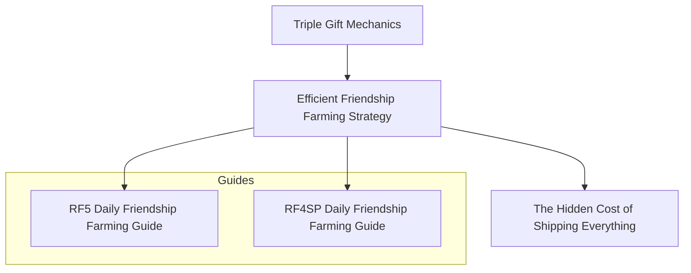

# Efficient Friendship Farming Strategy

## Overview

Long-term friendship farming is not simply about giving the highest-value gift every day.

Instead, it is about combining multiple game mechanics into a sustainable daily routine.

By understanding gift categories, handmade bonuses, shared ingredients, and shop inventory management, it is possible to reduce preparation time while steadily increasing friendship with many villagers at once.

This article summarizes the overall strategy behind efficient friendship farming.

---

## Key Takeaway

Efficient friendship farming is achieved by combining several independent mechanics into a single daily workflow.

Rather than maximizing one gift, the goal is to maximize long-term efficiency.

---

## Knowledge Graph



---

## Core Principles

The overall strategy is based on four main ideas:

- Use separate gift categories whenever possible.
- Take advantage of handmade gift bonuses.
- Batch-produce low-cost recipes that can be shared by multiple villagers.
- Manage shop inventory carefully to improve long-term farming efficiency.

These ideas reinforce each other and become more valuable over long playthroughs.

---

## Practical Implications

Instead of asking,

> "What is the best gift for this character?"

this strategy asks,

> "How can today's preparation benefit as many villagers as possible?"

By sharing ingredients and recipes between multiple villagers, daily preparation becomes faster and easier while maintaining steady friendship growth.

This approach is particularly useful for players who enjoy long-term optimization rather than speedrunning.

---

## Notes

This article summarizes one long-term optimization strategy based on gameplay observations and practical experience.

Different playstyles may benefit from different approaches.

There is no single "correct" way to play Rune Factory.

---

## Related Articles

- **Core Mechanics**
  - [Triple Gift Mechanics](./Triple-Gift-Mechanics.md)

- **Related Mechanics**
  - [The Hidden Cost of Shipping Everything](./The-Hidden-Cost-of-Shipping.md)

- **Practical Guides**
  - [RF5 Daily Friendship Farming Guide](./RF5-Daily-Friendship-Farming-Guide.md)
  - [RF4SP Daily Friendship Farming Guide](./RF4SP-Daily-Friendship-Farming-Guide.md)

- **Research**
  - [Candidate Count Model](./Candidate-Count-Model.md)

---

## Navigation

- Back to [README](../README.md)

- Back to [ROADMAP](../ROADMAP.md)
````

