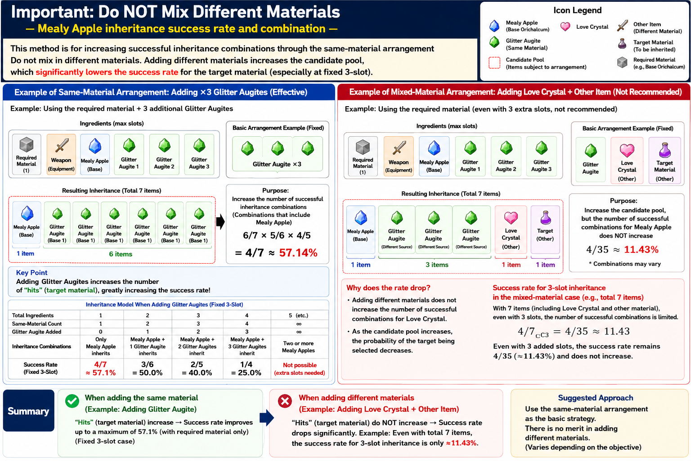
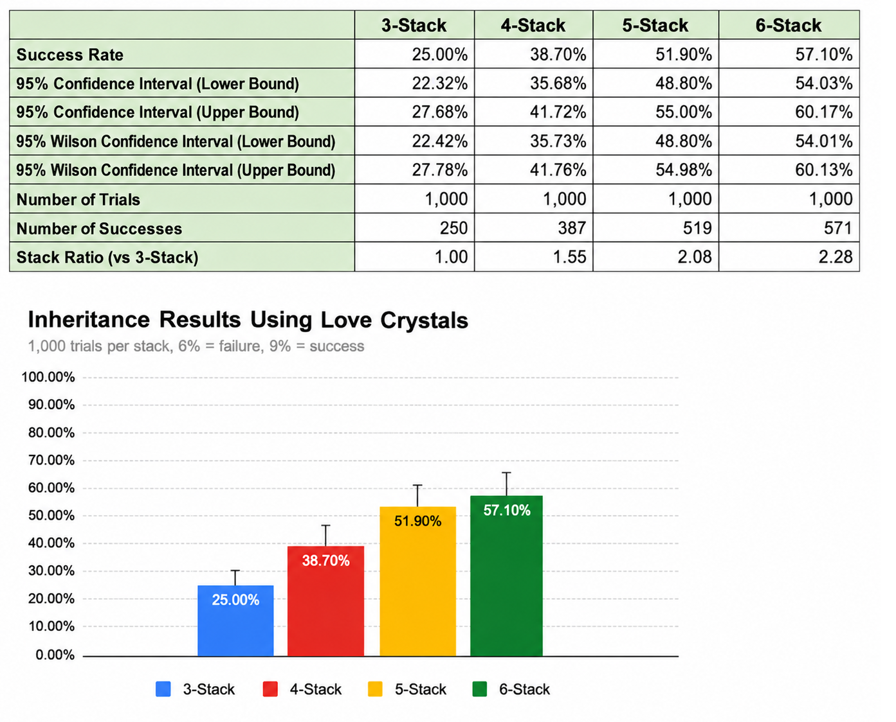

# Messhilite Inheritance

## Overview

Messhilite Inheritance is an observation-based research topic describing inheritance behavior observed when Messhilite is incorporated into inheritance recipes.

This article summarizes one conceptual interpretation derived from repeated gameplay observations and validation experiments.

---

## Why It Matters

Observation results suggest that Messhilite inheritance behavior may provide empirical observations consistent with the Candidate Count Model.

Rather than representing an isolated inheritance mechanic, Messhilite Inheritance serves as a validation interface connecting gameplay observations with broader conceptual models.

Validation in this context does not mean proof. It means checking whether repeated observations are consistent with the proposed conceptual model.

---

## Representative Figure

*Conceptual illustration of one possible Messhilite inheritance mechanism.*

---

## Validation Results

The observed success rates increase as stack count increases, a trend that appears consistent with interpretations based on the Candidate Count Model.

*Validation results summarize empirical observations that appear consistent with the Candidate Count Model. Detailed statistical methodology, confidence intervals, and experimental design are provided in the accompanying research PDF.*

---

## Key Takeaways

- Messhilite Inheritance appears consistent with Candidate Count-based interpretation.
- The observed behavior remains observation-based.
- Validation results support consistency with the broader Candidate Count Model, but do not prove the internal implementation.
- Future observations may further refine this conceptual model.

---

## Detailed Research PDF

This article provides a conceptual overview of Messhilite Inheritance.

Detailed observations, validation results, statistical discussion, and experimental methodology are documented in the accompanying research archive.

**Note:** All PDF documents are currently available in **Japanese only**.

- [Messhilite Inheritance Analysis](../pdf/08_メッシライト継承解析.pdf)

For detailed observations, validation results, statistical methodology, confidence intervals, experimental design, and discussion, please refer to the corresponding research PDF.

---

## Related Articles

### Research Root
- [Candidate Count Model](Candidate-Count-Model.md)

### Related Mechanics
- [Auto Arrange](Auto-Arrange.md)
- [Recursive Processing](Recursive-Processing.md)
- [Self Contamination](Self-Contamination.md)
- [Success Probability](Success-Probability.md)

### Strategy

- [Efficient Friendship Farming Strategy](Efficient-Friendship-Farming-Strategy.md)

### Practical Guides
- [RF5 Daily Friendship Farming Guide](RF5-Daily-Friendship-Farming-Guide.md)
- [RF4SP Daily Friendship Farming Guide](RF4SP-Daily-Friendship-Farming-Guide.md)

---

## Navigation

- [Back to Articles](README.md)
- [Back to ROADMAP](../ROADMAP.md)
- [Back to Repository README](../README.md)
