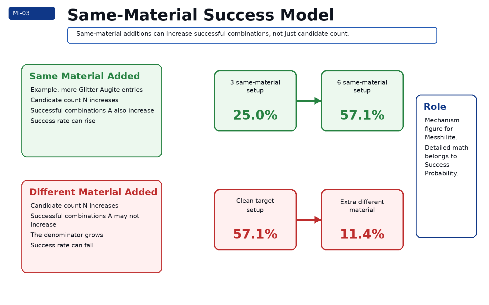
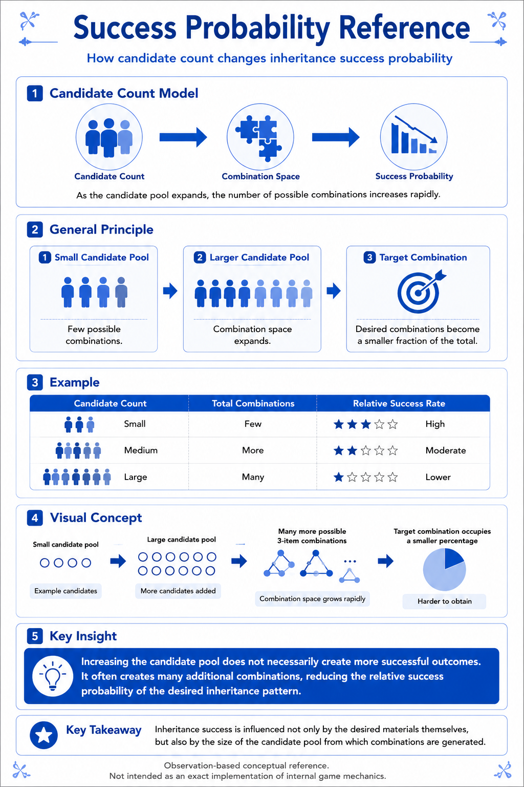
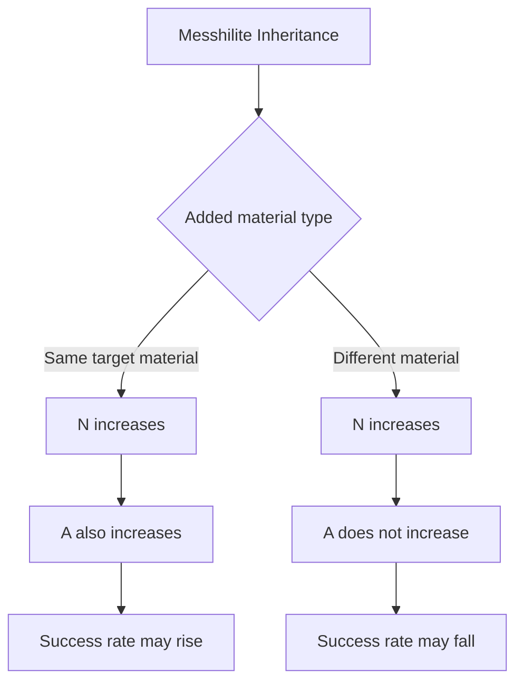
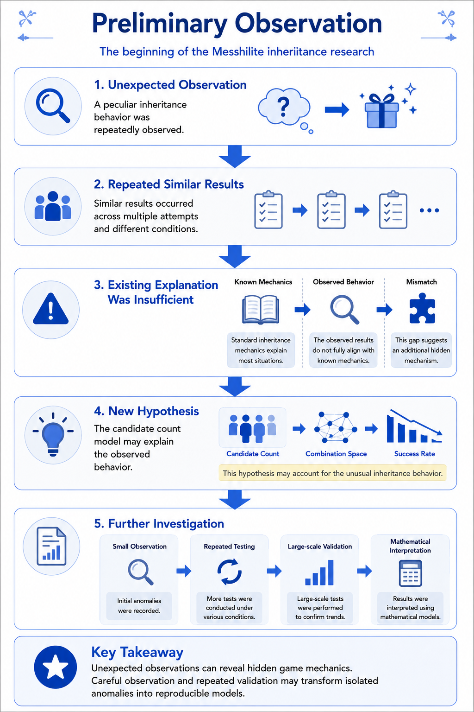
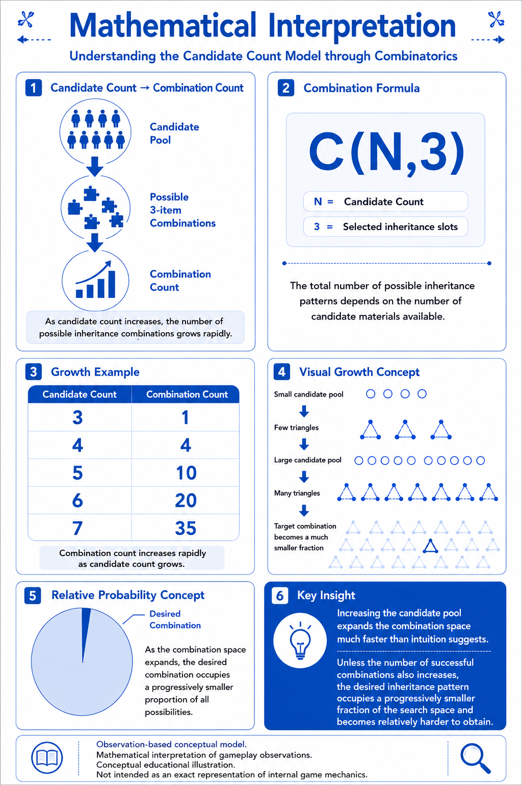

# Messhilite Inheritance

## Overview

Messhilite Inheritance is an observation-based research topic describing inheritance behavior observed when Messhilite is incorporated into inheritance recipes.

This article summarizes one conceptual interpretation derived from repeated gameplay observations and validation experiments.

In this repository, Messhilite Inheritance is treated as a validation interface for the Candidate Count Model rather than as an isolated mechanic.

---

## Why It Matters

Messhilite matters because it gives a relatively clear way to observe how candidate count and successful combinations may affect inheritance success.

The key observation is that adding materials does not always have the same meaning.

```text
Same target material added
        ↓
Candidate count increases
        ↓
Successful combinations may also increase
        ↓
Success rate may rise

Different material added
        ↓
Candidate count increases
        ↓
Successful combinations may not increase
        ↓
Success rate may fall
```

This makes Messhilite useful for testing whether observed gameplay results are consistent with candidate-count / combination-space explanations.

Validation in this context does not mean proof. It means checking whether repeated observations are consistent with the proposed conceptual model.

---

## Representative Figure


*Conceptual illustration of one possible Messhilite inheritance mechanism.*

This path intentionally uses `../images/messhilite-inheritance/` rather than `../images/candidate-count-model/`.

The repository uses Article-centric Asset Management: each article should normally refer to its own article asset folder, even when a similar figure also appears elsewhere.

---

## Same Material vs Different Material



*Same-material additions may increase both candidate count and successful combinations.*



*Different-material additions may increase candidate count without increasing the number of successful combinations.*

---

## Mermaid Source Concept



---

## Preliminary Observation



*Preliminary observations suggested that same-material stacking and different-material addition may behave differently.*

Early observations were not treated as proof. They were treated as a reason to perform larger validation trials.

---

## Validation Results


*Validation results summarize repeated observations that are consistent with the Candidate Count Model.*

The current RF5 validation dataset contains 4,000 total trials.

| Condition | Trials | Successes | Observed Rate | Reference Model |
|---|---:|---:|---:|---:|
| 3-stack | 1,000 | 250 | 25.0% | 25.0% |
| 4-stack | 1,000 | 387 | 38.7% | 40.0% |
| 5-stack | 1,000 | 519 | 51.9% | 50.0% |
| 6-stack | 1,000 | 571 | 57.1% | 57.1% |

The main purpose of this validation was not to prove internal game code. The purpose was to check whether the model was strong enough to support the rest of the Candidate Count interpretation.

---

## Mathematical Interpretation



*Mathematical interpretation connects observed Messhilite results to candidate count and combination space.*

A simplified expression used by the repository is:

```text
P ≈ A / C(N,3)
```

Where:

- `N` is the number of candidates;
- `C(N,3)` is the number of possible three-slot combinations;
- `A` is the number of combinations that satisfy the target condition.

For example, `20 / 35 = 57.1%` is easier to verify than a purely symbolic explanation and still connects naturally to `C(6,3) / C(7,3)`.

---

## Practical Implications

Messhilite Inheritance suggests that players should distinguish between:

- adding more of the same target material;
- adding different materials that only increase the candidate pool;
- preserving a clean candidate structure;
- blindly adding useful-looking materials.

In practical terms, success may improve when the added material increases successful combinations, but success may drop sharply when the added material only increases `N`.

---

## Relationship to Candidate Count Model

Messhilite Inheritance is not the root model.

It is a validation interface.

```text
Candidate Count Model
        ↓
Success Probability Model
        ↓
Messhilite Validation
        ↓
Observed consistency check
```

This article should therefore point to the Candidate Count Model as the conceptual root, while keeping its own images under `images/messhilite-inheritance/` for article independence.

---

## Validation Documents

Readers interested in experimental methodology and aggregated results may refer to the following supplementary validation documents.

**Note:** PDF documents are currently available in Japanese only.

- [Validation Methodology](../research/01_検証方法.pdf)
- [Validation Results Summary](../research/02_集計結果.pdf)
- [Integrated Validation Data](../research/07_統合データ.csv)

---

## Detailed Research PDF

This article provides an English overview only.

Detailed observations, validation results, statistical discussion, confidence intervals, experimental design, and additional interpretation are documented in the accompanying research archive.

- [Messhilite Inheritance Analysis](../pdf/08_メッシライト継承解析.pdf)

---

## Related Articles

### Research Root

- [Candidate Count Model](Candidate-Count-Model.md)

### Related Mechanics

- [Success Probability](Success-Probability.md)
- [Auto Arrange](Auto-Arrange.md)
- [Recursive Processing](Recursive-Processing.md)
- [Self Contamination](Self-Contamination.md)

---

## Notes

This article describes an observation-based model. It should not be read as a definitive implementation claim.

---

## Navigation

- [Back to Articles](README.md)
- [Back to ROADMAP](../ROADMAP.md)
- [Back to Repository README](../README.md)
