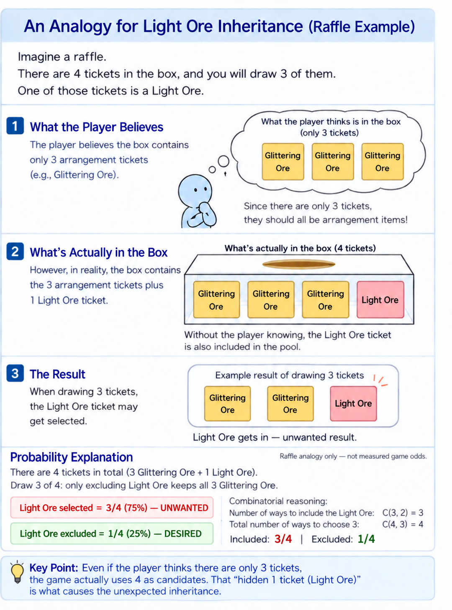
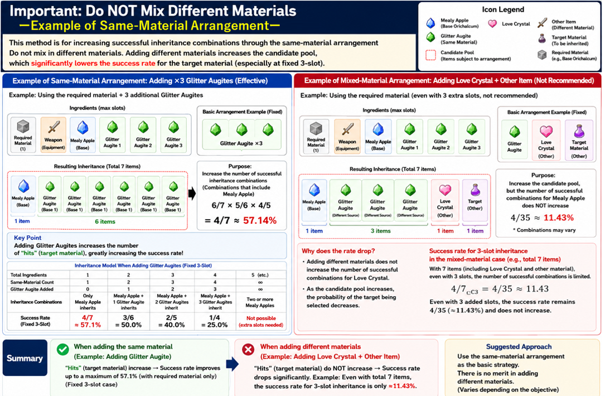
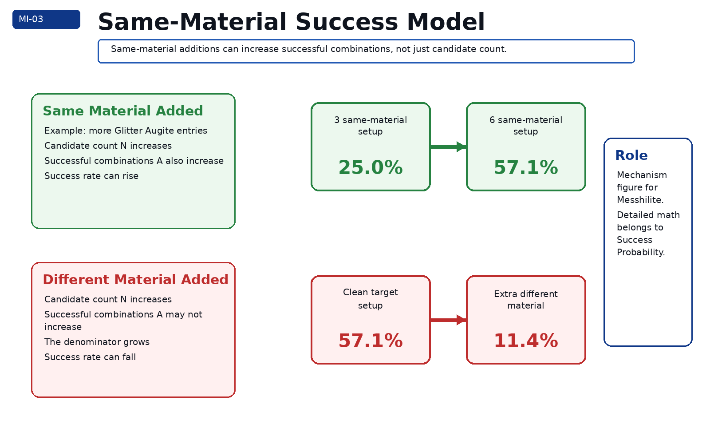
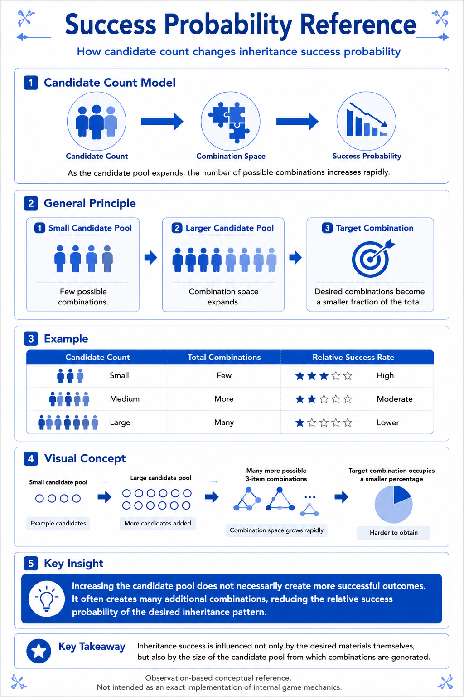
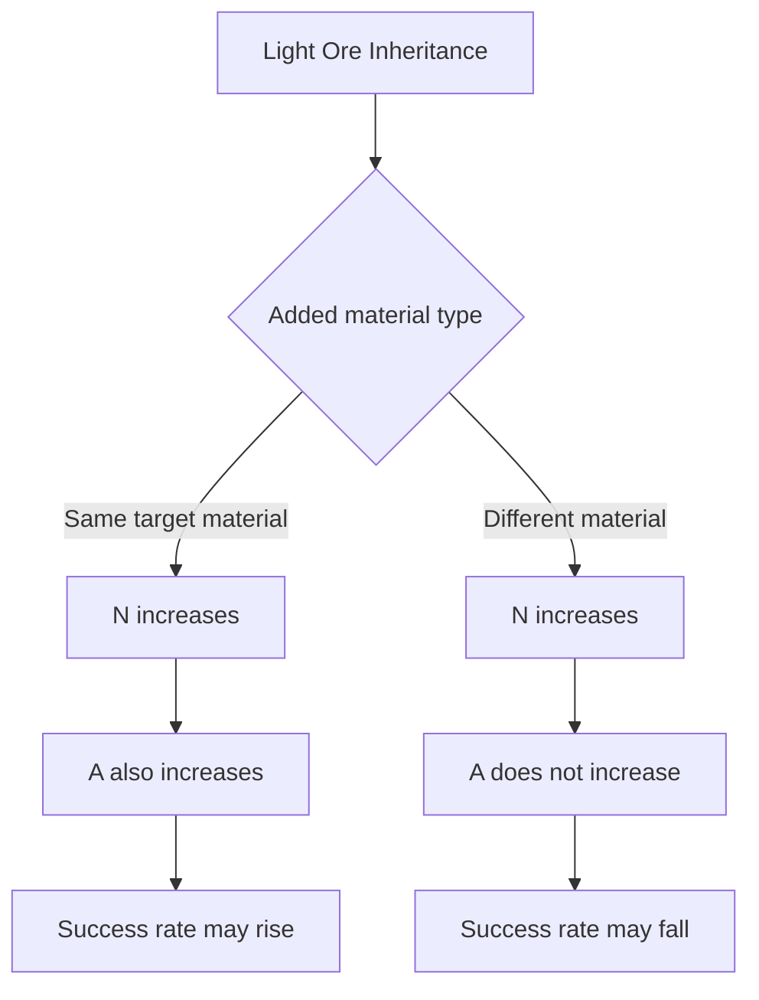
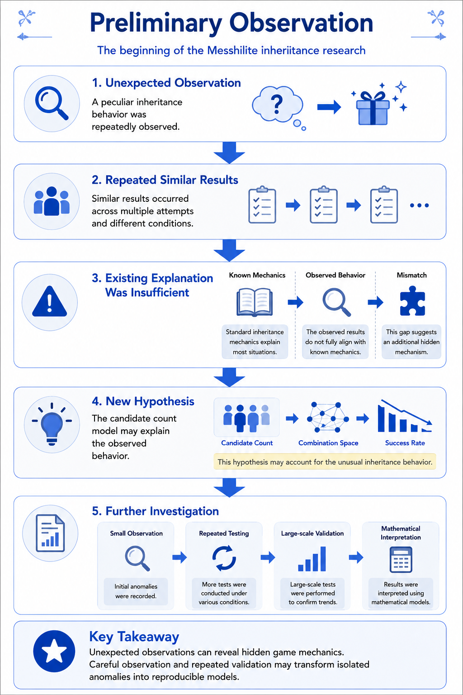
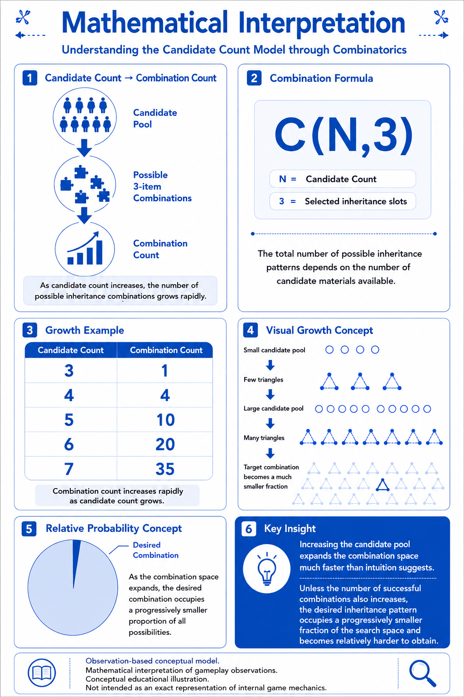

# Light Ore Inheritance

## Overview

Light Ore Inheritance (historical research label: Messhilite Inheritance) is an observation-based research topic describing inheritance behavior observed when Light Ore is incorporated into inheritance recipes.

This article summarizes one conceptual interpretation derived from repeated gameplay observations and validation experiments.

In this repository, Light Ore Inheritance is treated as a validation interface for the Candidate Count Model rather than as an isolated mechanic.

---

## Why It Matters

Light Ore matters because it gives a relatively clear way to observe how candidate count and successful combinations may affect inheritance success.

The key observation is that adding materials does not always have the same meaning.

```text
Same target material added
        ↓
Candidate count increases
        ↓
Successful combinations may also increase
        ↓
Success rate may rise

Different material added
        ↓
Candidate count increases
        ↓
Successful combinations may not increase
        ↓
Success rate may fall
```

This makes Light Ore useful for testing whether observed gameplay results are consistent with candidate-count / combination-space explanations.

Validation in this context does not mean proof. It means checking whether repeated observations are consistent with the proposed conceptual model.

---

## Raffle Analogy: From Three Visible Candidates to Four Candidates

> **Terminology note:** Some figures in this article retain the historical research label **Messhilite**. The current English item name used in this repository is **Light Ore**.



The `1/4` probability shown in the illustration belongs to the simplified equal-draw raffle example. It illustrates the combination space and should not be read as evidence that the game selects every candidate or subset with equal probability under all conditions.

This raffle analogy offers an intuitive way to read the Candidate Count interpretation used in this article. Rather than treating the three visible inheritance candidates as the entire candidate set, the explanatory model also counts Light Ore, producing a four-candidate structure.

With a three-slot selection limit, a four-candidate structure creates multiple possible three-candidate combinations. The desired result therefore becomes one possible outcome among several, which helps explain why a reset or repeated attempt may be required in some routes.

The figure is an analogy and explanatory model based on gameplay observations. It does not establish that the game internally performs a literal raffle, nor does it prove the internal implementation of Light Ore inheritance.

The later RF4SP observations provide a concrete reason for keeping this distinction: four possible candidate subsets do not necessarily imply four equally likely outcomes.

---

## Representative Figure



*Conceptual illustration of one possible Light Ore inheritance mechanism.*

This path intentionally uses `../images/messhilite-inheritance/` rather than `../images/candidate-count-model/`.

The repository uses Article-centric Asset Management: each article should normally refer to its own article asset folder, even when a similar figure also appears elsewhere.

---

## Same Material vs Different Material



*Same-material additions may increase both candidate count and successful combinations.*



*Different-material additions may increase candidate count without increasing the number of successful combinations.*

---

## Mermaid Source Concept


```mermaid
flowchart TD
    A[Light Ore Inheritance] --> B{Added material type}
    B -->|Same target material| C[N increases]
    C --> D[A also increases]
    D --> E[Success rate may rise]
    B -->|Different material| F[N increases]
    F --> G[A does not increase]
    G --> H[Success rate may fall]
```

---

## Preliminary Observation



*Preliminary observations suggested that same-material stacking and different-material addition may behave differently.*

Early observations were not treated as proof. They were treated as a reason to perform larger validation trials.

---

## Validation Results


*Validation results summarize repeated observations that are consistent with the Candidate Count Model.*

The current RF5 validation dataset contains 4,000 total trials.

| Condition | Trials | Successes | Observed Rate | Reference Model |
|---|---:|---:|---:|---:|
| 3-stack | 1,000 | 250 | 25.0% | 25.0% |
| 4-stack | 1,000 | 387 | 38.7% | 40.0% |
| 5-stack | 1,000 | 519 | 51.9% | 50.0% |
| 6-stack | 1,000 | 571 | 57.1% | 57.1% |

The main purpose of this validation was not to prove internal game code. The purpose was to check whether the model was strong enough to support the rest of the Candidate Count interpretation.

---

## RF4SP Selection Boundary

Later RF4SP observations revealed an important limitation of simple equal-probability interpretations.

In a separate ordering experiment, six candidate materials were tested across 200 valid three-candidate trials.

The observed ordering was strongly non-uniform and was closely associated with candidate identity. Across the tested materials, all 15 pairwise majority directions fit one overall ordering axis rather than behaving like uniform random placement.

A common-strength model fitted to those ordering observations also predicted the selection distribution of two separate 4→3 overflow Scouts reasonably well without being refitted to those Scout results. The held-out Scouts contained 20 total trials, and the model substantially outperformed a uniform 25%-per-candidate baseline.

This provides strong evidence that, under these RF4SP conditions:

> Candidate Count alone does not determine Candidate Selection Probability.

It also strongly supports that Ordering and 4→3 Selection share a predictive candidate-identity-associated structure under the tested RF4SP conditions.

However, the internal processing route remains unknown. The current data do **not** establish whether:

- candidates are ordered first and then truncated;
- Selection and Ordering use separate but correlated processes;
- both processes reference a common latent priority or strength;
- some other internal process produces the same observations.

These remain open questions. The fitted strength values are predictive model parameters, not confirmed game-internal parameters.

### Practical Meaning

The primary Candidate Count strategy is to reduce unnecessary competition whenever possible.

Light Ore inheritance is more difficult because the competition created by Light Ore cannot always be removed completely.

In those cases, the practical strategy becomes:

> redesign the candidate set so that the remaining competition is as favorable as possible.

The RF4SP observations add an important caution:

> if candidate identities differ substantially, four possible subsets should not automatically be treated as four equally likely outcomes.

This matters most when Light Ore inheritance must operate with an unavoidable overflow condition.

### Major Practical Cases

The RF4SP selection asymmetry does not mean that all previously observed Light Ore inheritance rates are invalid.

In the existing Love Crystal and Glitter Augite validation conditions, the observed success rates remained broadly consistent with the Candidate Count-based reference model.

RF4SP validation using both Love Crystal and Glitter Augite under the tested 3-stack and 6-stack conditions did not show a statistically significant deviation from the reference expectations.

This suggests that Candidate Count-based probability approximations may remain practically useful for some candidate compositions.

However, this should not be generalized into:

> same category = equal probability

or:

> similar materials always share the same selection strength.

Why some candidate identities behave similarly while others differ strongly remains unknown.

---

## Mathematical Interpretation



*Mathematical interpretation connects observed Light Ore results to candidate count and combination space.*

A simplified expression used by the repository is:

```text
P ≈ A / C(N,3)
```

Where:

- `N` is the number of candidates;
- `C(N,3)` is the number of possible three-slot combinations;
- `A` is the number of combinations that satisfy the target condition.

For example, `20 / 35 = 57.1%` is easier to verify than a purely symbolic explanation and still connects naturally to `C(6,3) / C(7,3)`.

This expression is an approximation framework for conditions where the relevant successful combinations can be treated under the stated probability assumptions.

RF4SP observations show that candidate-specific selection asymmetry can violate a simple equal-probability interpretation even when the combination space itself is correctly counted.

---

## Practical Implications

Light Ore Inheritance suggests that players should distinguish between:

- adding more of the same target material;
- adding different materials that only increase the candidate pool;
- preserving a clean candidate structure;
- blindly adding useful-looking materials.

In practical terms, success may improve when the added material increases successful combinations, but success may drop sharply when the added material only increases `N`.

---

## Weapon Category and Shield Effects

Repeated gameplay observations in RF4SP and RF5 suggest that Light Ore inheritance may preserve not only the source weapon's performance, but also a category-dependent property used for shield-effect calculation.

| Performance source | Final weapon appearance | Shield effect |
|---|---|---|
| Claymore / two-handed sword | Dual blades | Applied |
| Dual blades | One-handed sword | Not applied |

Under the tested conditions, shield effectiveness followed the weapon category of the performance source rather than the visible category of the completed weapon.

This observation is limited to shield-effect behavior. It does not by itself establish that all weapon-category-dependent mechanics use the same inherited category.

---

## Relationship to Candidate Count Model

Light Ore Inheritance is not the root model.

It is a validation interface.

```text
Candidate Count Model
        ↓
Success Probability Model
        ↓
Light Ore Validation
        ↓
Observed consistency check
```

This article should therefore point to the Candidate Count Model as the conceptual root, while keeping its own images under `images/messhilite-inheritance/` for article independence.

---

## Validation Documents

Readers interested in the experimental methodology, aggregated results, or raw validation data may refer to the following supplementary materials.

English-language PDFs are available in the [English PDF Edition](../pdf/english_edition/). The links below point to the Japanese primary research archive.

### Additional Research Materials

- [Validation Methodology](../research/01_検証方法.pdf)
- [Validation Results Summary](../research/02_集計結果.pdf)
- [Integrated Validation Data](../research/07_統合データ.csv)

### Research Repository

- [Research Archive](../research)

---

## Detailed Research PDF

This article provides an English overview only.

Detailed observations, validation results, statistical discussion, confidence intervals, experimental design, and additional interpretation are documented in the accompanying research archive.

- [Light Ore Inheritance Analysis](../pdf/08_メッシライト継承解析.pdf)

---

## Practical Tip: Upgrade After Final Inheritance

During testing in RF5, weapon upgrade effects applied through the 9 upgrade slots did not carry over after inheritance under the tested conditions.

If you intend to use Light Ore inheritance, performing weapon upgrades after completing the final inheritance may help avoid unnecessary rework.

---

## Related Articles

### Research Root

- [Candidate Count Model](Candidate-Count-Model.md)

### Related Mechanics

- [Success Probability](Success-Probability.md)
- [Auto Arrange](Auto-Arrange.md)
- [Recursive Processing](Recursive-Processing.md)
- [Performance-Source Contamination](Self-Contamination.md)

---

## Notes

This article describes an observation-based model. It should not be read as a definitive implementation claim.

---

## Navigation

- [Back to Articles](README.md)
- [Back to ROADMAP](../ROADMAP.md)
- [Back to Repository README](../README.md)
