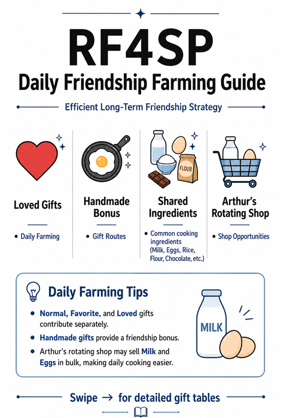
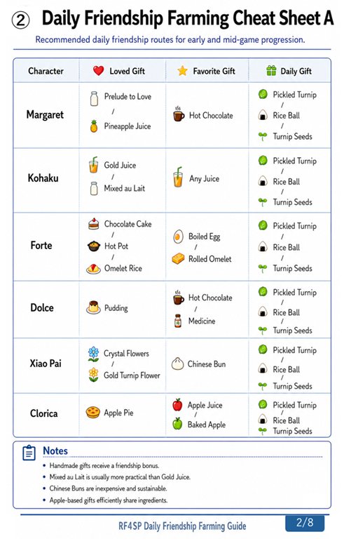
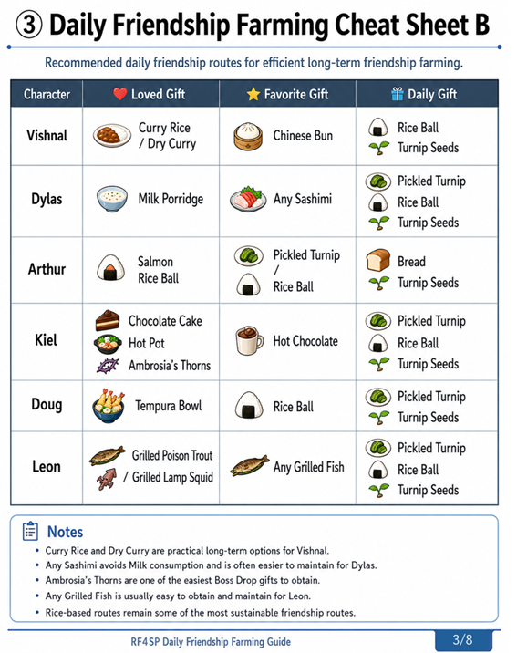
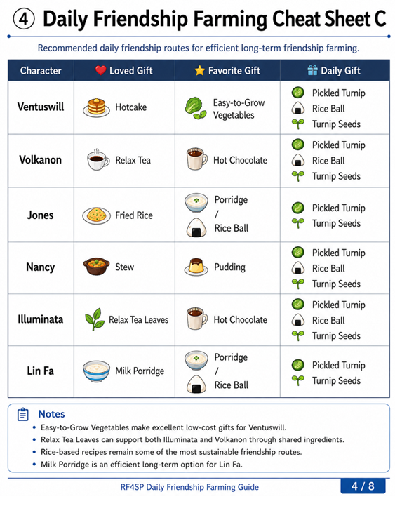
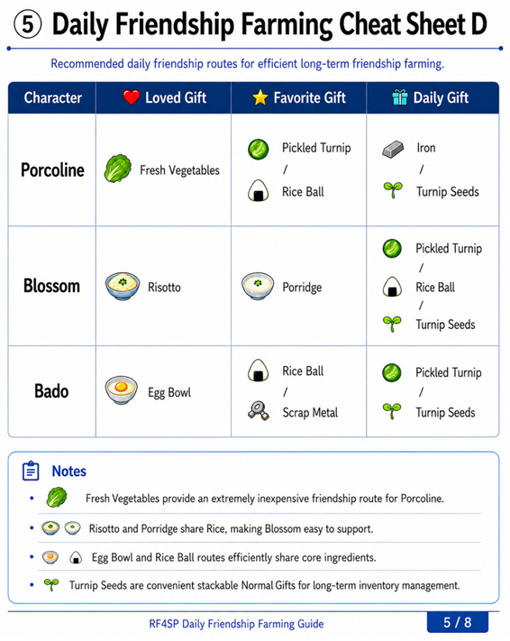
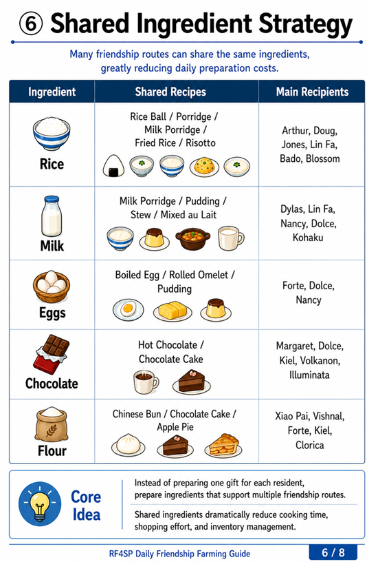
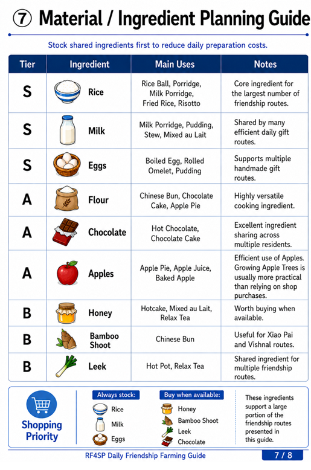
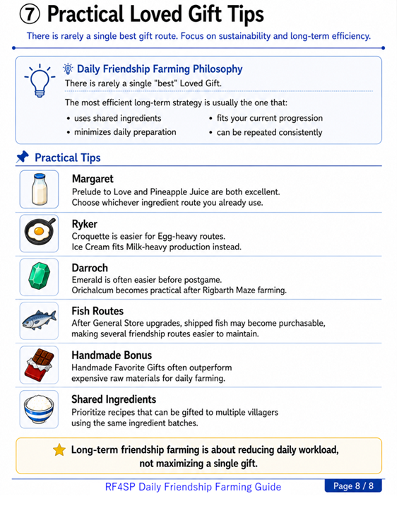

# RF4SP Daily Friendship Farming Guide

## Overview

This guide introduces practical long-term friendship farming routes for **Rune Factory 4 Special**.

Rather than focusing on expensive gifts for individual characters, this guide emphasizes sustainable daily routines based on shared ingredients, handmade gift bonuses, and efficient inventory management.

The goal is to reduce daily preparation time while maintaining steady friendship growth across many residents.

---

## Key Takeaway

Long-term friendship farming is not about finding a single "best" gift.

Instead, it is about building efficient daily routines that:

- reuse common cooking ingredients,
- minimize shopping effort,
- reduce cooking preparation,
- and support multiple friendship routes simultaneously.

This guide presents one practical approach based on repeated gameplay experience.

---

## Infographic

---

## Daily Friendship Routes

### Cheat Sheet A

### Cheat Sheet B

### Cheat Sheet C

### Cheat Sheet D

---

## Shared Ingredient Strategy

---

## Material / Ingredient Planning Guide

---

## Practical Loved Gift Tips

---

## Notes

This guide is based on repeated gameplay experience and practical long-term optimization.

Different players may prefer different gift routes depending on progression, available resources, and personal playstyle.

The routes presented here are intended as sustainable long-term strategies rather than absolute recommendations.

---

## Related Articles

### Core Mechanics

- [Triple Gift Mechanics](./Triple-Gift-Mechanics.md)

### Strategy

- [Efficient Friendship Farming Strategy](./Efficient-Friendship-Farming-Strategy.md)
- [The Hidden Cost of Shipping Everything](./The-Hidden-Cost-of-Shipping-Everything.md)

### Research

- [Candidate Count Model](./Candidate-Count-Model.md)

---

## Navigation

- Back to [README](../README.md)
- Back to [ROADMAP](../ROADMAP.md)
