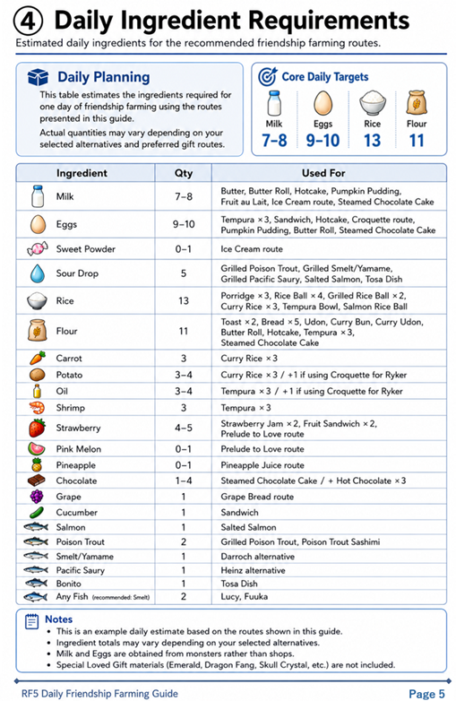
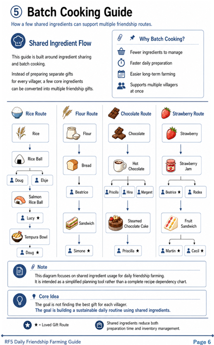
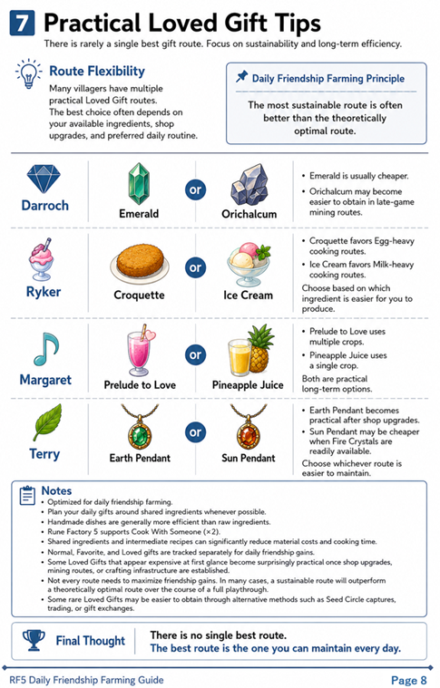

# RF5 Daily Friendship Farming Guide

Efficient Long-Term Friendship Strategy

---

# Overview

This guide focuses on efficient long-term friendship farming in **Rune Factory 5**.

Rather than optimizing a single gift for each villager, this guide emphasizes:

- Shared ingredients
- Batch cooking
- Handmade gift bonuses
- Daily sustainability
- Long-term preparation efficiency

The goal is to reduce preparation time while maintaining consistent friendship growth across many villagers.

---

# Key Takeaway

The best friendship route is rarely the one with the highest theoretical Friendship Points.

Instead, efficient daily farming comes from:

- Sharing ingredients between villagers
- Preparing intermediate recipes in batches
- Using practical Loved Gifts when infrastructure is established
- Choosing routes that are sustainable every day

---

# Daily Gift Farming Guide

Shared ingredients can support multiple villagers simultaneously.

Planning around ingredient overlap significantly reduces both cooking time and material costs.

---

# Optional Daily Alternatives

Alternative routes may require fewer rare materials or better match late-game resource abundance.

The optimal route depends on your available ingredients and preferred daily routine.

---

# Special Loved Gifts

Many expensive-looking Loved Gifts become surprisingly practical once mining routes, shop upgrades, or crafting infrastructure have been established.

---

# Daily Ingredient Requirements

This ingredient list represents one example daily farming route.

Actual material consumption varies depending on optional gift selections and preferred alternatives.

---

# Batch Cooking Guide

Batch cooking allows a small number of shared ingredients to support multiple friendship routes.

Preparing intermediate recipes in advance greatly simplifies long-term daily farming.

---

# Cook With Someone Recommendations

Cook With Someone (×2) is especially valuable for recipes that:

- consume large amounts of Milk or Eggs
- support multiple friendship routes
- require expensive intermediate recipes

Using this feature strategically can significantly reduce daily preparation costs.

---

# Practical Loved Gift Tips

Many villagers have multiple practical Loved Gift routes.

Rather than pursuing a single theoretically optimal gift, selecting recipes that match your available resources often results in a more sustainable daily routine.

---

# Notes

- Normal, Favorite, and Loved gifts contribute separately to daily friendship gains.
- Handmade gifts receive an additional friendship bonus.
- Shared ingredients and batch cooking reduce preparation costs.
- Shop upgrades and mining routes may dramatically change long-term gift efficiency.
- The most sustainable route often outperforms the theoretically optimal route over an entire playthrough.

---

# Related Articles

- Triple Gift Mechanics
- The Hidden Cost of Shipping Everything
- Efficient Friendship Farming Strategy

---

# Navigation

← Efficient Friendship Farming Strategy

→ RF4SP Daily Friendship Farming Guide
