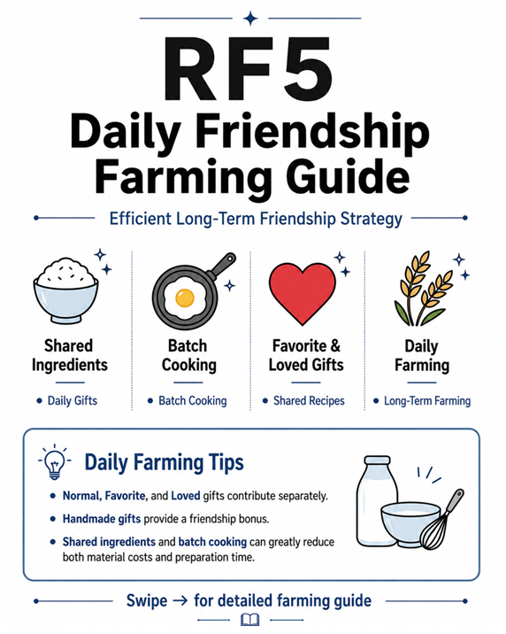
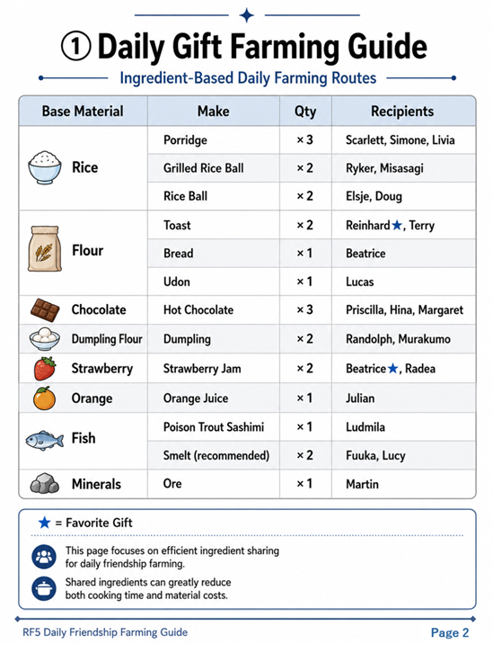
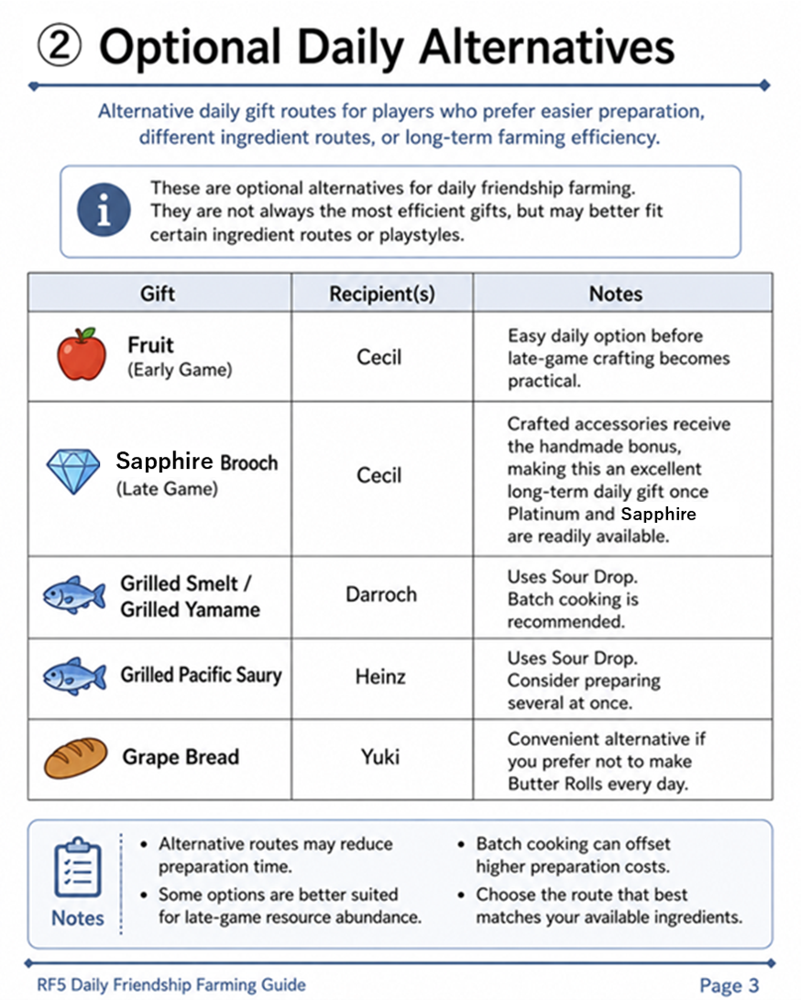
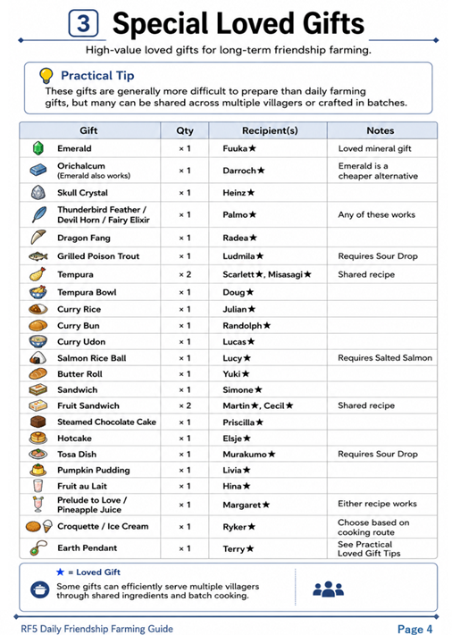
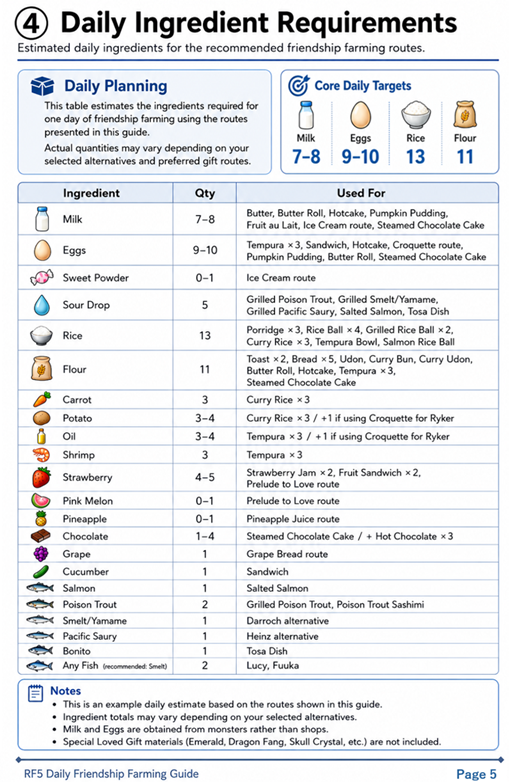
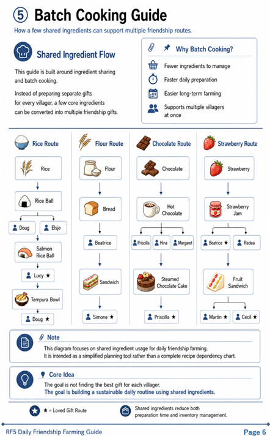
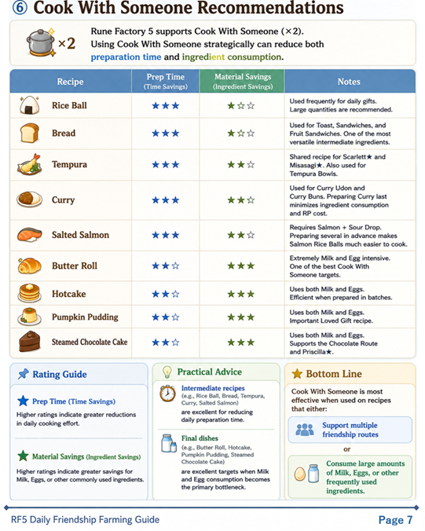
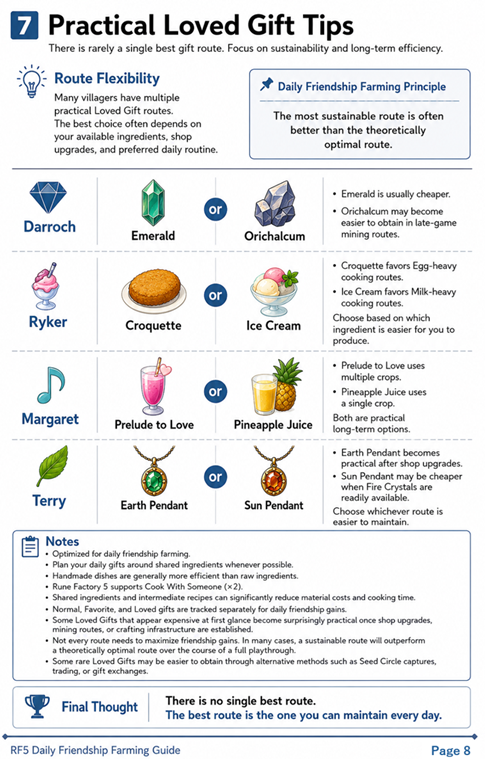

# RF5 Daily Friendship Farming Guide

Efficient Long-Term Friendship Strategy

---

# Overview

This guide focuses on efficient long-term friendship farming in **Rune Factory 5**.

Rather than optimizing a single gift for each villager, this guide emphasizes:

- Shared ingredients
- Batch cooking
- Handmade gift bonuses
- Daily sustainability
- Long-term preparation efficiency

The goal is to reduce preparation time while maintaining consistent friendship growth across many villagers.

---

# Key Takeaway

The best friendship route is rarely the one with the highest theoretical Friendship Points.

Instead, efficient daily farming comes from:

- Sharing ingredients between villagers
- Preparing intermediate recipes in batches
- Using practical Loved Gifts when infrastructure is established
- Choosing routes that are sustainable every day

---

## Infographic

---

# Daily Gift Farming Guide

Shared ingredients can support multiple villagers simultaneously.

Planning around ingredient overlap significantly reduces both cooking time and material costs.

---

## Early Game Tips

Before cooking and crafting become available, simple stackable items are often the easiest way to maintain daily friendship.

Practical early-game options include:

- 🌱 Turnip Seeds
- 🍙 Rice Balls
- 🍡 Dumplings
- 🍞 Bread
- 🥒 Pickled Turnips

Unlike handmade dishes, these items **do not receive the handmade friendship bonus**. However, in my own playthrough, I found the difference to be relatively small in practice, so I usually used **Turnip Seeds** as my standard daily gift because they were inexpensive, stackable, and convenient to carry.

That said, I still tried to use **handmade gifts whenever giving Favorite or Loved Gifts**, since those gifts provide much larger friendship gains and benefit more from the handmade bonus.

Some of these stackable items overlap with villagers' Favorite Gifts shown in the Daily Gift Farming Guide.

If you are already giving a villager their Favorite Gift, consider using a different stackable item instead.

For example:

- **Reinhard** already receives Iron as a Favorite Gift in this guide, so Rice Balls, Bread, or another stackable gift may be a better choice than Turnip Seeds.
- **Fuuka dislikes Pickled Turnips**, so avoid using them as a universal daily gift.

Once cooking and crafting become available, the shared-ingredient routes in this guide generally become the more efficient long-term strategy.

---

# Optional Daily Alternatives

Alternative routes may require fewer rare materials or better match late-game resource abundance.

The optimal route depends on your available ingredients and preferred daily routine.

---

# Special Loved Gifts

Many expensive-looking Loved Gifts become surprisingly practical once mining routes, shop upgrades, or crafting infrastructure have been established.

---

# Daily Ingredient Requirements

This ingredient list represents one example daily farming route.

Actual material consumption varies depending on optional gift selections and preferred alternatives.

---

# Batch Cooking Guide

Batch cooking allows a small number of shared ingredients to support multiple friendship routes.

Preparing intermediate recipes in advance greatly simplifies long-term daily farming.

---

# Cook With Someone Recommendations

Cook With Someone (×2) is especially valuable for recipes that:

- consume large amounts of Milk or Eggs
- support multiple friendship routes
- require expensive intermediate recipes

Using this feature strategically can significantly reduce daily preparation costs.

---

# Practical Loved Gift Tips

Many villagers have multiple practical Loved Gift routes.

Rather than pursuing a single theoretically optimal gift, selecting recipes that match your available resources often results in a more sustainable daily routine.

---

# Notes

- Normal, Favorite, and Loved gifts contribute separately to daily friendship gains.
- Handmade gifts receive an additional friendship bonus.
- Shared ingredients and batch cooking reduce preparation costs.
- Shop upgrades and mining routes may dramatically change long-term gift efficiency.
- The most sustainable route often outperforms the theoretically optimal route over an entire playthrough.

---

## Related Articles

- **Core Mechanics**
  - [Triple Gift Mechanics](./Triple-Gift-Mechanics.md)

- **Related Strategy**
  - [Efficient Friendship Farming Strategy](./Efficient-Friendship-Farming-Strategy.md)

- **Related Mechanics**
  - [The Hidden Cost of Shipping Everything](./The-Hidden-Cost-of-Shipping.md)

- **Practical Guides**
  - [RF4SP Daily Friendship Farming Guide](./RF4SP-Daily-Friendship-Farming-Guide.md)

- **Research**
  - [Candidate Count Model](./Candidate-Count-Model.md)

---

## Navigation

- ← Back to [README](../README.md)

- ← Back to [ROADMAP](../ROADMAP.md)

