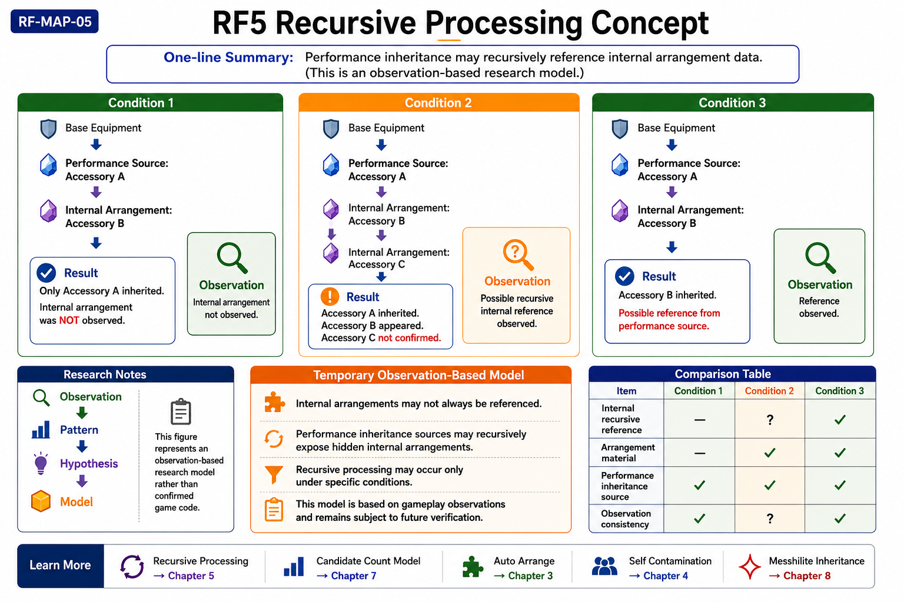
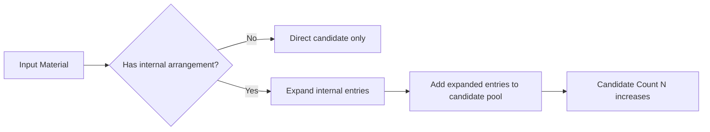
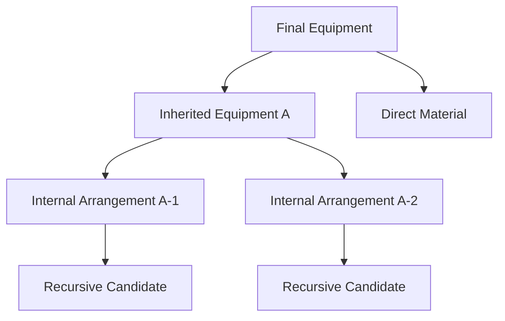
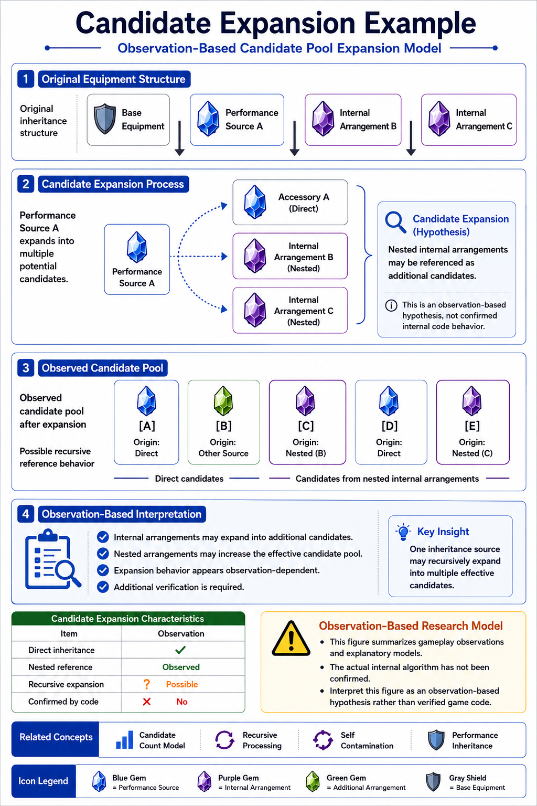
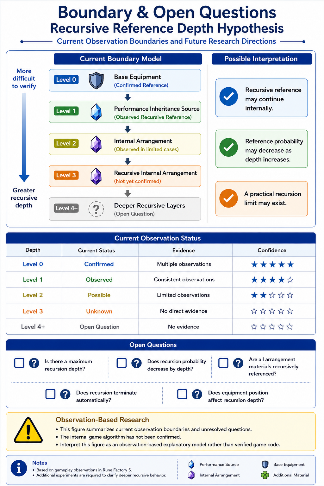

# Recursive Processing

## Overview

Recursive Processing is an observation-based research topic describing situations where internal arrangement information may be referenced again during later inheritance processing.

This article summarizes one conceptual model for explaining inheritance behavior that appears difficult to describe with a flat, one-layer candidate model.

---

## Why It Matters

Recursive Processing matters because it can explain why the effective candidate pool may expand beyond the items that the player directly inserted.

If an inherited item contains internal arrangement information, and that internal information is later referenced, then the candidate pool may expand recursively.

This connects Recursive Processing to:

- Candidate Count Model
- Self Contamination
- Auto Arrange
- Success Probability
- practical high-difficulty inheritance routing

---

## Representative Figures



*Conceptual hypothesis: inherited equipment may carry internal arrangement information that can later affect candidate generation.*


*Observation-oriented figure: some inheritance behavior appears compatible with internal reference or expansion.*

---

## Mermaid Source Concept





---

## Core Mechanism

The working model is:

```text
Inherited equipment
        ↓
Internal arrangement information exists
        ↓
Internal entries are referenced
        ↓
Additional candidates are generated
        ↓
Candidate Count N increases
```

The key distinction is that the inherited item is not treated as a simple single candidate. It may behave as a container that can expose internal entries under certain conditions.

---

## Candidate Expansion Example



*Conceptual example: candidate count may increase when internal entries are expanded.*

This figure is not intended to prove a specific internal implementation. It illustrates why recursive expansion can rapidly increase candidate count and make inheritance outcomes less stable.

---

## Boundary and Open Questions



*Boundary-oriented figure: recursive behavior may be conditional and should not be assumed in every inheritance case.*

Current open questions include:

- when internal arrangement entries are referenced;
- whether different equipment types behave differently;
- whether RF4SP and RF5 differ in recursive depth or candidate handling;
- whether recursive expansion has practical limits;
- how recursive expansion interacts with Self Contamination and Auto Arrange.

---

## Practical Implications

Recursive Processing suggests that high-difficulty inheritance is not only a matter of adding the correct materials.

The player may need to manage:

- source equipment history;
- internal arrangement contents;
- intermediate equipment design;
- candidate count at each crafting stage;
- verification after each important step.

In practical terms, recursive behavior makes intermediate crafting strategy important.

---

## Relationship to Candidate Count Model

Recursive Processing is one candidate-expansion mechanism.

```text
Recursive Processing
        ↓
Internal entries become candidates
        ↓
Candidate Count N increases
        ↓
Combination space expands
        ↓
Success probability may decrease
```

This article should therefore be read as a branch article under the Candidate Count Model rather than as an isolated theory.

---

## Detailed Research PDF

This article provides an English overview only.

Detailed observations, Japanese terminology, test cases, and discussion are documented in the accompanying research archive.

**Note:** PDF documents are currently available in Japanese only.

- [Recursive Processing Analysis](../pdf/05_再帰処理解析.pdf)

---

## Related Articles

### Research Root

- [Candidate Count Model](Candidate-Count-Model.md)

### Related Mechanics

- [Auto Arrange](Auto-Arrange.md)
- [Self Contamination](Self-Contamination.md)
- [Success Probability](Success-Probability.md)
- [Messhilite Inheritance](Messhilite-Inheritance.md)

---

## Notes

This article describes an observation-based model. It should not be read as a definitive implementation claim.

---

## Navigation

- [Back to Articles](README.md)
- [Back to ROADMAP](../ROADMAP.md)
- [Back to Repository README](../README.md)
