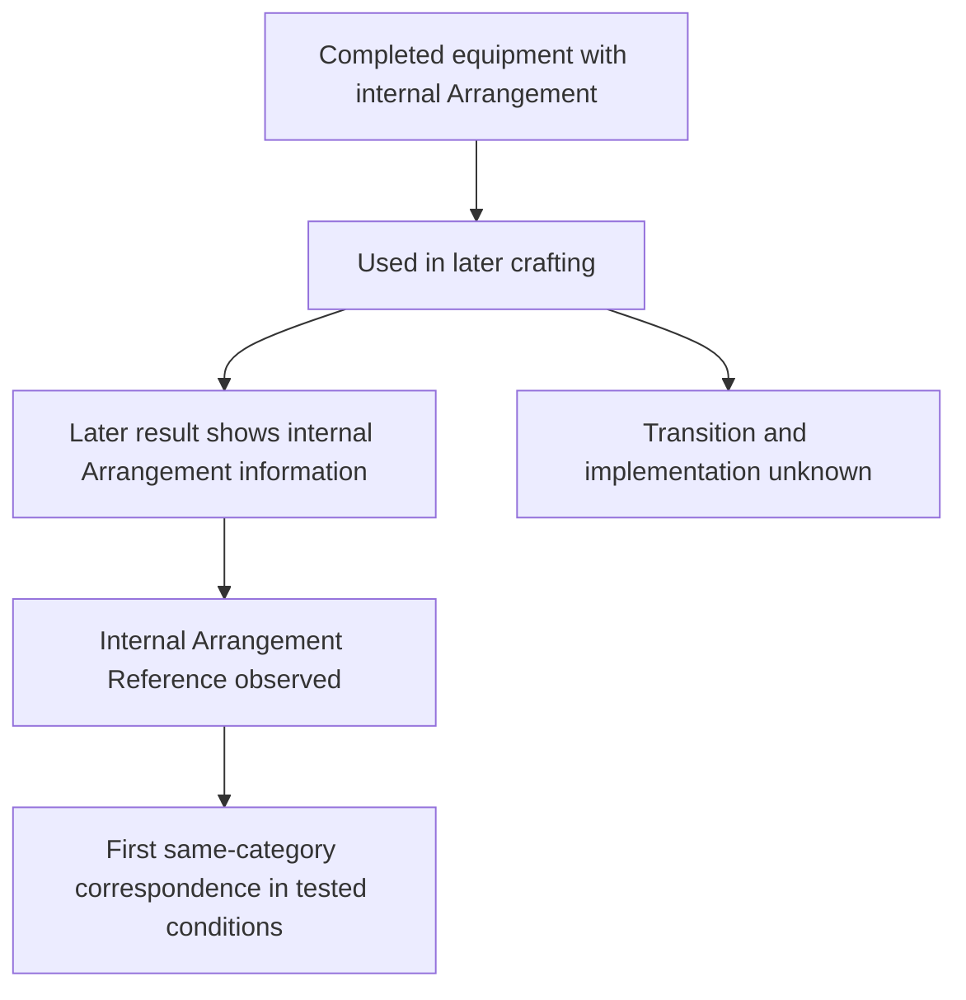
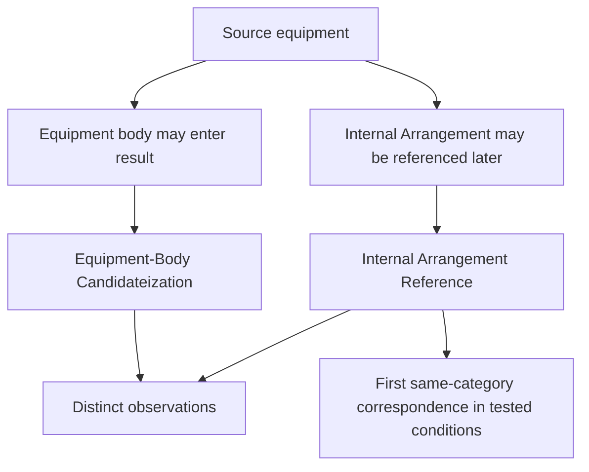

# Internal Arrangement Reference / First Same-Category Internal-Arrangement Reference

> **Current observation:** Internal Arrangement Reference. **Historical filename:** `Recursive-Processing.md` is retained so existing links continue to work. “Recursive Processing” was an earlier interpretation, not a confirmed implementation.

## Observation boundary

In observed inheritance cases, information recorded in a completed equipment item's internal Arrangement appears again in a later crafting result. The observation supports a relationship between the source item's internal Arrangement and the later outcome. It does not, by itself, establish recursive traversal, expansion order, candidate-pool insertion, or the number of internal candidates.

### Observed conditional rule: First Same-Category Internal-Arrangement Reference

In repeated gameplay conditions involving multiple pieces of equipment from the same category, changing their input order changed the reference outcome. The observed result corresponded to internal Arrangement information from the same-category equipment placed first. This is a conditional behavioral rule within Internal Arrangement Reference, supported by the tested input-order conditions; it is not a claim that every recipe or category behaves alike. The observed relationship has also been used operationally in the Shuffle Method. “First” describes the correspondence between input order and the result, not an internal first-match scan.

Equipment-Body Candidateization is a separate observation: the source equipment body may appear as a candidate. A body entering a result does not prove that the body's internal Arrangement was expanded. Conversely, an internal Arrangement reference does not establish the processing path by which the body entered.

## Historical interpretation

Earlier material called this behavior **Recursive Processing** and modeled the source as a container that recursively expands internal entries into a candidate pool, thereby increasing candidate count `N`. That causal sequence is a historical hypothesis. The gameplay observations did not isolate the proposed steps or establish that their order reflects the game's implementation.

**First Same-Category Internal-Arrangement Reference** is now a current observed conditional behavioral rule. It does not restore Recursive Processing as a current mechanism. Why the game produces this first-position correspondence is unknown; first-match scanning, internal category traversal, base selection, and recursive algorithms are not established.

## Observation-side diagrams

```mermaid
flowchart TD
    A[Completed equipment with internal Arrangement] --> B[Used in later crafting]
    B --> C[Later result shows internal Arrangement information]
    C --> D[Internal Arrangement Reference observed]
    D --> F[First same-category correspondence in tested conditions]
    B --> E[Transition and implementation unknown]
```

```mermaid
flowchart TD
    A[Source equipment] --> B[Equipment body may enter result]
    A --> C[Internal Arrangement may be referenced later]
    B --> D[Equipment-Body Candidateization]
    C --> E[Internal Arrangement Reference]
    E --> G[First same-category correspondence in tested conditions]
    D --> F[Distinct observations]
    E --> F
```

The arrows identify a material used and later observations; they do not depict internal execution order. “First” labels an observed input-order/result relationship only.

## Historical figures and source

The following figures are preserved as historical assets. Their labels and any apparent expansion, candidate-pool, or processing-order claims are **historical models**, not current confirmed mechanisms:

- 
- 
- 
- 

The Japanese [Recursive Processing Analysis](../pdf/05_再帰処理解析.pdf) is retained under its physical filename as a historical research PDF. Its title is not current mechanism authority.

## Current unknowns and use

- How broadly the observed first same-category rule applies across recipes, equipment categories, and RF4SP/RF5; the tested order-dependent result is current observation, not an open mechanism question.
- Which conditions allow an internal Arrangement to be referenced in a later result beyond the tested cases?
- How body entry and internal Arrangement reference relate in the same trial.
- Whether RF4SP and RF5 behave alike under matched conditions.
- Whether the effective candidate count changes in a given setup and how it should be measured.

Candidate Count Model remains an active analytical framework for cases whose candidate count is supported by evidence. Internal Arrangement Reference alone does not determine `N`. Verify the outcome at each crafting stage and label any proposed candidate-pool transition as a model or unknown.

Weapon upgrade effects did not carry over under the tested RF5 conditions. That observation does not identify where the upgrade data is stored; the storage mechanism needs separate validation.

## Related articles

- [Candidate Count Model](Candidate-Count-Model.md)
- [Equipment-Body Candidateization](Self-Contamination.md) (historical filename)
- [Auto Arrange](Auto-Arrange.md)
- [Success Probability](Success-Probability.md)
- [Light Ore Inheritance](Messhilite-Inheritance.md)

[Articles](README.md) · [ROADMAP](../ROADMAP.md) · [Repository README](../README.md)
