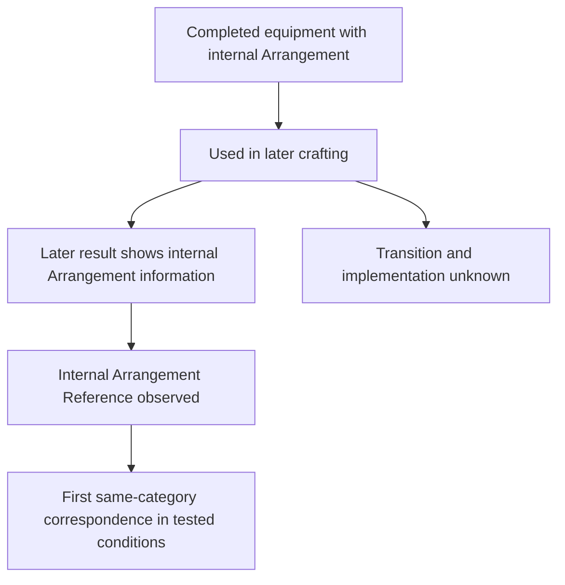
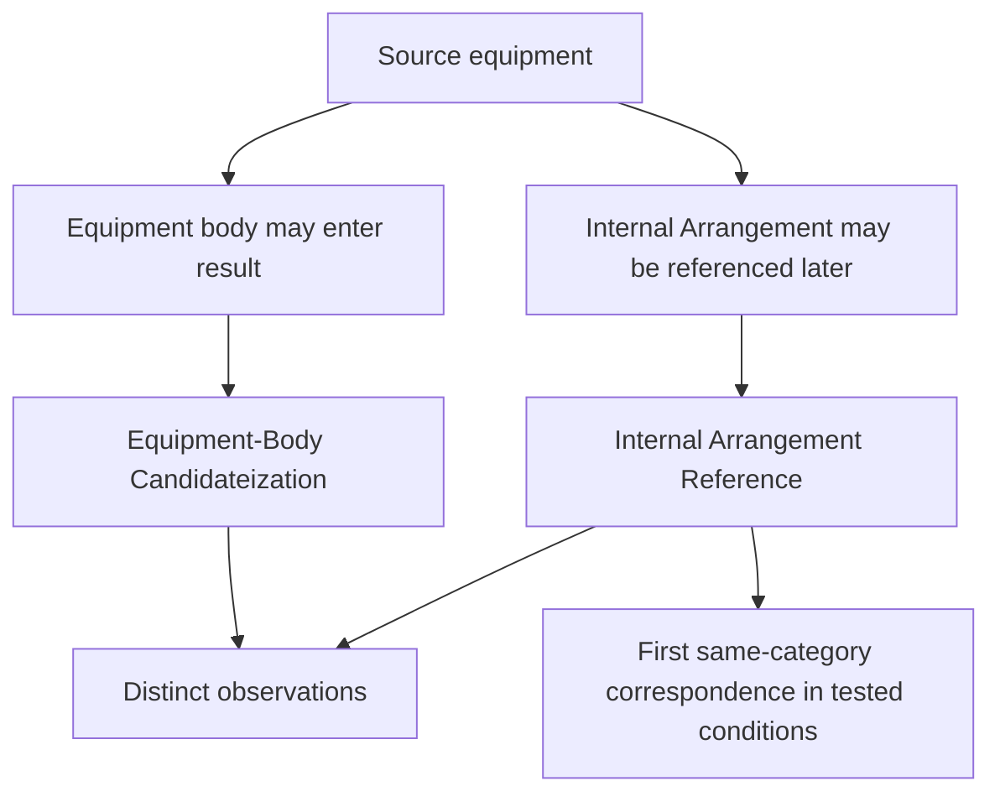
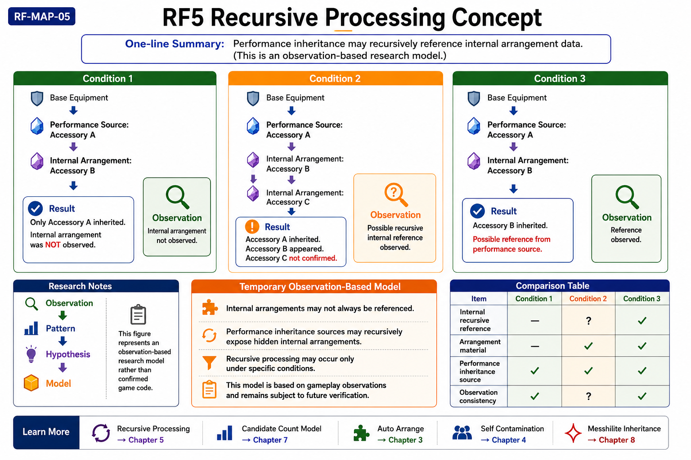
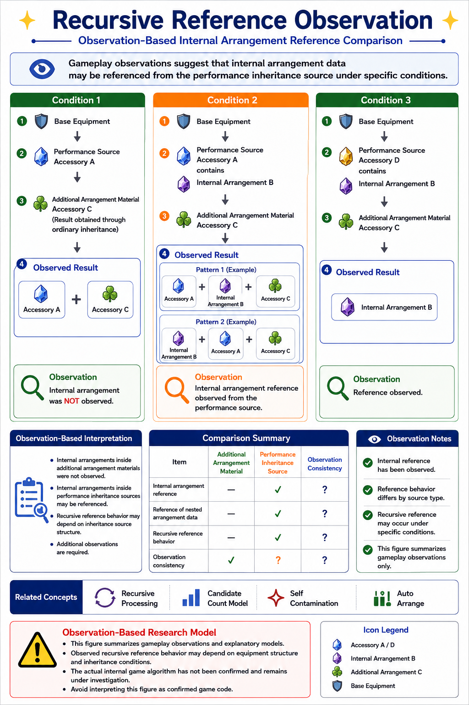
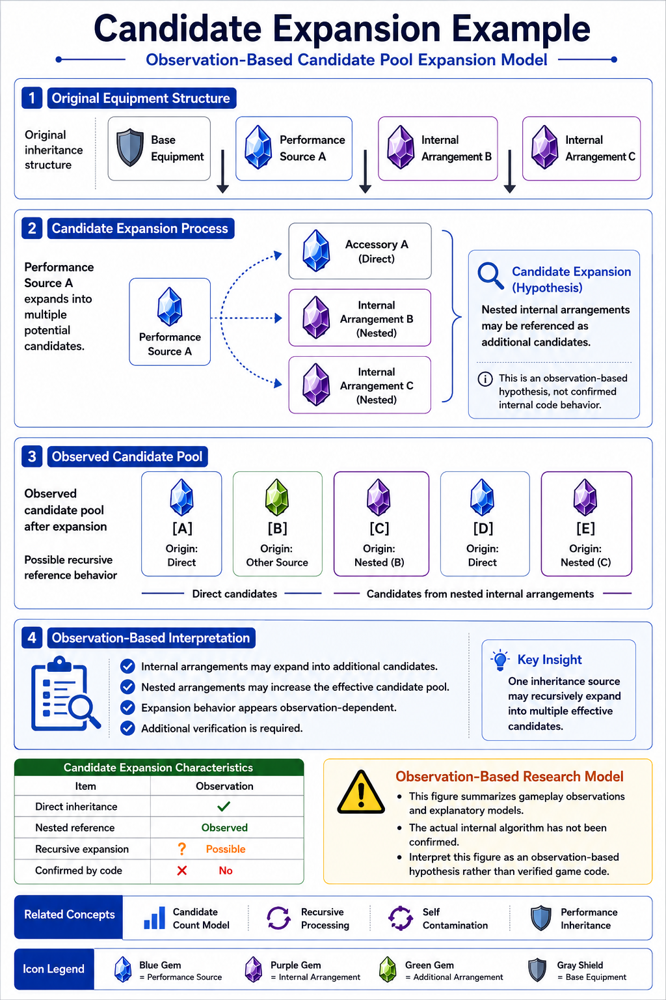
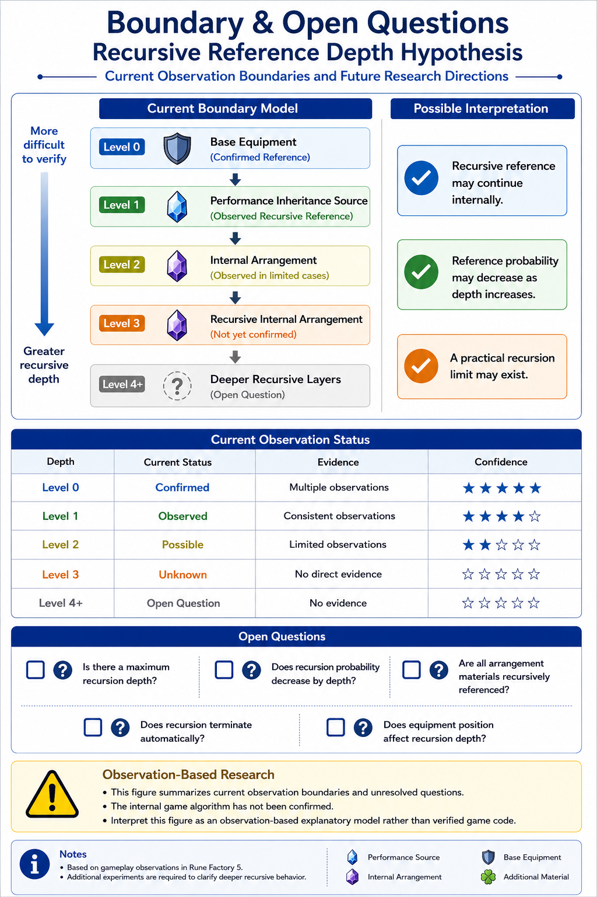

# Internal Arrangement Reference / First Same-Category Internal-Arrangement Reference

> **Current observation:** Internal Arrangement Reference. **Historical filename:** `Recursive-Processing.md` is retained so existing links continue to work. “Recursive Processing” was an earlier interpretation, not a confirmed implementation.

## Observation boundary

In observed inheritance cases, information recorded in a completed equipment item's internal Arrangement appears again in a later crafting result. The observation supports a relationship between the source item's internal Arrangement and the later outcome. It does not, by itself, establish recursive traversal, expansion order, candidate-pool insertion, or the number of internal candidates.

### Observed conditional rule: First Same-Category Internal-Arrangement Reference

In repeated gameplay conditions involving multiple pieces of equipment from the same category, changing their input order changed the reference outcome. The observed result corresponded to internal Arrangement information from the same-category equipment placed first. This is a conditional behavioral rule within Internal Arrangement Reference, supported by the tested input-order conditions; it is not a claim that every recipe or category behaves alike. The observed relationship has also been used operationally in the Shuffle Method. “First” describes the correspondence between input order and the result, not an internal first-match scan.

Equipment-Body Candidateization is a separate observation: the source equipment body may appear as a candidate. A body entering a result does not prove that the body's internal Arrangement was expanded. Conversely, an internal Arrangement reference does not establish the processing path by which the body entered.

## Practical Applications: Shuffle Method and Cushion Method

The observed **First Same-Category Internal-Arrangement Reference** behavior can be used to improve equipment crafting procedures.

Two practical methods developed from this observation are the **Shuffle Method** and the **Cushion Method**.

Both methods aim to reduce unnecessary dependence on random inheritance outcomes. They do not change the desired final equipment effects. Instead, they change how the crafting procedure is arranged.

These methods are based on observed gameplay behavior, not a confirmed account of the game's internal implementation.

### 1. Shuffle Method

**Principle:** Changing the order of equipment from the same category can change which internal Arrangement is referenced.

In tested RF5 crafting conditions, using the same materials in a different order produced different inheritance behavior.

One arrangement required random selection and potentially repeated resets, while another arrangement avoided that particular random-dependent step.

The important difference was not the set of materials used, but their **input order**.

**Practical procedure:**

1. Identify the equipment pieces belonging to the same category.
2. Examine which pieces contain internal Arrangement information.
3. Change their input order to select a more favorable reference outcome.
4. Check the resulting equipment's Arrangement to confirm the effect.

The Shuffle Method does not guarantee deterministic inheritance in every recipe. Its usefulness depends on the tested equipment and crafting conditions.

### 2. Cushion Method

**Principle:** Place a piece of equipment without an internal Arrangement first, allowing it to serve as a cushion against unwanted internal Arrangement references.

In an observed RF5 crafting example involving boots, introducing equipment without an internal Arrangement at the relevant position changed a previously random-dependent crafting step into a reliable one.

This method uses the same first same-category reference behavior as the Shuffle Method, but with a more specific choice of equipment.

**Practical procedure:**

1. Identify a crafting step affected by unwanted internal Arrangement references.
2. Prepare a suitable piece of same-category equipment without an internal Arrangement.
3. Place that equipment first in the relevant same-category order.
4. Add the equipment needed for the desired inheritance result.
5. Verify the resulting Arrangement before proceeding.

The cushion is not simply an arbitrary extra item. Its relevant property is the absence of internal Arrangement information.

Under suitable conditions, this can eliminate one reset-dependent step.

This is an observed operational result, not a universal guarantee.

### 3. Relationship Between the Methods

| Aspect | Shuffle Method | Cushion Method |
|---|---|---|
| Main operation | Reorder same-category equipment | Place equipment without an internal Arrangement first |
| Shared basis | First Same-Category Internal-Arrangement Reference | First Same-Category Internal-Arrangement Reference |
| Primary purpose | Change the referenced Arrangement | Avoid an unwanted Arrangement reference |
| Potential benefit | Reduce unnecessary resets | Convert a random-dependent step into a reliable step |

The Cushion Method can be understood as a specialized application of the same order-dependent observation used by the Shuffle Method.

The methods can also be combined or adapted within more complex crafting procedures.

### 4. Strategic Significance

Equipment inheritance often appears to require several favorable random outcomes to occur together.

However, not every random-dependent step is necessarily unavoidable.

By changing the crafting procedure, it may be possible to remove one or more unnecessary random conditions while preserving the original objective.

This distinction is important:

**The goal is not merely to improve the odds of a difficult random event. It is to determine whether that random event needs to occur at all.**

The Shuffle Method and Cushion Method demonstrate this approach in practical crafting situations.

### 5. Evidence and Limitations

- The order-dependent reference behavior is supported by repeated gameplay observations under tested conditions.
- The Shuffle Method has been demonstrated through RF5 crafting examples using identical materials in different orders.
- The Cushion Method has been demonstrated through an RF5 crafting example in which one random-dependent step was avoided.
- These observations do not establish the game's internal traversal, recursion, or candidate-pool insertion algorithm.
- The methods should not be assumed to behave identically across all recipes, categories, or Rune Factory titles.
- Successful application should be confirmed by inspecting the resulting equipment at each relevant crafting stage.

These methods are practical applications of an observed behavioral rule. They should not be interpreted as proof of a specific internal implementation.

## Historical interpretation

Earlier material called this behavior **Recursive Processing** and modeled the source as a container that recursively expands internal entries into a candidate pool, thereby increasing candidate count `N`. That causal sequence is a historical hypothesis. The gameplay observations did not isolate the proposed steps or establish that their order reflects the game's implementation.

**First Same-Category Internal-Arrangement Reference** is now a current observed conditional behavioral rule. It does not restore Recursive Processing as a current mechanism. Why the game produces this first-position correspondence is unknown; first-match scanning, internal category traversal, base selection, and recursive algorithms are not established.

## Observation-side diagrams

```mermaid
flowchart TD
    A[Completed equipment with internal Arrangement] --> B[Used in later crafting]
    B --> C[Later result shows internal Arrangement information]
    C --> D[Internal Arrangement Reference observed]
    D --> F[First same-category correspondence in tested conditions]
    B --> E[Transition and implementation unknown]
```

```mermaid
flowchart TD
    A[Source equipment] --> B[Equipment body may enter result]
    A --> C[Internal Arrangement may be referenced later]
    B --> D[Equipment-Body Candidateization]
    C --> E[Internal Arrangement Reference]
    E --> G[First same-category correspondence in tested conditions]
    D --> F[Distinct observations]
    E --> F
```

The arrows identify a material used and later observations; they do not depict internal execution order. “First” labels an observed input-order/result relationship only.

## Historical figures and source

The following figures are preserved as historical assets. Their labels and any apparent expansion, candidate-pool, or processing-order claims are **historical models**, not current confirmed mechanisms:

- 
- 
- 
- 

The Japanese [Recursive Processing Analysis](../pdf/05_再帰処理解析.pdf) is retained under its physical filename as a historical research PDF. Its title is not current mechanism authority.

## Current unknowns and use

- How broadly the observed first same-category rule applies across recipes, equipment categories, and RF4SP/RF5; the tested order-dependent result is current observation, not an open mechanism question.
- Which conditions allow an internal Arrangement to be referenced in a later result beyond the tested cases?
- How body entry and internal Arrangement reference relate in the same trial.
- Whether RF4SP and RF5 behave alike under matched conditions.
- Whether the effective candidate count changes in a given setup and how it should be measured.

Candidate Count Model remains an active analytical framework for cases whose candidate count is supported by evidence. Internal Arrangement Reference alone does not determine `N`. Verify the outcome at each crafting stage and label any proposed candidate-pool transition as a model or unknown.

Weapon upgrade effects did not carry over under the tested RF5 conditions. That observation does not identify where the upgrade data is stored; the storage mechanism needs separate validation.

## Related articles

- [Candidate Count Model](Candidate-Count-Model.md)
- [Equipment-Body Candidateization](Self-Contamination.md) (historical filename)
- [Auto Arrange](Auto-Arrange.md)
- [Success Probability](Success-Probability.md)
- [Light Ore Inheritance](Messhilite-Inheritance.md)

[Articles](README.md) · [ROADMAP](../ROADMAP.md) · [Repository README](../README.md)
