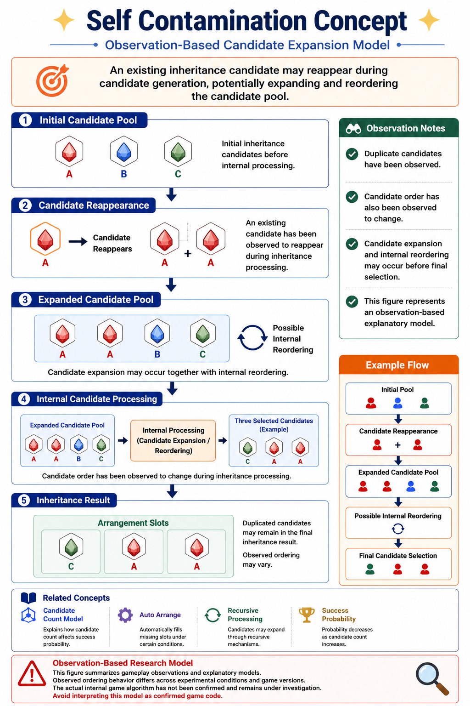
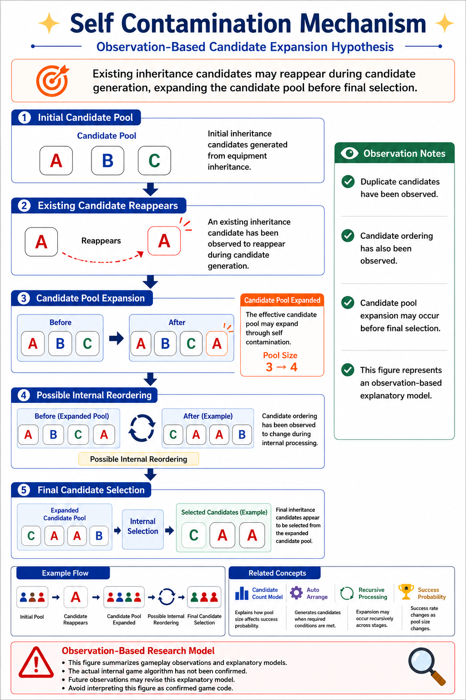
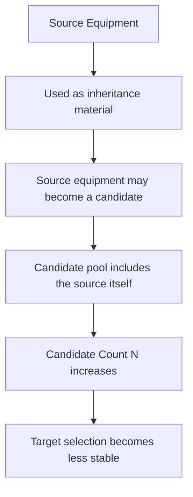
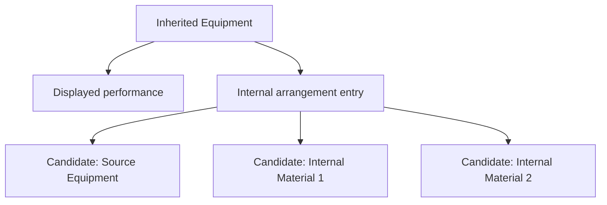
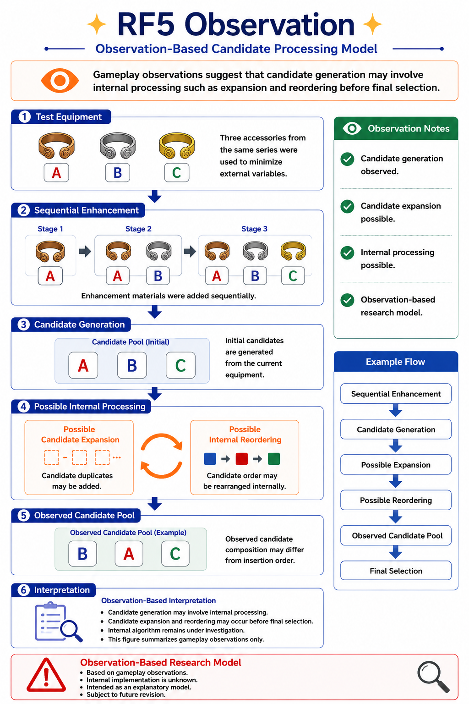
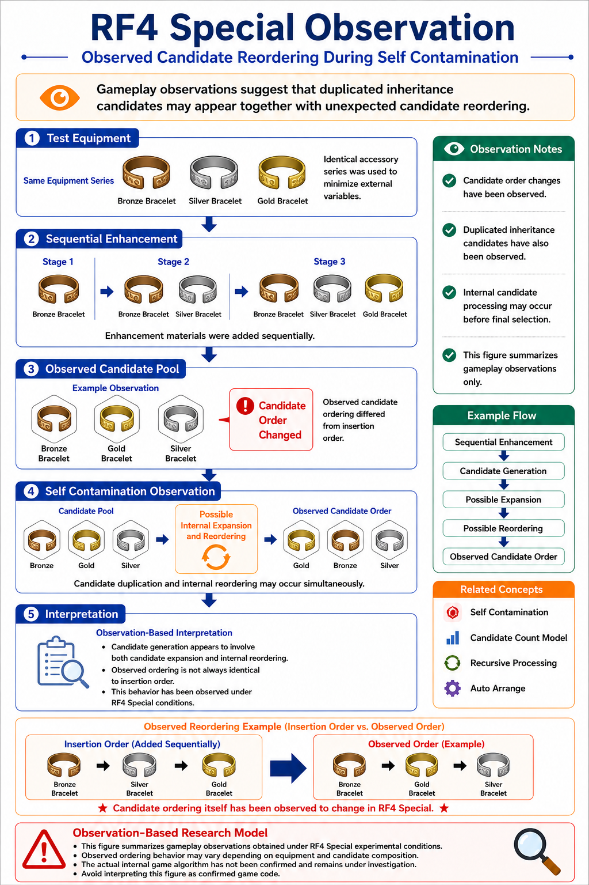
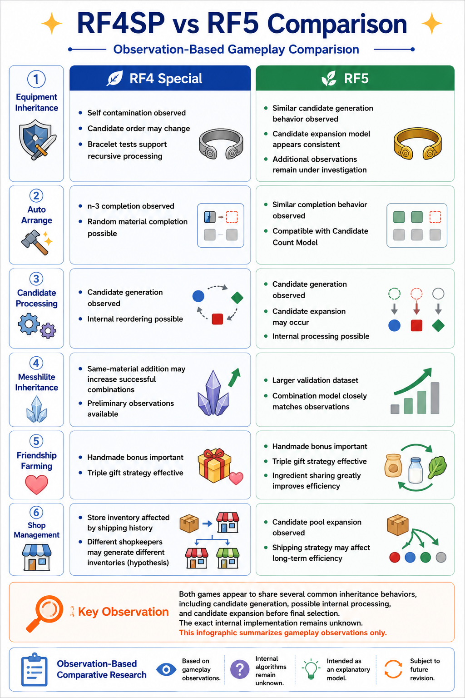

# Self Contamination

## Overview

Self Contamination is an observation-based research topic describing situations where inheritance processing appears to introduce the source equipment itself, or information derived from it, back into the candidate pool.

This article summarizes one conceptual model derived from repeated gameplay observations in Rune Factory 4 Special and Rune Factory 5.

---

## Why It Matters

Self Contamination matters because it can make the candidate pool larger than the player expects.

A player may believe the setup contains only a few intended candidates. However, if the source equipment itself or its internal arrangement entries become candidates, the effective candidate count `N` may increase.

That matters because inheritance success is strongly affected by candidate count.

---

## Representative Figures



*Conceptual illustration: the source equipment or its internal information may re-enter the candidate pool.*



*Mechanism-oriented illustration: self-derived entries can increase candidate count and destabilize selection.*

---

## Mermaid Source Concept





---

## Core Mechanism

The working model is:

```text
Source equipment used for inheritance
        ↓
Source equipment or internal entries become candidates
        ↓
Candidate pool expands
        ↓
Desired three-slot result becomes harder to preserve
```

The important point is that the player may not directly add all of the candidates that later appear relevant to the result. Some candidates may be generated through inheritance structure itself.

---

## Observations

### RF5 observation



*RF5 observation example: self-derived candidate behavior appears to affect inheritance results.*

### RF4SP observation



*RF4SP observation example: similar candidate-expansion behavior may appear under different conditions.*

### RF4SP / RF5 comparison



*Comparison figure: both titles show observations that are compatible with candidate expansion, but the exact behavior may differ by title and equipment category.*

---

## Practical Implications

Self Contamination suggests that repeated inheritance can become riskier than a simple three-material model implies.

Practical precautions include:

- do not assume that only directly inserted materials are candidates;
- avoid unnecessary inheritance chains when a clean result is required;
- use intermediate equipment carefully;
- verify final inheritance slots after each important step;
- treat unexpected candidate entries as information, not merely bad luck.

---

## Relationship to Candidate Count Model

Self Contamination is one possible candidate-expansion route.

```text
Self Contamination
        ↓
Source-derived candidate generation
        ↓
Candidate Count N increases
        ↓
Combination space expands
        ↓
Success probability may decrease
```

This is why Self Contamination is closely linked to Recursive Processing and Success Probability.

---

## Relationship to Recursive Processing

Self Contamination and Recursive Processing are related but not identical.

- Self Contamination focuses on the source equipment or source-derived information entering the candidate pool.
- Recursive Processing focuses on internal arrangement information being referenced or expanded.

They may overlap in practical cases, but they should remain conceptually separate during analysis.

---

## Detailed Research PDF

This article provides an English overview only.

Detailed observations, Japanese terminology, test cases, and discussion are documented in the accompanying research archive.

**Note:** PDF documents are currently available in Japanese only.

- [Self Contamination Analysis](../pdf/04_自己混入解析.pdf)

---

## Related Articles

### Research Root

- [Candidate Count Model](Candidate-Count-Model.md)

### Related Mechanics

- [Auto Arrange](Auto-Arrange.md)
- [Recursive Processing](Recursive-Processing.md)
- [Success Probability](Success-Probability.md)
- [Messhilite Inheritance](Messhilite-Inheritance.md)

---

## Notes

This article describes an observation-based model. It should not be read as a definitive implementation claim.

---

## Navigation

- [Back to Articles](README.md)
- [Back to ROADMAP](../ROADMAP.md)
- [Back to Repository README](../README.md)
