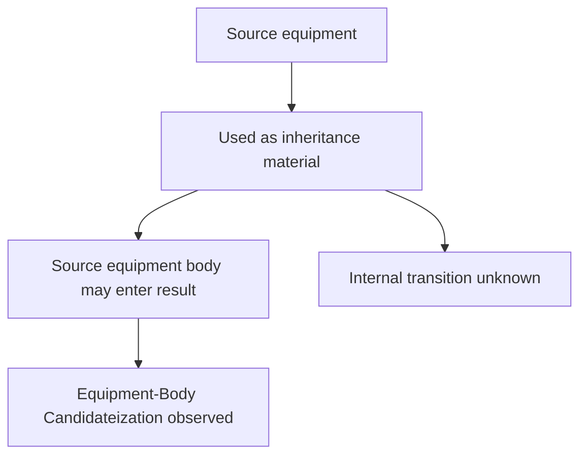
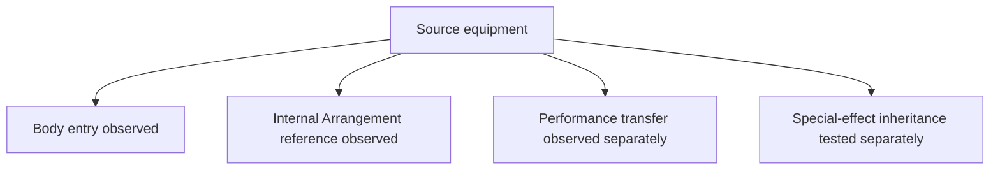

# Equipment-Body Candidateization

> **Current observation:** Equipment-Body Candidateization. **Historical filename:** `Self-Contamination.md` is retained for link compatibility. “Self Contamination” and “Performance-Source Contamination” are deprecated historical terms.

## Observation boundary

In gameplay inheritance results, equipment used as a source material can itself appear as an equipment-body candidate. This is distinct from transfer of that equipment's performance, reference to its internal Arrangement, and inheritance of any special effect. One observation does not prove another.

In both RF4SP and RF5, body entry has been observed under specific tested conditions. The complete category rules, entry frequency, exact candidate construction, and internal processing order remain unknown. This article describes a visible result, not an implementation sequence.

## Historical interpretation

Older explanations grouped equipment-body entry and source-derived internal entries under “Self Contamination” or “Performance-Source Contamination.” They proposed that the source and internal entries re-enter a candidate pool and increase candidate count `N`. Those descriptions remain historical interpretation. The current observation does not establish that all proposed entries exist or that the same mechanism produces them.

The separate current observation [Internal Arrangement Reference](Recursive-Processing.md) concerns internal Arrangement information appearing later. Do not infer recursive expansion from an equipment body entering a result. “First Same-Category Internal-Arrangement Reference” remains **HOLD**. Unknown transitions must not be filled with a newly assumed mechanism.

## Observation-side diagrams

```mermaid
flowchart TD
    A[Source equipment] --> B[Used as inheritance material]
    B --> C[Source equipment body may enter result]
    C --> D[Equipment-Body Candidateization observed]
    B --> E[Internal transition unknown]
```

```mermaid
flowchart TD
    A[Source equipment] --> B[Body entry observed]
    A --> C[Internal Arrangement reference observed]
    A --> D[Performance transfer observed separately]
    A --> E[Special-effect inheritance tested separately]
```

The arrows group distinct observations and do not prescribe a processing order or imply that all four occur in one trial.

## Historical assets

These assets retain their original names and artwork. Their old labels or depicted causal chains are **historical**, and must not be read as current mechanism diagrams:

- 
- 
- 
- 
- 
- 

The [Self Contamination Analysis](../pdf/04_自己混入解析.pdf) PDF is a historical research asset; its physical filename and link are preserved.

## Practical and model boundary

Do not assume that only directly inserted materials can appear in a later result. Inspect source equipment and the final Arrangement after important crafts. If a model posits additional candidates, state the candidate set and its evidence before applying a success-probability calculation. Equipment-Body Candidateization alone does not quantify the pool or lower the success probability by a known amount.

## Current unknowns

- Which equipment categories and material placements permit body entry?
- Which candidate pool, if any, contains the body before selection?
- Under what conditions does internal Arrangement reference also occur?
- Which observed differences between RF4SP and RF5 survive matched-condition tests?

## Related articles

- [Candidate Count Model](Candidate-Count-Model.md)
- [Internal Arrangement Reference](Recursive-Processing.md) (historical filename)
- [Auto Arrange](Auto-Arrange.md)
- [Success Probability](Success-Probability.md)
- [Light Ore Inheritance](Messhilite-Inheritance.md)

[Articles](README.md) · [ROADMAP](../ROADMAP.md) · [Repository README](../README.md)
