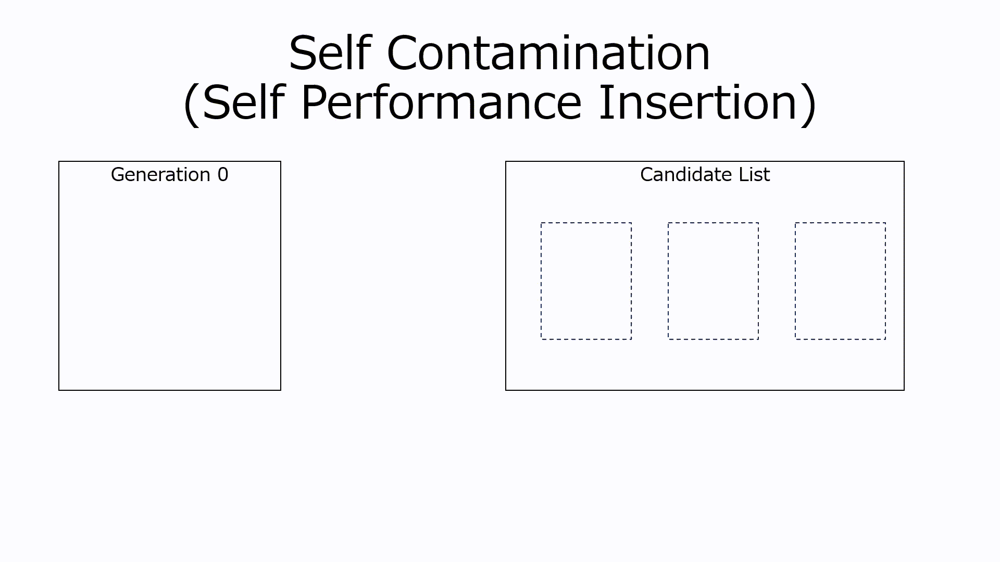
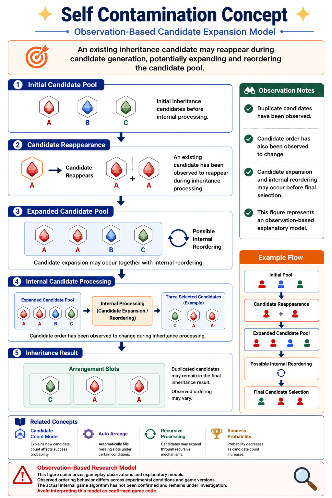
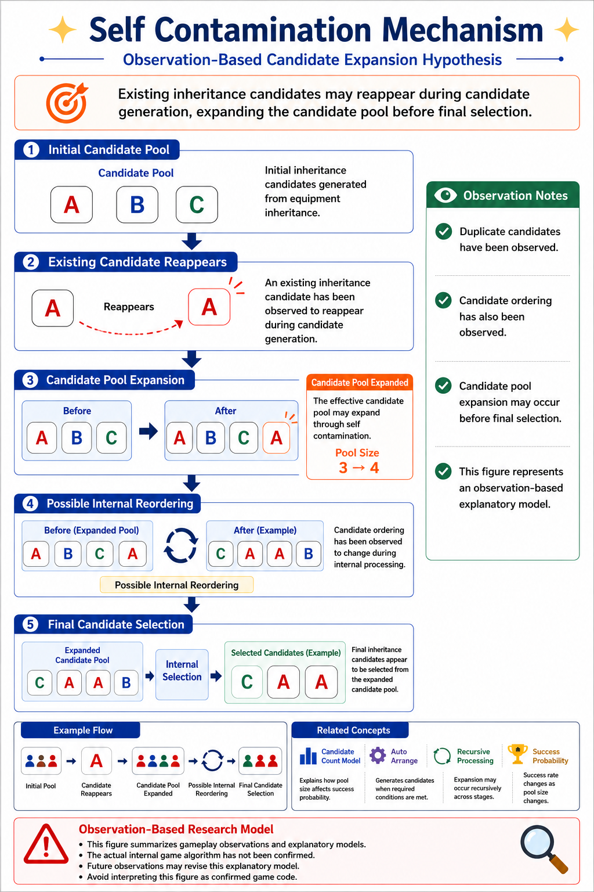
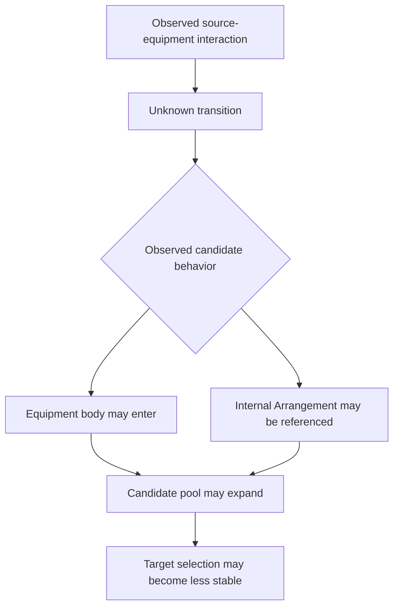
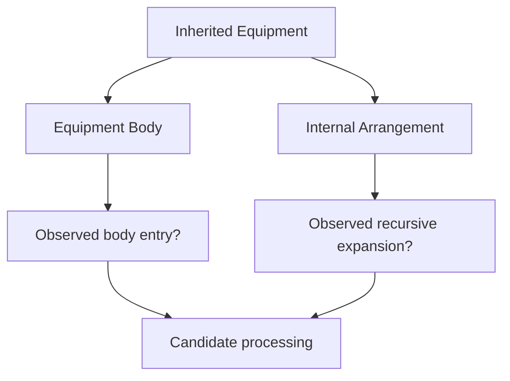
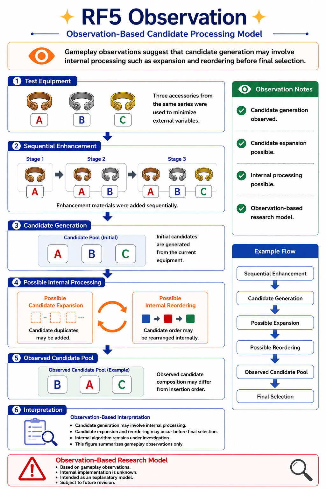
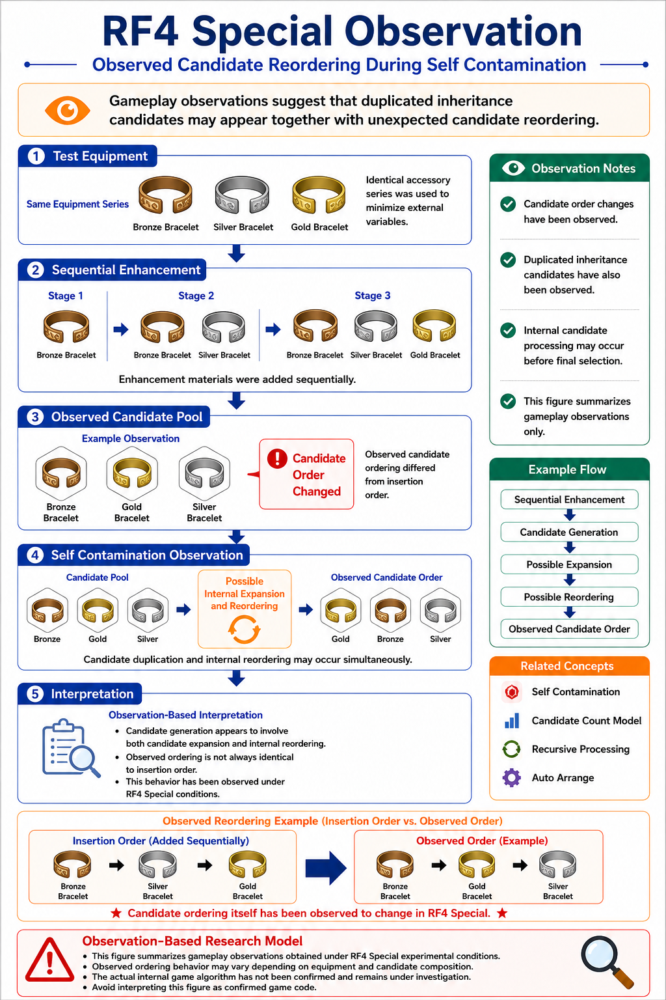
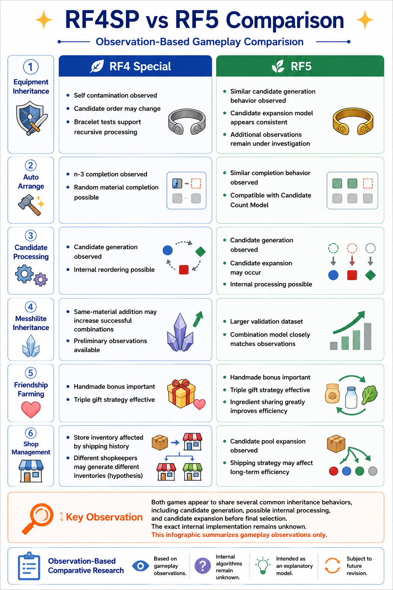

# Performance-Source Contamination

## Overview

Performance-Source Contamination (historically labeled "Self Contamination") is an observation-based research topic describing situations where inheritance processing appears to introduce the source equipment itself, or information derived from it, back into the candidate pool.

This article summarizes one conceptual model derived from repeated gameplay observations in Rune Factory 4 Special and Rune Factory 5.

---

## Conceptual Animation


---

## Why It Matters

Performance-Source Contamination matters because it can make the candidate pool larger than the player expects.

A player may believe the setup contains only a few intended candidates. However, if the source equipment itself or its internal arrangement entries become candidates, the effective candidate count `N` may increase.

That matters because inheritance success is strongly affected by candidate count.

---

## Representative Figures

> **Terminology note:** Some figures in this article retain the earlier label **Self Contamination**. The current term used in this repository is **Performance-Source Contamination**.



*Conceptual illustration: the source equipment or its internal information may re-enter the candidate pool.*



*Mechanism-oriented illustration: self-derived entries can increase candidate count and destabilize selection.*

---

## Mermaid Source Concept


```mermaid
flowchart TD
    A[Observed source-equipment interaction] --> B[Unknown transition]
    B --> C{Observed candidate behavior}
    C --> D[Equipment body may enter]
    C --> E[Internal Arrangement may be referenced]
    D --> F[Candidate pool may expand]
    E --> F
    F --> G[Target selection may become less stable]
```


```mermaid
flowchart TD
    A[Inherited Equipment]
    A --> B[Equipment Body]
    A --> C[Internal Arrangement]
    B --> D[Observed body entry?]
    C --> E[Observed recursive expansion?]
    D --> F[Candidate processing]
    E --> F
```

---

## Core Mechanism

The current observation-level model is:

```text
Observed source-equipment interaction
        ↓
Equipment body and/or internal Arrangement may enter candidate processing
        ↓
Candidate pool may expand
        ↓
Desired three-slot result may become harder to preserve
```

The important point is that the player may not directly add all of the candidates that later appear relevant to the result. Some candidates may emerge from inheritance structure itself.

However, recent observations suggest that two behaviors previously discussed together may need to be separated:

1. the **equipment body itself** becoming a candidate;
2. the equipment's **internal Arrangement** being referenced or expanded.

The internal transition that determines these behaviors remains unknown.

---

## Observations

### RF5 observation



*RF5 observation example: self-derived candidate behavior appears to affect inheritance results.*

### RF4SP observation



*RF4SP observation example: similar candidate-expansion behavior may appear under different conditions.*

### RF4SP / RF5 comparison



*Comparison figure: both titles show observations that are compatible with candidate expansion, but the exact behavior may differ by title and equipment category.*

---

## Emerging Boundary: Equipment-Body Candidateization

Recent gameplay observations suggest that the current label **Performance-Source Contamination** may be narrower than the observed behavior itself.

In both Rune Factory 4 Special and Rune Factory 5, equipment bodies have been observed entering the Arrangement under some inheritance conditions.

Observed examples include:

- a sword itself appearing in the Arrangement of shoes;
- a shield itself appearing in the Arrangement of shoes;
- an accessory itself appearing in the Arrangement of shoes;
- similar equipment-body entry when an accessory is used as the destination.

These observations are important because the equipment body can appear without clear evidence that its own internal Arrangement has also been recursively expanded.

A contrasting observation also exists:

- under tested sword-to-sword inheritance conditions, the inherited sword itself was not observed entering the Arrangement in the same way.

This indicates that equipment-body entry should not currently be treated as a universal property of equipment inheritance.

A possible category-dependent rule is under investigation, but the exact trigger remains unknown.

### Current distinction

The observations currently support keeping the following phenomena separate:

```text
Equipment-body candidateization
        ≠
Recursive Arrangement expansion
```

**Equipment-body candidateization** refers to the equipment item itself appearing in candidate processing.

**Recursive Arrangement expansion** refers to internal Arrangement entries of inherited equipment being referenced or expanded into later processing.

Gameplay observations indicate that equipment-body entry can occur without observable recursive expansion of that equipment's internal Arrangement.

Conversely, shoe-to-shoe inheritance has shown behavior compatible with recursive processing of internal Arrangement entries.

Therefore, these should currently be treated as separate observation classes, even though they may interact in some inheritance chains.

### Terminology status

Because of these observations, **Performance-Source Contamination** should currently be understood as a historical / working label rather than a confirmed complete description of the underlying behavior.

The broader term **Equipment-Body Candidateization** is used here only as a descriptive label for the observed equipment-body entry phenomenon. It is not yet a claim about the game's internal implementation.

---

## Practical Implications

Performance-Source Contamination suggests that repeated inheritance can become riskier than a simple three-material model implies.

Practical precautions include:

- do not assume that only directly inserted materials are candidates;
- avoid unnecessary inheritance chains when a clean result is required;
- use intermediate equipment carefully;
- verify final inheritance slots after each important step;
- treat unexpected candidate entries as information, not merely bad luck;
- do not assume that an equipment body appearing as a candidate means that its internal Arrangement will also be recursively expanded;
- treat equipment category and source/destination combination as possible experimental variables when unexpected equipment-body entries appear.

---

## Relationship to Candidate Count Model

Performance-Source Contamination is one possible candidate-expansion route.

```text
Performance-Source Contamination
        ↓
Source-derived candidate generation
        ↓
Candidate Count N increases
        ↓
Combination space expands
        ↓
Success probability may decrease
```

This is why Performance-Source Contamination is closely linked to Recursive Processing and Success Probability.

---

## Relationship to Recursive Processing

Performance-Source Contamination and Recursive Processing are related but not identical.

Recent observations make this distinction especially important.

### Equipment-body candidateization

The equipment item itself enters candidate processing.

```text
Equipment
    ↓
Candidate: Equipment Body
```

### Recursive Arrangement expansion

Internal Arrangement information from inherited equipment is referenced or expanded into later candidate processing.

```text
Equipment
    ↓
Internal Arrangement
    ↓
Candidate(s) derived from internal entries
```

Gameplay observations indicate that the first behavior can occur without clear evidence of the second.

For example, a sword, shield, or accessory may itself appear in an Arrangement without its own internal Arrangement being observably expanded.

By contrast, shoe-to-shoe inheritance has shown behavior compatible with recursive expansion of internal Arrangement entries.

This suggests the following observation-level structure:

```text
Equipment inheritance
        ↓
Unknown Transition
        ↓
Observed equipment-body entry?
        ↓
Observed internal Arrangement expansion?
```

The repository does **not** currently assume that these two observations are produced by the same internal rule.

Their exact relationship, category conditions, and implementation mechanism remain unknown.

---

## Detailed Research PDF

This article provides an English overview only.

Detailed observations, Japanese terminology, test cases, and discussion are documented in the accompanying research archive.

English-language PDFs are available in the [English PDF Edition](../pdf/english_edition/). The link below points to the Japanese primary research archive.

- [Performance-Source Contamination Analysis](../pdf/04_自己混入解析.pdf)

---

## Related Articles

### Research Root

- [Candidate Count Model](Candidate-Count-Model.md)

### Related Mechanics

- [Auto Arrange](Auto-Arrange.md)
- [Recursive Processing](Recursive-Processing.md)
- [Success Probability](Success-Probability.md)
- [Light Ore Inheritance](Messhilite-Inheritance.md)

---

## Notes

This article describes an observation-based model. It should not be read as a definitive implementation claim.

The exact trigger for equipment-body candidateization remains unknown.

Current observations are compatible with category-dependent behavior, but a category rule has not yet been established as an implementation-level mechanism.

The repository therefore distinguishes between:

- **observed equipment-body entry**;
- **observed recursive Arrangement expansion**;
- **inferred category conditions**;
- **unknown internal processing**.

These are different evidence levels and should not be treated as equivalent claims.

In particular:

```text
Observed State
        ↓
Unknown Transition
        ↓
Observed State
```

The unknown transition should not be filled with an implementation mechanism unless stronger evidence establishes one.

---

## Navigation

- [Back to Articles](README.md)
- [Back to ROADMAP](../ROADMAP.md)
- [Back to Repository README](../README.md)
