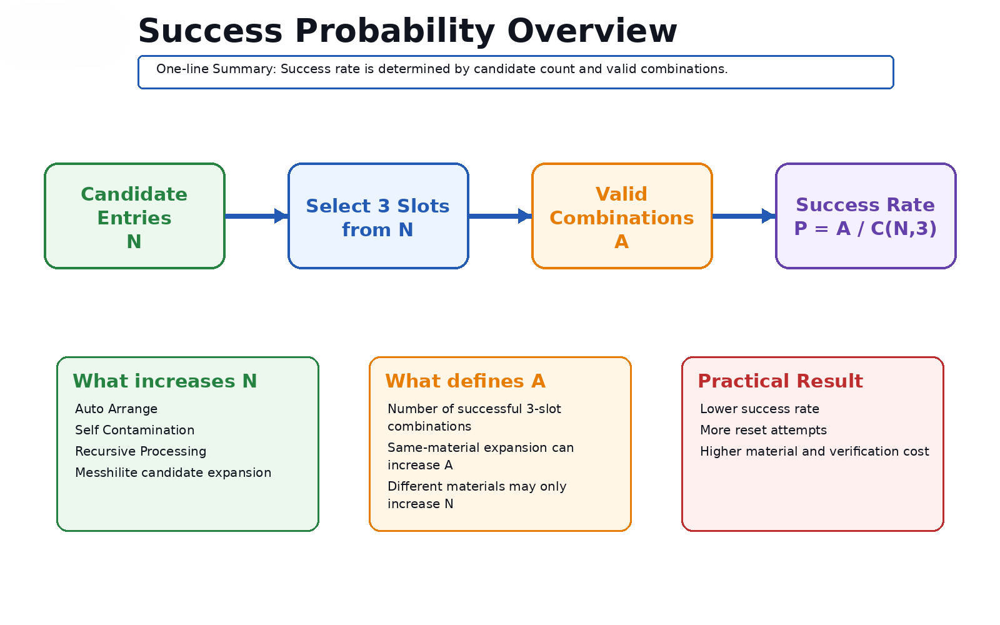
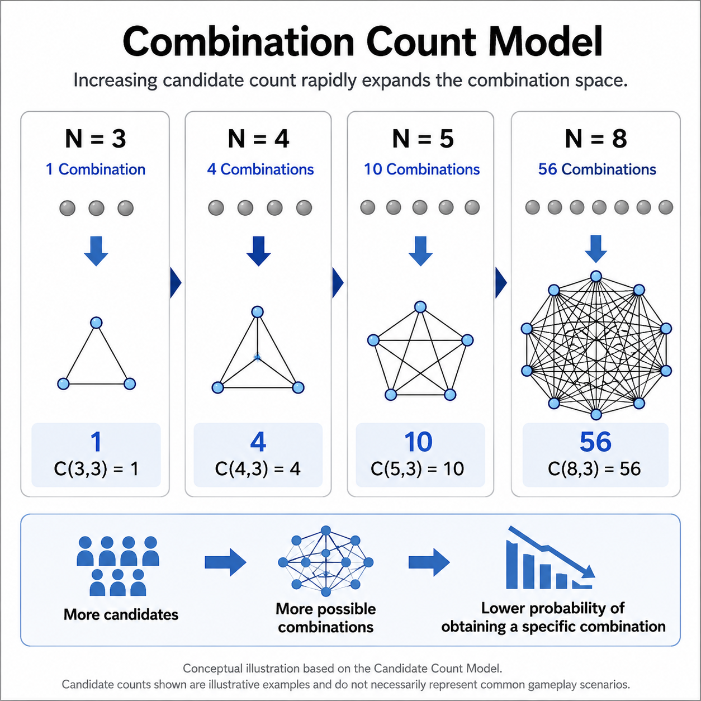
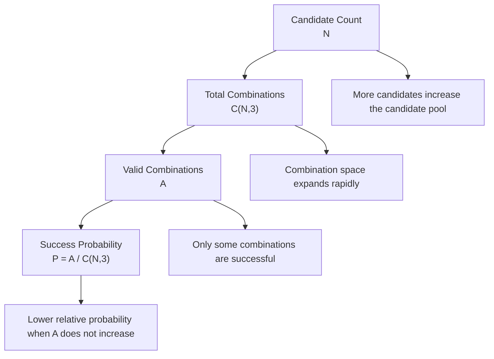
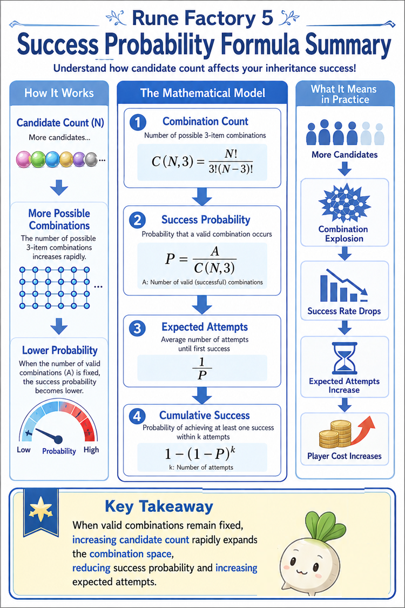
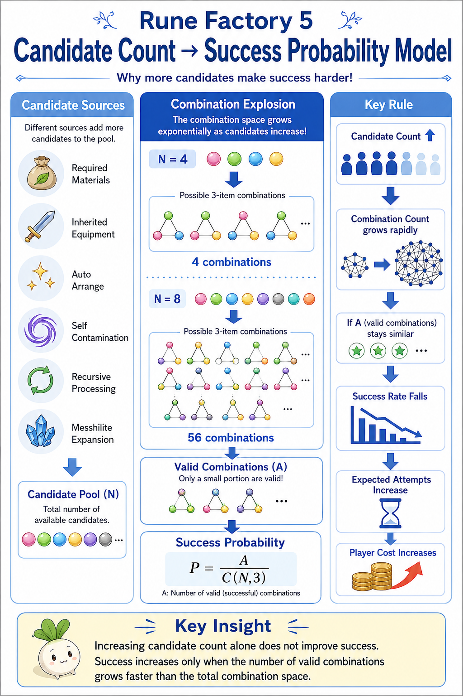
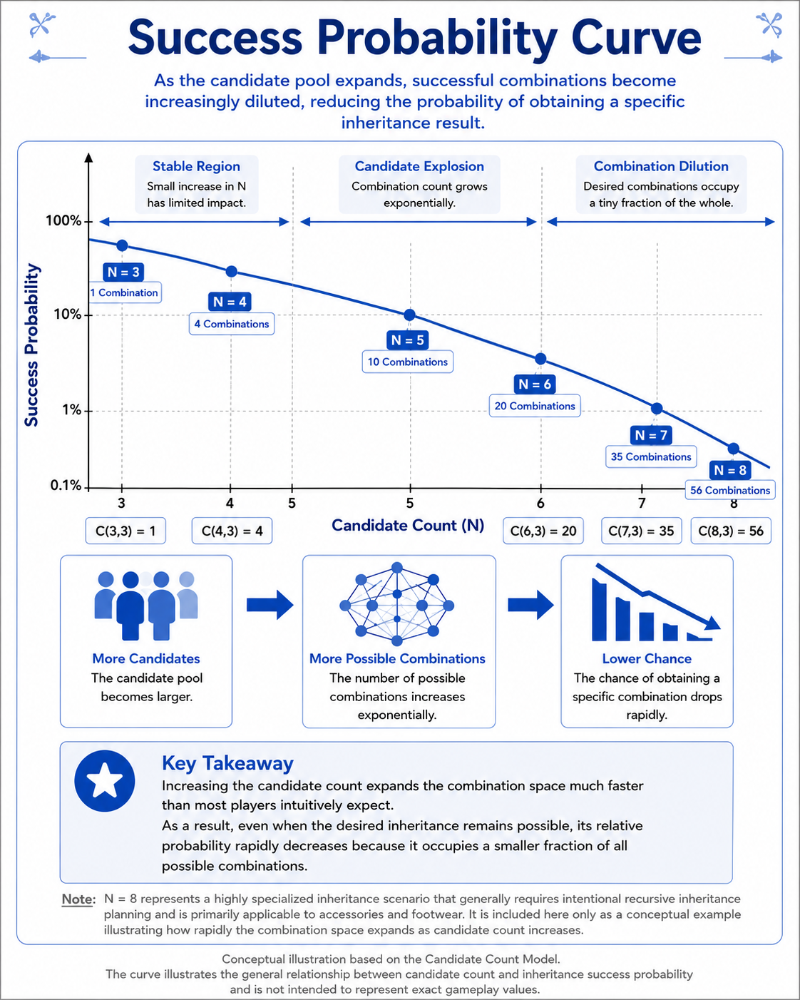
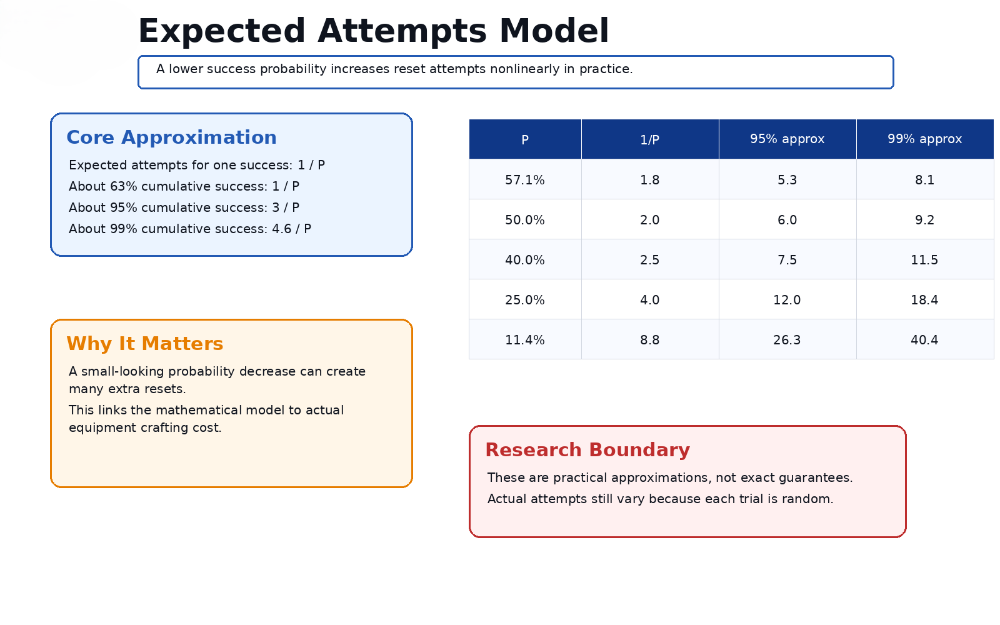

# Success Probability

## Overview

Success Probability is an observation-based research topic describing how inheritance success can be interpreted through candidate count and combination space.

This article summarizes the mathematical interface of the Candidate Count Model.

The goal is not to claim the exact internal implementation. The goal is to provide a practical model for understanding why inheritance becomes less stable when the candidate pool grows.

---

## Why It Matters

Many inheritance outcomes feel random when viewed one attempt at a time.

However, if the system selects three entries from a larger candidate pool, then success probability can be modeled through combinations.

The basic idea is:

```text
Candidate Count N
        ↓
Total three-slot combinations C(N,3)
        ↓
Successful combinations A
        ↓
Success Probability P = A / C(N,3)
```

This lets the repository explain multiple phenomena with the same framework:

- Auto Arrange increases candidate count.
- Self Contamination increases candidate count.
- Recursive Processing increases candidate count.
- Messhilite experiments provide validation observations.

---

## Representative Figures



*Overview: candidate count affects the space of possible three-slot outcomes.*



*Conceptual model: success probability depends on how many valid combinations remain inside the expanded candidate space.*

---

## Mermaid Source Concept



---

## Core Formula

The simplified model used in this repository is:

```text
P ≈ A / C(N,3)
```

Where:

- `N` = candidate count;
- `C(N,3)` = number of possible three-slot combinations;
- `A` = number of combinations that satisfy the desired inheritance condition;
- `P` = approximate success probability.

This is a model for interpretation and planning, not a proof of internal game code.



*Formula summary for the candidate-count success model.*

---

## Combination Space



*Combination count expands quickly as candidate count increases.*

The important practical lesson is that adding candidates can be harmful even when those candidates do not look important individually.

If candidate count increases but the number of successful combinations does not increase, the success rate usually falls.

---

## Probability Curve



*Conceptual curve: larger candidate pools generally reduce the relative share of successful combinations unless successful combinations increase as well.*

---

## Expected Attempts



*Expected attempts and cumulative success become important when practical crafting requires repeated resets or repeated material preparation.*

In practical equipment building, success probability is not only a theoretical number. It affects:

- expected reset count;
- material consumption;
- time cost;
- whether an inheritance route is practical.

---

## Practical Implications

The Success Probability model suggests several practical rules:

- reducing candidate count is often more valuable than adding more materials;
- extra materials are dangerous if they increase `N` without increasing `A`;
- intermediate crafting can sometimes reduce final-stage candidate pressure;
- low-probability inheritance should be planned as a route, not attempted blindly.

---

## Relationship to Messhilite Validation

Messhilite experiments are treated as one validation interface for this model.

In the current RF5 validation dataset, each stack condition contains 1,000 trials:

| Condition | Trials | Successes | Observed Rate | Reference Model |
|---|---:|---:|---:|---:|
| 3-stack | 1,000 | 250 | 25.0% | 25.0% |
| 4-stack | 1,000 | 387 | 38.7% | 40.0% |
| 5-stack | 1,000 | 519 | 51.9% | 50.0% |
| 6-stack | 1,000 | 571 | 57.1% | 57.1% |

These observations are consistent with the candidate-count / combination-space interpretation, but they do not prove the internal implementation.

---

## Detailed Research PDF

This article provides an English overview only.

Detailed mathematical discussion, Japanese terminology, validation discussion, and additional examples are documented in the accompanying research archive.

**Note:** PDF documents are currently available in Japanese only.

- [General Mathematical Model](../pdf/07_数式・一般化モデル.pdf)
- [Messhilite Validation Data](../research/07_統合データ.csv)

---

## Related Articles

### Research Root

- [Candidate Count Model](Candidate-Count-Model.md)

### Related Mechanics

- [Auto Arrange](Auto-Arrange.md)
- [Self Contamination](Self-Contamination.md)
- [Recursive Processing](Recursive-Processing.md)
- [Messhilite Inheritance](Messhilite-Inheritance.md)

---

## Notes

This article describes an observation-based model. It should not be read as a definitive implementation claim.

---

## Navigation

- [Back to Articles](README.md)
- [Back to ROADMAP](../ROADMAP.md)
- [Back to Repository README](../README.md)
