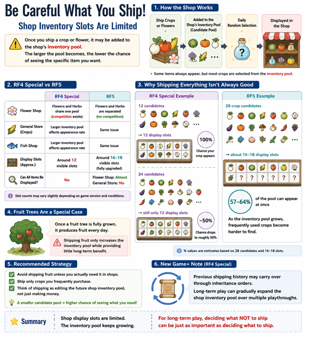

# The Hidden Cost of Shipping Everything in Rune Factory

## Overview

During long-term play, I realized that shipping isn't just about making money.

Every new crop or flower you ship may expand the shop's inventory pool, while the number of display slots remains limited.

That completely changed how I manage my farm.

Now I think of shipping as managing my future shop inventory, not just selling items for profit.

## Key Takeaway

Shipping every crop or flower is not always optimal for long-term gameplay.

Expanding the candidate pool may reduce the probability of finding specific desired items in shops.

This article discusses one possible long-term optimization strategy based on gameplay observations.

## Infographic

## Notes

This is simply one long-term strategy based on gameplay observations and personal experience.

Different playstyles may benefit from different approaches.

There is no single "correct" way to play.

## Articles
- Back to [README](../README.md)
