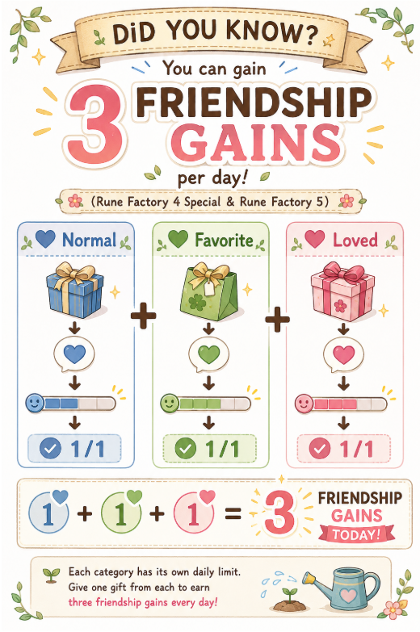

# Triple Gift Mechanics in Rune Factory

## Overview

In Rune Factory 4 Special and Rune Factory 5, Normal, Favorite, and Loved gifts appear to be evaluated separately for daily friendship gains.

This means that, in practical daily friendship farming, a villager may gain friendship up to three times per day from gifts if each gift belongs to a different category.

This article explains the basic idea and how to check it in-game.

## Key Takeaway

Normal, Favorite, and Loved gifts can each contribute to friendship gain on the same day.

Watching the friendship gauge after each gift is an easy way to confirm whether friendship increased.

This is especially easy to observe when the villager has a low friendship level, because the gauge movement is more visible.

## Infographic

## Practical Use

A simple daily routine can be:

1. Give one normal gift.
2. Give one favorite gift.
3. Give one loved gift.

When combined with handmade gifts and low-cost recipes, this can greatly improve long-term friendship farming efficiency.

## Notes

These observations are based on repeated gameplay experience.

This article does not claim to confirm the internal game code.

Different playstyles may not need this level of optimization.

The main purpose is to provide a practical method for players who enjoy long-term friendship farming.

## Related Articles

- [Efficient Friendship Farming Strategy](./Efficient-Friendship-Farming-Strategy.md)
- [RF5 Daily Friendship Farming Guide](./RF5-Daily-Friendship-Farming-Guide.md)
- [RF4SP Daily Friendship Farming Guide](./RF4SP-Daily-Friendship-Farming-Guide.md)
- [The Hidden Cost of Shipping Everything](./The-Hidden-Cost-of-Shipping.md)

---

Back to [README](../README.md)
