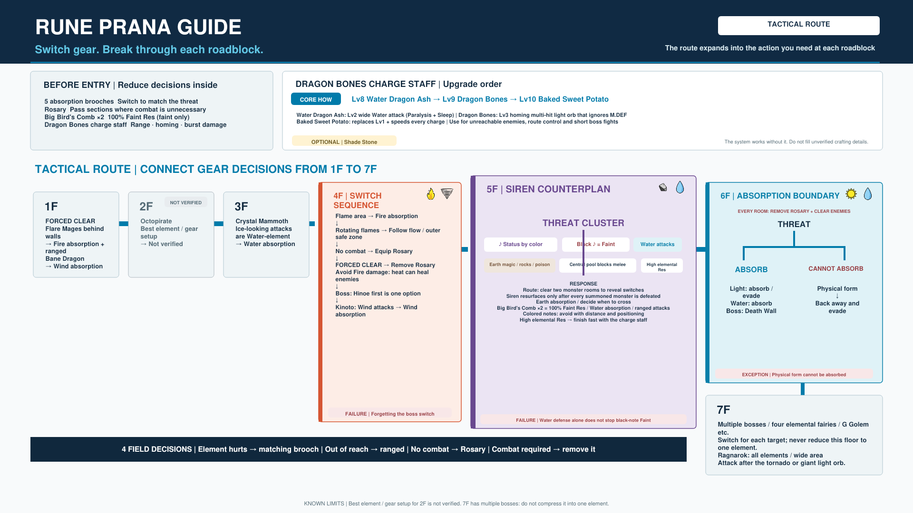

# Rune Factory 4 Special — Rune Prana Tactical Route Guide

A visual route guide for **Rune Prana** in Rune Factory 4 Special.

Instead of trying to force one setup through the entire dungeon, this guide treats Rune Prana as a sequence of equipment decisions:

**Prepare what you can before entering, then switch equipment when the threat changes.**

## Need the absorption brooches first?

→ [See the Elemental Absorption Brooch Build Guide](../elemental-absorption-brooches/)

## Japanese visual

[Open the Japanese version](../../images/rune-prana-tactical-route/rf4sp-rune-prana-tactical-route-guide-jp.png)

## How to read the guide

- **1F–3F:** navigation and local equipment decisions
- **4F:** a sequence of equipment switches
- **5F:** multiple overlapping threats
- **6F:** a branch between attacks that can and cannot be handled by elemental absorption
- **7F:** multiple bosses; do not reduce the entire floor to one element

The 3F note is intentional: Crystal Mammoth's attacks look like ice, but the observed in-game element is **Water**. Follow the Water-absorption route shown in the guide.

### Optional: Shade Stone

Shade Stone can be useful with the Water Dragon Ash charge attack.

Water Dragon Ash provides a Water-element charge attack that can inflict
Paralysis and Sleep.

In RF4SP testing against the four elemental fairies, attacks that were absorbed
did not inflict these status effects.

Shade Stone also changed the observed interaction with the Water Dragon Ash
attack:

- Without Shade Stone: about 3,300 HP absorbed at about 4,000 M.ATK
- With Shade Stone: about 800 HP absorbed at about 12,000 M.ATK

Because the test conditions used different M.ATK values, these numbers should
not be treated as a direct damage comparison. However, the observation shows
that Shade Stone can meaningfully alter the elemental interaction.

This makes Shade Stone useful for reducing the amount of HP restored by
Water-absorbing enemies.

It may also help preserve the practical value of the Paralysis / Sleep charge
attack: in the four-elemental-fairy test, these status effects were not observed
when the attack was absorbed.

#### Known boundary

Core Beam damage did not change in the same Shade Stone comparison.

The reason is currently unknown.
This observation does not establish whether Core Beam is non-elemental or
whether another resistance mechanism is involved.

## Scope and limits

- The best element and equipment setup for 2F has not been verified.
- Elemental absorption does not replace every defensive or tactical response.
- The guide preserves local equipment changes instead of presenting one universal Rune Prana build.

## Observation note

The route is based on in-game RF4SP observations and practical play. Unverified points remain labeled rather than being filled in for visual completeness.

## Navigation

- [Visual Game Guide Series](../)
- [Repository README](../../README.md)

