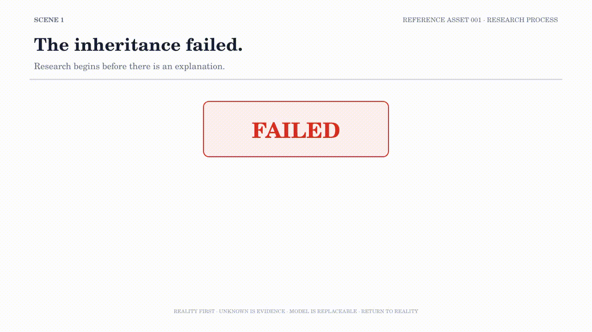

# RA001 — Research Process

## Purpose

This asset introduces the research cycle behind the repository through an inheritance failure: move from an unexplained result to a located question, build a replaceable model, test its boundaries, and return to Reality.

## Experience Goal

The viewer should see that research does not begin with an explanation. It begins when “bad luck” is no longer sufficient and the Unknown can be turned into an observable question.

## Key Question

> What changes the result?

## Position within the Series

RA001 is the recommended starting point. It establishes the recurring movement from Reality to Observation, Unknown, Model, Counterexample, and back to Reality.

The later assets narrow this cycle into decision context, observation design, and a concrete search-space problem.

## Related Assets

- Next: [RA002 — Decision Process](RA002-Decision-Process.md)
- Observation focus: [RA003 — Observation Design](RA003-Observation-Design.md)
- Applied research constraint: [RA004 — The Permutation Problem](RA004-The-Permutation-Problem.md)
- [Reference Assets index](README.md)

## Related Repository Documents

- [Research Process](../research-methodology/research-process.md)
- [Research Methodology](../research-methodology/README.md)
- [Candidate Count Model](../articles/Candidate-Count-Model.md)
- [Messhilite Inheritance](../articles/Messhilite-Inheritance.md)
- [Research Data and Validation](../research/README.md)

The GIF is an Experience Preview. Use the linked documents for the research context, evidence, and limitations.

