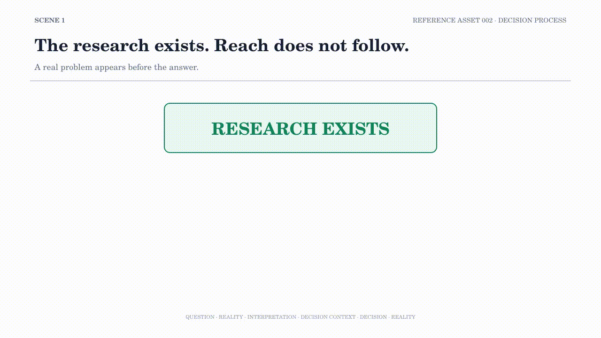

# RA002 — Decision Process

## Purpose

This asset shows why evidence alone does not produce a decision. A real repository problem—research exists, but reach is Unknown—is evaluated through known facts, unresolved questions, and an explicit objective before an actionable option is selected.

## Experience Goal

The viewer should distinguish Reality, Interpretation, Decision Context, Decision, and later evaluation. The same Reality can support a different action when the objective becomes explicit.

## Key Question

> What should be done, and why this option?

## Position within the Series

RA002 follows the research cycle introduced in RA001 and focuses on the turning point between observation and action.

It carries the Unknown into the decision instead of silently converting missing evidence into certainty. Reality then evaluates the decision and opens the next observation.

## Related Assets

- Previous: [RA001 — Research Process](RA001-Research-Process.md)
- Observation boundary: [RA003 — Observation Design](RA003-Observation-Design.md)
- Applied model boundary: [RA004 — The Permutation Problem](RA004-The-Permutation-Problem.md)
- [Reference Assets index](README.md)

## Related Repository Documents

- [Judgment Architecture](../research-methodology/judgment-architecture.md)
- [Research Methodology](../research-methodology/README.md)
- [Repository Roadmap](../ROADMAP.md)
- [Main Repository Entry](../README.md)

The GIF is an Experience Preview. It does not replace the repository documents or establish a universal decision procedure.

