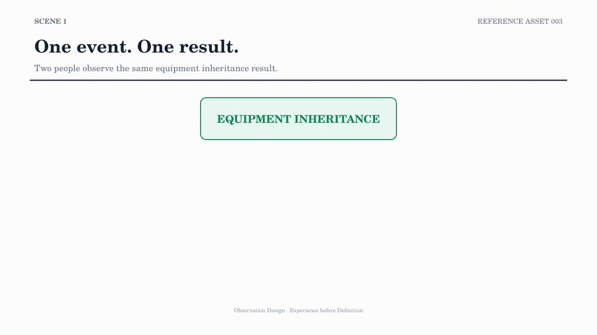

# RA003 — Observation Design

## Purpose

This asset examines how two people can encounter the same event and result while observing different parts of it. Before attributing the difference to knowledge, experience, or skill, it asks which observation target changed.

## Experience Goal

The viewer should learn to separate the event from the way it was observed. “Observed the outcome” and “observed the candidate conditions” are different observation designs, even when the equipment, experiment, and result are the same.

## Key Question

> What actually changed between two observations?

## Position within the Series

RA003 moves upstream from decision to observation. It makes the observation boundary visible before a method or personal ability is named as the cause of a difference.

The structure is not limited to Rune Factory. It is a repository entry point for thinking about how observation design precedes research definition.

## Related Assets

- Research cycle: [RA001 — Research Process](RA001-Research-Process.md)
- Decision context: [RA002 — Decision Process](RA002-Decision-Process.md)
- Observation under search constraints: [RA004 — The Permutation Problem](RA004-The-Permutation-Problem.md)
- [Reference Assets index](README.md)

## Related Repository Documents

- [Research Methodology](../research-methodology/README.md)
- [Research Process](../research-methodology/research-process.md)
- [Candidate Count Model](../articles/Candidate-Count-Model.md)
- [Research Data and Validation](../research/README.md)
- [Repository Roadmap](../ROADMAP.md)

The GIF is an Experience Preview. It summarizes an observation boundary; it does not define a psychological or cognitive mechanism.

