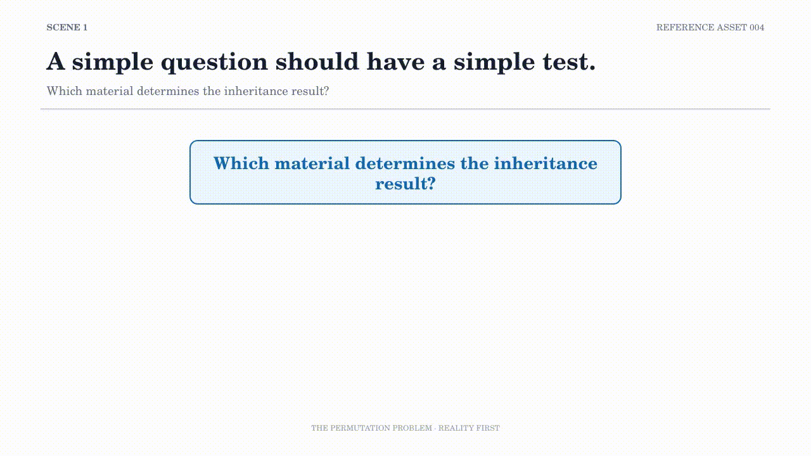

# RA004 — The Permutation Problem

## Purpose

This asset presents a practical research constraint: a simple inheritance question can produce too many material orders, combinations, and candidate outcomes to test exhaustively. A model makes selective observation possible without claiming that the remaining search space has disappeared.

## Experience Goal

The viewer should see why exhaustive testing becomes unrealistic, why Random Testing is not a complete research design, and how a replaceable candidate-based model can reveal the next testable Unknown.

## Key Question

> How can an impossible search become a useful observation plan?

## Position within the Series

RA004 is the applied endpoint of the series. It brings together the research cycle from RA001, the explicit decision context from RA002, and the observation boundary from RA003.

Its focus is not to prove an internal game mechanism. It shows how a model can reduce a search space, guide observation, encounter an unexpected result, and become eligible for revision.

## Related Assets

- Research cycle: [RA001 — Research Process](RA001-Research-Process.md)
- Decision context: [RA002 — Decision Process](RA002-Decision-Process.md)
- Observation boundary: [RA003 — Observation Design](RA003-Observation-Design.md)
- [Reference Assets index](README.md)

## Related Repository Documents

- [Candidate Count Model](../articles/Candidate-Count-Model.md)
- [Success Probability](../articles/Success-Probability.md)
- [Auto Arrange](../articles/Auto-Arrange.md)
- [Recursive Processing](../articles/Recursive-Processing.md)
- [Research Data and Validation](../research/README.md)
- [Repository Roadmap](../ROADMAP.md)

The GIF is an Experience Preview. The model remains observation-based and replaceable; use the linked documents for evidence, scope, and unresolved questions.

