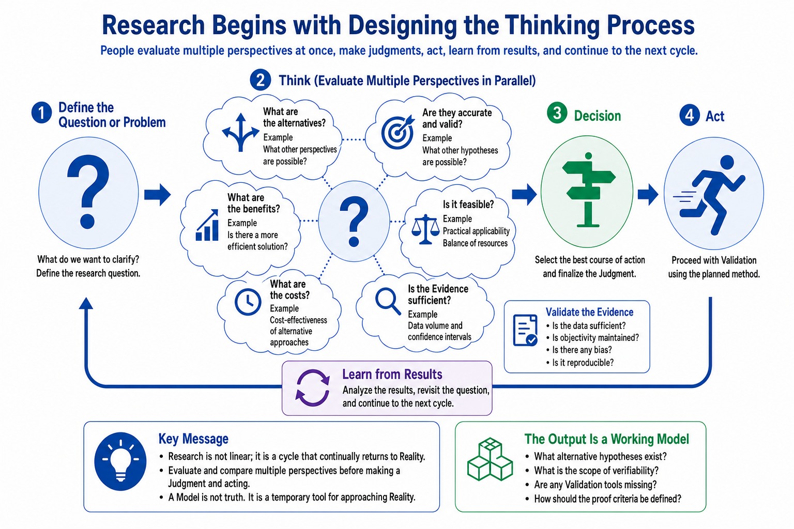

# Research Methodology

## Overview

This repository records not only research results, but also the methods used to produce and evaluate them. These methods include Observation, Judgment, Validation, and a continuing return to Reality.

The Candidate Count Model is one outcome of this research practice. It is not the methodology itself.

## Visual Assets

### Research Process

The Research Process presents research as a cycle of questions, parallel evaluation, decisions, action, learning, and renewed observation.



[Read about the Research Process](research-process.md)

### Judgment Architecture

The Judgment Architecture shows how Human Judgment, Knowledge, Experience, and Reality interact without treating Reality as part of the Judgment system.


[Read about the Judgment Architecture](judgment-architecture.md)

## Core Principles

- Reality remains the final reference.
- Observation and Interpretation are separated.
- Models are replaceable.
- Unknowns are preserved rather than hidden.
- Judgment evaluates multiple perspectives in parallel.
- Validation returns the research process to Reality.
- Learning generates new questions.

## Relationship to the Repository

The repository uses the following general relationship:

```text
Research Methodology
↓
Observation and Experiment Design
↓
Candidate Count Model and other research models
↓
Repository Documentation
↓
Return to Reality
```

This relationship does not imply that the methodology necessarily leads to the Candidate Count Model. The model is one research outcome developed through observation and experimentation.

## Related Pages

- [Candidate Count Model](../articles/Candidate-Count-Model.md)
- [ROADMAP](../ROADMAP.md)
- [Main README](../README.md)
