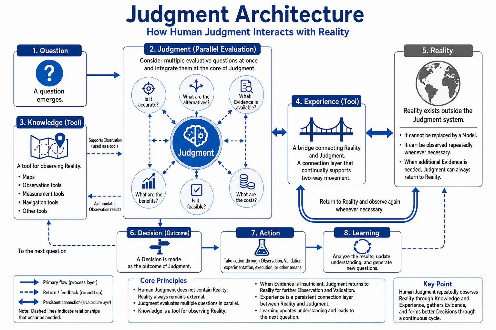

# Judgment Architecture

## Purpose

This diagram describes the relationship among Human Judgment, Knowledge, Experience, and Reality.

## Key Distinctions

- Reality exists outside the Judgment system.
- Knowledge supports Observation but does not replace Reality.
- Experience connects Judgment and Reality over time.
- Judgment evaluates several questions in parallel.
- Decision is an outcome of Judgment.
- Action and Learning generate new Observations and questions.

## Judgment and Decision

**Judgment** is the evaluation and integration of multiple perspectives.

**Decision** is the selected course of action that results from Judgment.

Keeping these concepts separate prevents the evaluation process from being confused with its outcome.

## Return to Reality

When Evidence is insufficient, Judgment returns to Reality through Knowledge and Experience to conduct additional Observation and Validation. Knowledge and Experience support this return; they do not replace Reality.

## Limitations

This is a conceptual architecture, not a claim about neurological or psychological mechanisms.

It does not replace empirical models from cognitive science, psychology, or neuroscience.
